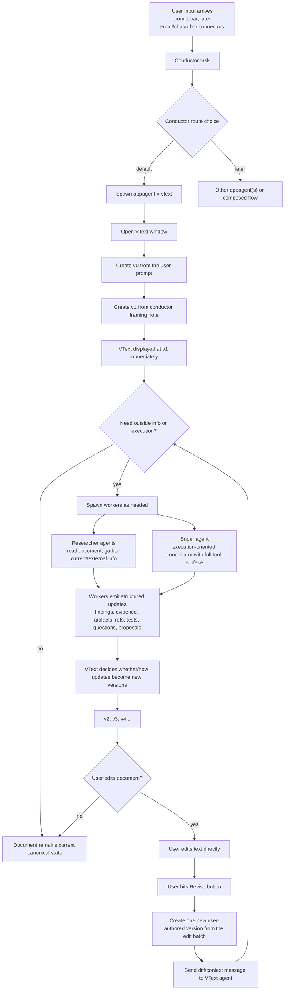

# Project Goals

**Last Updated:** 2026-04-30
**Scope:** Canonical near-term implementation plan for deployed `vtext` + MAS stabilization, while preserving the publishing/citation/compute-economics facts that later layers require.

---

## Core Goal

Make the deployed system coherent before doing more broad infrastructure work, without losing the larger product shape.

Choir is the Automatic Computer in deployed form: a living-document desktop backed by a dark factory of agents and microVMs. The product sequence is:

1. **Stabilized `vtext`:** researcher, super, user edits, versions, and Trace work reliably.
2. **Ingestion:** URL/content extraction, YouTube transcripts, uploads, PDFs, EPUBs, and later multimedia display apps whose content can be transcluded into `vtext`.
3. **Publication:** selected private versions/artifacts become immutable platform-visible records.
4. **Transclusion:** Pretext-backed text rendering and embedded referenced content.
5. **Citation:** citation graph over published immutable refs.
6. **Compute economy:** compute accounting and CHIPS economics.

Do not implement token mechanics yet. Do preserve the provenance, evidence, artifact, citation, trajectory, VM, model, publication-boundary, and compute-usage facts needed by later layers.

That means:
- the prompt bar always goes through `conductor`
- `conductor` becomes the real routing authority
- `vtext` becomes the primary user-facing work surface
- `vtext` versions become the canonical state of work
- generic work state stays simple and legible under a `dumb data, smart models` principle
- workers and `super` become visibly real and debuggable
- Trace becomes understandable enough to debug trajectories, with a possible later appagent upgrade only if scale requires agentic search/dynamic UI
- prompts become easy to inspect and edit inside Choir as per-user sandbox state
- embedded Dolt becomes the real storage model
- `vmctl` is understood as active/background VM fork, merge, promotion, and rollback machinery, not just deployment plumbing

Canonical context docs:

- `docs/north-star.md`
- `docs/runtime-invariants.md`
- `docs/implementation-scope.md`
- `docs/current-architecture.md`

---

## First Deliverable: `vtext` Flow Chart

This is the target product/runtime flow.

### Important behavioral rules

1. The prompt bar input should call `conductor` no matter what.
2. If the result is “show a toast,” that should be `conductor`’s choice, not frontend pattern matching.
3. By default, `conductor` should spawn `appagent=vtext`.
4. Opening the `vtext` window should be a consequence of the conductor/appagent flow, not a deterministic desktop shortcut.
5. The user prompt becomes `v0`.
6. The conductor's short spawn/delegation framing note becomes `v1`.
7. `v1` replaces the old pattern where `vtext` used an extra initial answer-from-priors call.
8. The `vtext` window should open quickly with `v1` displayed as current.
9. `vtext` spawns workers when needed.
10. Workers never directly author canonical document text and do not send document patches.
11. Workers emit structured updates: findings, evidence, artifacts, refs, tests, questions, or proposals.
12. `vtext` decides whether and how worker updates become `v2`, `v3`, and further revisions.
13. User edits are batched into one user-authored version when the user hits Revise.

---

## What Must Be True About The Product

### `vtext`

`vtext` is not chat.

`vtext` is:
- a version-native document surface
- the primary cumulative state of a project/process
- the place where user edits and agent synthesis meet
- eventually transclusion-native, not just text-native

`vtext` should feel like:
- one big editable document surface
- no sidebar-first UX
- no wasted chrome
- minimal floating controls only
- a natural place for users to steer and refine work

`vtext` should also:
- live canonically in embedded Dolt
- have a natural file manifestation or shortcut in the filesystem
- open from the file browser into a new `vtext` window even when the source of truth is the database

### Conductor

`conductor` is:
- the intake/router
- the place where prompt-bar input lands first
- later the place where connector input lands first

`conductor` should:
- always receive top-level input
- choose toast vs appagent routing
- default to spawning `vtext`
- later route to or compose other appagents

### Multiagent Runtime

The MAS should feel real, not implied.

That means:
- `vtext` should actually spawn researchers for current/external information
- `super` should actually appear for execution-oriented work
- messages between `vtext`, `researcher`, and `super` should be visible in Trace
- the system should not merely “hint” at delegation in prompts while behaving like a single-shot rewrite
- `vtext` should open immediately with `v0` user input and `v1` conductor framing
- worker updates should revise and enrich the document after that first conductor-framed state

### Apps and agent topology

Not every app is an appagent. Apps can remain plain display/control surfaces.
They become appagents when they need durable domain ownership, prompts, dynamic
UI, or agentic behavior.

Likely app sequence:
- `vtext` as the first appagent
- browser next, potentially promptable through the URL bar or controlled by conductor
- mail after that, starting with a Choir desktop email address before optional user email import
- calendar for scheduled tasks
- media display apps for uploaded, linked, or agent-retrieved audio/video/image content

For one user:
- there can be many durable `vtext` agents, one per `vtext`
- researchers should come from a shared pool
- there should generally be one top-level `super`

Why:
- many `vtext` agents let many document contexts stay durable and wakeable
- shared researchers are relatively safe because they are read-mostly evidence workers
- a top-level `super` gives one place to request `vmctl` resources such as background VM forks and promotions

Execution concurrency should deepen before it broadens:
- appagents can be peers
- `super` acts as the privileged orchestration root for mutable work
- `super` creates or coordinates cosupers in background VMs
- cosupers may spawn cosupers
- mutable super/cosuper work should not edit the live desktop directly

This encourages dense supervised concurrency rather than sparse overlapping privileged concurrency.

Tool access should enforce these boundaries directly. If an agent should not do shell work, writable-file work, or privileged delegation, it simply should not have those tools.

### `vtext` agent behavior

The default `vtext` mode should not be chatty or psychologically self-reporting.

By default, the `vtext` agent should:
- synthesize the best current document state from user edits and available worker updates
- write the next version as if it were trying to advance the work well, not narrate its own process
- delegate in the background when delegation is useful
- update the document again when workers return evidence

By default, the `vtext` agent should avoid:
- filler like “I think…”
- process narration like “I am delegating to…”
- unnecessary self-reference
- chatty back-and-forth framing unless the user explicitly asks for that mode

The primary use case of Choir is not conversational back-and-forth. It is cumulative document/process advancement through versions.

### Prompting style

Prompts should be subtle.

That means:
- prefer a few strong positive instructions over long rule lists
- avoid too many “do not” clauses
- avoid negative prompt blocks that over-focus attention on failure cases
- steer with framing and examples where possible
- use prohibitions sparingly, only where they protect core invariants

### Data Modeling

We should follow a `dumb data, smart models` principle.

That means:
- keep stored work data generic and inspectable
- preserve actors, timestamps, messages, versions, and causal relationships
- preserve whether work happened sequentially or concurrently
- avoid over-encoding workflow algorithms into specialized schema prematurely
- let models interpret and process the data, with policy expressed in prompts

In practice:
- do not feel obliged to build tables like `work_edges` just because the relationships are graph-like
- do preserve enough information to reconstruct what caused what
- treat runtime execution records as implementation details around a broader concept of work

---

## Proximate Next Runs

These are the real next runs, in order.

### Execution Checklist

#### Phase 1. Move prompt and context ownership into the sandbox

- [x] Remove frontend context engineering such as `buildAgentPrompt()`.
- [x] Make the frontend send only user intent / revise events, not synthesized agent instructions.
- [x] Load role prompts from editable text files in the sandbox at runtime.
- [x] Make backend prompt assembly the single source of truth for `conductor`, `vtext`, `researcher`, `super`, and later `co-super`.
- [x] Make prompt files editable without rebuilding the binary.
- [x] Keep prompt style subtle and positive rather than full of prohibitions.

#### Phase 2. Make prompt management a real sandbox-owned feature

- [x] Add per-user prompt storage/state inside the sandbox.
- [x] Expose prompt management inside Choir as a proper app surface.
- [x] Let users inspect and edit:
  - `conductor` prompting
  - `vtext` prompting
  - worker-role prompting
  - [ ] later app-specific prompts and policies
- [x] Ensure the frontend never becomes the source of truth for prompt policy again.

#### Phase 3. Make `conductor` authoritative

- [x] Remove deterministic prompt-bar dispatch in the frontend.
- [x] The prompt bar should always submit to `conductor`.
- [x] If the user gets a toast, that should be because `conductor` chose that outcome.
- [x] Default route should be: spawn `appagent=vtext`.
- [x] Opening `vtext` should happen from conductor output, not from a frontend shortcut.

#### Phase 4. Make `vtext` UX coherent

- [x] The `vtext` window should be almost entirely the document surface.
- [x] Keep only:
  - floating Revise button
  - floating `<` and `>` version navigation
  - extremely minimal status signaling
- [x] Remove dead space and misleading status chrome.
- [x] Make version navigation clear and safe.

#### Phase 5. Make the `vtext` process real

- [x] The user prompt should create `v0`.
- [x] The conductor spawn/delegation call should create `v1` from a short framing note without a separate vtext answer-from-priors call.
- [x] The `vtext` agent should spawn workers as needed.
- [x] Worker updates should be structured as findings, evidence, artifacts, refs, tests, questions, or proposals, not document patches.
- [x] Worker updates should cause later canonical versions according to an explicit revision policy.
- [x] User edit batches should create one user-authored version and produce a diff/context message for `vtext`.
- [x] This should work naturally as an iterative document loop, not like chat turns.

#### Phase 6. Make worker spawning visible and trustworthy

- [x] `researcher` should appear for current/external-info requests.
- [x] `super` should appear for execution-oriented work.
- [x] Both should be able to message `vtext` and each other through coagent tools.
- [x] The user should be able to tell whether delegation actually happened.
- [ ] The runtime should converge on one top-level `super` per user, with background-VM cosupers, shared researchers, and many durable appagents.
- [x] Researchers should persist retrieved and evidentiary material into embedded Dolt rather than ad hoc writable filesystems.

#### Phase 7. Improve Trace

- [ ] Make Trace readable enough to debug runs quickly.
- [ ] Show:
  - top-level run
  - delegation chain
  - worker family
  - tool calls
  - message flow
  - canonical synthesis points
- [ ] Prefer “simple and legible” over “maximally complete.”
- [ ] Learn from the old Rust Trace app, but do not duplicate its complexity.
- [ ] Bias toward visual explanation:
  - geometry
  - topology
  - temporality
  - color
- [ ] Avoid requiring the user to read every message just to understand what happened.
- [ ] Make it easy to query, filter, and inspect runs agentically.
- [ ] Keep Trace out of the default `vtext` writing UI; use a hidden deep link/menu path from `vtext` to the relevant Trace trajectory if needed.
- [ ] After trajectory volume is high enough, Trace may become a real appagent rather than just a passive debug surface.

#### Phase 8. Stabilize Dolt and snapshot filesystem boundaries

- [ ] Embedded per-user Dolt should be the real private desktop/appagent state model.
- [ ] Per-user snapshot filesystem state should be clearly separated from embedded Dolt state.
- [ ] Platform Dolt should own platform-visible facts: accounts, VM lifecycle/capacity/routing records, publications, public artifact metadata, citations, and compute accounting.
- [ ] The publication pass should add a platform VM pool for public/unauthenticated serving of published `vtext` artifacts without hydrating private user VMs.
- [ ] `vtext` versions should feel native to that model.
- [ ] Work/version state should be aligned with the document-centered product.
- [ ] `vtext` should have a filesystem manifestation or shortcut model that makes sense in the file browser.
- [ ] Desktop/workspace state should move toward Dolt-backed user state rather than frontend assumptions or runtime-local shell glue.
- [ ] A user should be able to restore the same desktop/app graph across devices while hot and after hydrating from snapshot.
- [ ] Keep host-side SQLite where it makes sense, but stop treating SQLite as the sandbox document truth.

#### Phase 9. Then return to `vmctl`

- [ ] Review `go-choir` `vmctl` + `vmmanager` + `microvm.nix`.
- [ ] Review `choiros-rs` user-VM / worker-VM lifecycle patterns.
- [ ] Learn from the good parts while rejecting the “hibernate too aggressively” behavior.
- [ ] Design the active/background VM fork, merge, promotion, rollback, and hibernation lifecycle.

---

## Technical Debt To Track Explicitly

### Product / Runtime Debt

- The prompt surfaces are scattered across frontend/backend/runtime.
- There is no coherent per-user prompt-management surface yet.
- The frontend still contains routing behavior that should belong to `conductor`.
- Trace is still too raw and too hard to read.
- `vtext` orchestration is too prompt-fragile.
- The system can delegate in principle, but the product does not yet make that trustworthy.
- The current runtime vocabulary still overweights `task` records relative to the broader concept of work.
- The fake polling `Super` muddies the intended `super` role.

### Naming / Conceptual Debt

- Old names still leak into code, docs, and habits.
- Prior concepts from `etext`, `writer`, `terminal agent`, and `supervisor` can still confuse implementation decisions.
- We need a canonical glossary and should use it consistently.

### Documentation Debt

- Some docs are still aspirational rather than descriptive.
- Some docs still assume Cogent as an external control plane.
- README and state docs need continued maintenance as the implementation moves.

### Factory / Workflow Debt

- Some old mission notes and ad hoc frontend scripts still reference deleted Factory-era paths.
- Remove or quarantine that residue instead of letting it quietly shape local development.

### Infrastructure Debt

- `vmctl` is still not deeply validated on real x86 Firecracker hosts.
- The browser app is still constrained by the current iframe approach.
- The local dev/test stack is still too easy to get into a half-working state.

---

## Deliverables Before Codegen / CI Iteration

Before the next big implementation + test + CI pass, we want these docs to be the source of truth:

1. This goals file
2. The canonical glossary
3. The `vtext` flow chart above
4. `docs/north-star.md`
5. `docs/runtime-invariants.md`
6. `docs/implementation-scope.md`

Once these are confirmed:
- do codegen / implementation
- test locally
- push
- iterate on CI until green

---

## Simple Definition Of Success

We are on track when:
- the prompt bar always goes through `conductor`
- `conductor` really chooses what happens
- `vtext` feels like the document itself
- `vtext` actually spawns workers when appropriate
- Trace makes it obvious what happened without requiring message-by-message reading
- prompts are editable as per-user sandbox state inside Choir
- embedded Dolt is the real local storage model
- and only after that, `vmctl` becomes the main next frontier
