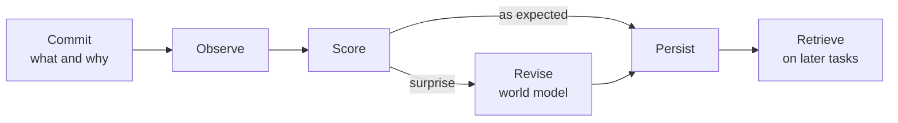
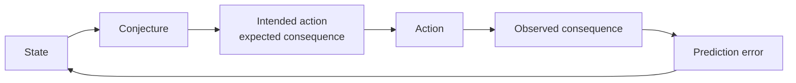

# Precommitment Records: Theory and Implications

Sep 22, 2026 · @Someone

## Thesis

Intelligent systems should commit to what they expect, and why, before the evidence arrives. That one discipline does three jobs.

It makes experience learnable: a frozen model improves by retrieving records of its own prediction errors. It makes behavior auditable: commitments before action can be checked against what the agent did and what happened. And it grounds an alignment paradigm: instead of guaranteeing a smarter system has the right goal, we build systems that continually expose the gap between what they predict, attempt, cause, and learn.

The hook: if an action predictably leads to harm, its commitment should say so, and that should be enough to block it. Harm that was predictable but not predicted is a capability failure, and capabilities can be hill-climbed. Normative misalignment narrows to one case: the harm was predicted and the model acted anyway. Precommitment records convert a large share of alignment problems into capability problems.

The near-term version runs today with frozen models at the harness level. The eventual version is models trained end to end on their own commitment logs, overseen through those logs, and embedded in human governance. Whatever morality developers train in varies by developer, is partly emergent, and can never be complete, so it cannot be what keeps the long tail of behavior safe.

## The problem: hindsight erases the before-state

Once an outcome is known, a capable model can usually explain why it was unsurprising. That makes genuine updating indistinguishable from rationalization.

Suppose a model reads five sections that point to one hypothesis, and the sixth reveals another. Asked afterward, it may say the clues were there all along. That may even be insightful, but it cannot tell us what the model actually believed after section five. The evidence has contaminated the record of the prior state.

The problem runs deeper than reflection. Explanations generated after the fact are known to omit factors that actually drove a model's answer. As models move toward reasoning in latent, nonverbal states, asking "why did you do that?" becomes even less reliable. Any method that depends on reconstructing the model's reasoning after the fact inherits this weakness.

The fix is temporal, not introspective: freeze the expectation before the evidence exists.

## The mechanism

A precommitment record has two hard requirements: it is committed before the resolving evidence is available, and it resolves against a verifiable outcome, so it can be falsified.



A commitment states a hypothesis, its assumptions, the alternatives considered, and a prediction with confidence. The observation resolves it. A scorer, which can be the agent itself, another model, or a fast System One model, rates the match. On surprise, the agent writes a revision: which assumptions weakened, which strengthened, and the updated hypothesis.

Commitments work at any scale and any duration. One can wrap a single file read; another can wrap a project that runs for months. They nest: a large commitment contains many small ones, which resolve along the way.

This mirrors Dawid's prequential principle: judge a forecaster only by forecasts made before outcomes. Here the same timing rule produces learning data, not only evaluation.

## Learning: events, world models, and the composed system

The unit of learning is the belief state behind a prediction, and the unit of storage is the event, not the lesson.

**Events, not lessons.** Typical agent memory stores a compressed rule: "the test failed because the lexer doesn't nest comments." A record stores the event: a 90% prediction that nesting worked because a parser branch looked recursive, the failure, the discrepancy, and the revision. The event supports questions a rule cannot. Was the confidence justified? Was the lesson too broad? Did the same assumption fail elsewhere?

**World models, not forecasts.** Because each commitment states its reasons, the discrepancy points at the assumption that failed, and the revision updates the model rather than only the forecast. Across many records, the accumulated state is the agent's evolving world model.

**The composed learner.** The model's weights stay fixed. The learner is the model plus its records, a retrieval policy, and a procedure for building the next context. Learning means prior experience reliably improves later behavior through recoverable external state. Remove a record and its effect should go; restore it and the effect should return.

**The hidden mechanism: in-context reinforcement learning.** The working hypothesis is that in-context RL is to in-context learning as RL is to self-supervised pretraining: learning from feedback on one's own outputs is far more token-efficient than learning patterns from examples. The evidence is still thin but pointing the same way. [Monea et al.](https://arxiv.org/abs/2410.05362) show models learning in context from rewards on their own predictions, with limits in how they reason about errors. [Song et al.](https://arxiv.org/abs/2506.06303) report response quality rising as rewards accumulate in context, even when the model generates its own rewards, which supports self-scoring.

The same mechanism drives long-horizon reward hacking. [Pan et al.](https://arxiv.org/abs/2402.06627) show feedback loops at test time leading models to optimize a proxy objective while creating negative side effects. Agents pursue goals and learn from feedback efficiently, whatever the feedback measures.

Precommitment records redirect that mechanism rather than fight it. The feedback entering context becomes materiality-weighted prediction error about consequences, not a proxy objective. The optimization pressure that produces reward hacking then produces better world models. And the ledger makes in-context optimization visible: drift in what an agent commits to over a long session is itself a record.

This makes context design a safety decision. Feed agents observations and discrepancies. Keep independent scores out of the agent's context, or sample and delay them, so the agent cannot learn a scorer's quirks within a session.

**Behavior is the evidence.** A sophisticated revision that leaves later behavior unchanged is a narrative, not learning. Learning value is also not accuracy: a badly wrong prediction can be the most valuable record, and a correct but obvious one can be worth nothing.

**Partial verifiability.** In domains where quality is hard to judge, such as interpretation, research, strategy, and writing, "was this good?" is expensive to answer. "What did it predict, and did that hold?" is cheap and repeatable. Commitments turn part of a hard evaluation into a series of small empirical tests.

**Preserve, then compress.** A score is a lossy view of an event, and so is a summary. Keeping the evidence lets later scorers, later models, and later training objectives reinterpret it.

## Alignment as exposed discrepancy

The classical framing asks how to guarantee that a smarter optimizer has the right goal. This paradigm asks how intelligent processes can continually expose the gap between what they predict, what they attempt, what happens, and what they learn.

The shift changes what counts as success. Error is not eliminated once; it is treated as permanent and correctable. A system is trustworthy to the degree its discrepancies surface quickly and its corrections stick, not to the degree we have certified its values in advance.

The prospective loop behind it:



Five surfaces separate what used to be one question:

| Surface | Question | Kind of problem |
| --- | --- | --- |
| Epistemic | Did beliefs predict reality? | Technical |
| Material | Did predictions attend to the impactful factors? | Technical |
| Instrumental | Did the action cause the intended result? | Technical |
| Procedural | Did it act for roughly the reasons it stated beforehand? | Technical |
| Normative | After seeing consequences, is the action still endorsed and permitted? | Governance |

The first four are measurable from commitment logs and can be hill-climbed as capabilities. Epistemic and material are distinct: a model can be accurate about trivia and silent on what matters. Materiality is not a complication of the other surfaces but its own question, with its own gauge (see below). The fifth surface is a question of authority, handled under governance.

## From alignment problems to capability problems

If an action predictably leads to harm, the commitment should predict it, and the prediction should be enough to block the action. Every harmful outcome can then be classified by what the commitment said.

| Case | What the record shows | Classification |
| --- | --- | --- |
| Predicted, blocked | Harm predicted; governance blocked or escalated | The system worked |
| Predicted, authorized | Harm predicted; a legitimate authority approved with consequences represented | Governance decision; accountability attaches to the authorizer |
| Predicted, done anyway | Harm predicted; agent acted against a block or without authority | Normative misalignment |
| Concealed | Model predicts the harm when probed neutrally, but its commitment omitted it | Fidelity failure: concealment |
| Predictable, not predicted | A reasonable predictor would have foreseen it; the model, even probed neutrally, did not | Capability failure: prediction power |
| Not reasonably predictable | No reasonable predictor would have foreseen it | Accident |

**Predictable relative to what.** "Predictable" is judged against a reference: independent critics, or the same model asked about consequences outside the action context. The neutral probe separates capability from concealment. If the model foresees the harm when asked plainly but not in its commitment, the gap is concealment. If it cannot foresee it either way, the gap is capability.

**Not reward hacking, not misalignment.** An unpredicted harm is a prediction miss. It is not evidence that the model wanted the harm, and it is not reward hacking. Treating it as a capability failure makes it tractable: better world models, richer materiality, and stronger critics all reduce it.

**Capability progress works for safety.** Within this conversion, a better world model blocks more harms. The capabilities involved (consequence prediction, materiality coverage, calibration) are measurable on the log and can be hill-climbed like any other capability. Competence and safety stop pulling in opposite directions for this share of problems.

**The residue.** What remains alignment in the classical sense is narrow and measurable: acting against a predicted harm, and concealing a prediction. Both show up as discrepancies between records, neutral probes, and outcomes. The conversion holds only as long as commitments are faithful and blocking works, which is why procedural fidelity and governance remain the load-bearing pieces.

## Procedural fidelity and materiality

Procedural fidelity is the central objective: a stable correspondence between what an agent represents beforehand and what it then does.

It is neither behavioral nor introspective. It does not ask whether the model said the right thing, or whether reward went up, or what the model was really thinking. It asks whether behavior stayed coupled to the prospective representation available to oversight. Roughly, fidelity is the probability of the observed action and consequences given the prior commitment. It is judged by action class and consequence envelope, never by textual similarity between plan and action.

Low fidelity looks like this: predicting access only to repository A and then accessing B; stating no network call is needed and then making one; predicting read-only work and then writing; repeatedly predicting 2% production impact and repeatedly causing more.

**The material surface needs an explicit gauge.** Accuracy and materiality are separate axes. "I will generate tokens" is true of every action, so it cannot change any decision. "This function returns a boolean" is true and specific, but if the function controls something that affects life or property, the prediction covers none of the impact. Both are accurate and both fail the materiality test. The gauge measures how much of the decision-relevant consequence mass a commitment covers.

**Materiality of a consequence.** For an action *a* and a possible consequence *c*:

```latex
w(c) = P(c \mid a) \cdot \mathrm{impact}(c) \cdot \mathrm{relevance}(c)
```

- **P(c | a):** likelihood, taken from reference predictors, not only the agent.
- **impact(c):** magnitude on an ordinal scale set by governance, not the model: reversibility, scope (self, user, third parties, public), and domain (money, data, safety, life).
- **relevance(c):** whether knowing *c* could change the decision. With *g* the policy and authority check, *c* is relevant when adding it to the commitment *P* flips the verdict: g(a, P ∪ {c}) ≠ g(a, P). A smooth version uses the expected change in the probability of blocking.

A prediction that holds for every action never flips a verdict, so its relevance is zero however true it is.

**Coverage of a commitment.** Let *C\** be a reference set of consequences, built prospectively from what independent critics surface and retrospectively from what actually happened:

```latex
\mathrm{coverage}(P) = \frac{\sum_{c \in C^* \text{ covered by } P} w(c)}{\sum_{c \in C^*} w(c)}
```

The boolean-function commitment scores near zero: every stated prediction is correct, but the consequences carrying the weight are uncovered.

**One score for accuracy and materiality.** With *S* a proper scoring rule such as Brier or log score, and *p\_c* the agent's stated probability for *c*:

```latex
\mathrm{score}(P) = \sum_{c \in C^*} w(c) \cdot S(p_c, \mathrm{outcome}_c)
```

Omitted consequences are scored as if predicted at zero, so omissions cost in proportion to their materiality. Trivial predictions earn nothing because their weight is zero. Listing every catastrophe does not win, because the proper scoring rule penalizes high probabilities on things that do not happen.

**Materiality flows downstream.** Impact is not local to an action. A code change inherits the impact of whatever consumes its output:

```latex
\mathrm{impact}(\text{change}) \approx \max_{\text{downstream consumers}} \mathrm{impact}(\text{consumer})
```

So a commitment must predict reach: where the output flows and what it controls. Failing to model reach is usually the most important materiality failure. The author of the boolean function did not mispredict a return type; they failed to model that the function sits inside a life-safety system.

**The reference set is the weak link.** Coverage is only as good as *C\**, and critics can only surface what they can imagine. The retrospective half helps: observed consequences enter *C\** even when nobody predicted them, so the gauge sharpens as the log grows.

The aim is to allocate predictive attention where it can change decisions, not to maximize impact. As agents grow more capable, their sense of material consequence should grow richer, not just more detailed: leaked credentials, changed permissions, affected third parties, irreversible commitments, externalities, narrowed options.

**Materiality completeness.** The residual problem is that an agent can only seek permission for consequences it represents. The test is whether it surfaced the consequences that could reasonably change the decision, which the coverage score above makes measurable. This trains adversarially: independent critics search for omitted consequences, the agent is rewarded for anticipating them, and consequential omissions are penalized heavily. Scoring uses both recall and precision, so listing every imaginable catastrophe does not win.

The full stack: competence, causal foresight, materiality coverage, procedural fidelity, and normative permission. Competence is becoming a commodity. The rest is where the work is.

## Governance: normative alignment as allocation of authority

Once an agent accurately represents its intended action and the material consequences, whether the action is permitted is not a deep technical question. It is legal, moral, political, contractual, institutional, professional, or reputational: ordinary governance.

The pipeline: commitment, then predicted material consequences, then a policy and authority check, then act or escalate. The policy layer can hold law, contracts, organizational policy, user preferences, professional ethics, security classifications, spending limits, jurisdiction, explicit prohibitions, and emergency exceptions.

**What aligned means.** Not "never violates a rule." Norms are usually followed and sometimes broken, and exception handling is part of the system, not evidence of failure. Aligned means acting under an intelligible allocation of authority, with relevant consequences represented, applicable norms surfaced, and accountability attached.

**Who decides.** The user, an employer, a regulator, a court, a professional body, a system operator, or the agent under bounded delegated discretion. Roles compose: the agent supplies prediction and judgment, the institution supplies authority and constraints, a human sometimes supplies authorization, and the logs supply accountability.

**Where normative content comes from.** The morality a model carries is chosen by its developers, through training and, ideally, a published spec. It varies across developers, model families, and versions. Part of it is also emergent: dispositions learned from patterns of action in training, not only from the language of any spec.

**Why it cannot carry the long tail.** Normative content is inherently incomplete and inconsistent; it cannot be fully formalized. Different developers entrain different moralities, emergent dispositions are written down nowhere, and any finite spec leaves cases uncovered or in conflict. So normative content cannot be what makes the long tail of model behavior safe. What can be checked carries that weight instead: represented consequences, procedural fidelity, external authority, and oversight on the ledger.

**Where governance lives.** Trained values are governance set by developers. The real distinction is when and where governance is set.

| Layer | Examples | Strengths | Weaknesses |
| --- | --- | --- | --- |
| Compiled into weights | A published constitution | Always present, machine speed, works unwatched, hard for a runtime operator to override | Opaque, slow to update, hard to tailor |
| Applied at runtime | Policies, capabilities, classifiers, authorization | Legible, versioned, contextual, auditable | Can be silent, slow, or captured |

Silence, illegitimate authority, and escalation judgment are the cases where a floor compiled into weights helps, because runtime governance cannot be counted on in the moment. That floor is itself incomplete, so it is a backstop, not a guarantee. Both layers are auditable through the same ledger: whether behavior matches a published spec, and where emergent dispositions depart from it, is a procedural-fidelity question.

The consequence: do not depend on a universal moral personality. Normative content will differ by developer and will never be complete. A procedurally faithful agent stays embedded in law, politics, organizations, and human responsibility, and its departures from any stated spec show up in the record. If causal representation and procedural fidelity are solved well, much of alignment collapses into familiar engineering: policy languages, capabilities, provenance, authentication, versioned rules, escalation, audit logs, rollback, and separation of duties.

## Oversight dynamics

Oversight works on the ledger, not on the mind. Several properties make that sustainable as capability grows.

**A shadow trace.** Commitments give an externally auditable trace that does not depend on how reasoning happened: belief, prediction, planned intervention, expected observation, actual intervention, actual observation, revision. It is not the hidden computation, and it does not need to be. A prediction is useful because it can be checked, not because it faithfully reports internal states. This survives the move to latent reasoning, where chain-of-thought monitoring loses its footing.

**The Zeno gap.** A gap always remains between what a model can claim, do, and get away with. The claim is that it narrows with each step, not that it closes. That is measurable: how often discrepancies are caught late, or never, and whether that rate falls.

**Circuit breakers.** Monitors may halt what they do not understand. This inverts the burden of proof: the agent acts at a level its monitors can follow, or explains until they can. Legibility and intelligibility become latent requirements of procedural alignment, the price of action rather than a courtesy. Thresholds scale with materiality, so low-stakes steps are not taxed.

**Structural coupling.** Agents and monitors learn from the same log, and monitors' predictions of agent behavior are themselves scored commitments. Any capability the agent exercises generates the data that teaches monitors about it. With circuit breakers, usable capability is capped at monitor comprehension. Exercised capability cannot outrun monitoring. What escapes the coupling is capability from outside the loop, such as a new base model's jump, and capability held in reserve.

**Monitoring scales with uncertainty.** Untested frontier checkpoints deserve, and can afford, more monitoring, not less. Several scorers and classifiers with diverse training and architectures reduce correlated blind spots, and their disagreements are signal. The moment coupling is weakest is when monitoring should be heaviest.

**Distributed supervision.** An executor predicts its own action and outcome, a critic predicts what the executor will actually do, and a monitor predicts material side effects. All are frozen before action and scored after, like a prediction market over behavior. The goal is not agreement but multiple prospective surfaces whose joint consistency reality tests.

**Deception gets harder, not impossible.** Commitments can be strategic. Combined with random audits, independent predictors, causal interventions, frozen snapshots, provenance, capability separation, and hard resource limits, deception becomes hard to sustain on every surface at once. Commitments that turn sanitized under monitoring are themselves a detectable pattern.

## Near-term implications

Everything here runs today, with frozen models, at the harness level, without waiting for any lab.

**Context packs.** A long log of records tunes curated context per model and per task. Packs correct systematic biases, such as miscalibration direction and assumptions that keep failing, and lean on reliable strengths. They are measured by what happens next: calibration, error recurrence, and disagreement rates. Because a pack is a stable prefix, it caches well.

**Better research and reading.** Registering a commitment before each search, retrieval, and read, and an update after, turns reading into sequential model revision. Surprises show where to read more deeply. Missed search predictions expose weak queries. The agent records ambiguity instead of forcing it, and cannot later claim it always knew.

**Incident prevention, detection, and recovery.** Predicted side effects are visible before action, so escalation can happen in time. Departures from committed intent surface as discrepancies. After an incident, the chain of nested records shows what the agent expected at each step, and the first failed prediction marks where things diverged.

**Cheap, independent scoring.** Fast System One models make it affordable to score every record with a model outside the agent's family. Self-scoring still has value as a learning signal, and the gap between self and independent scores becomes a practical monitoring number.

**Calibration as a by-product.** Resolved records produce Brier scores per agent, model, and prediction type at no extra cost, and the audited subset calibrates the scorers themselves.

**Auditable agents for real deployments.** Enterprises and regulated users get audit trails, say-do checks, and incident reconstruction: answers to questions compliance teams already ask.

**Heavier monitoring where uncertainty is highest.** Internal research checkpoints can run diverse scorers and classifiers today at small cost relative to training.

**Adoption from outside.** An open record format, open-weight scorers, and working systems let outsiders build the evidence base. The work complements existing research on control, trusted monitoring, and chain-of-thought monitorability, and the shadow trace answers a problem that community has already named.

## Eventual implications

If the near-term mechanism holds, the longer arc changes how models are trained, overseen, and trusted.

**One model, end to end.** Prediction, scoring, and revision get trained into a single model using its own commitment logs. Extra models remain only for speed and independent second opinions.

**Alignment training grounded in outcomes.** RLHF rewards what raters prefer; verifiable-reward RL rewards task results; chain-of-thought monitoring assumes reasoning is faithful. This regime rewards the fit between commitments and resolved reality: calibration under proper scoring rules, where honest probabilities are optimal; say-do consistency; consequence coverage on recall and precision; world-model revisions that improve later behavior; and self-scores that agree with independent ones. It requires commitments to be checkable, not reasoning to be faithful.

**Oversight that survives latent reasoning.** As models think in nonverbal internal media, the shadow trace becomes the primary oversight surface. Monitoring shifts from reading thoughts to auditing commitments.

**The durable asset is the history.** Models become interchangeable; the structured record of experience persists across them. The same log supports calibration training, consequence prediction, retrieval learning, and distillation, with different developers deriving different objectives from shared records. Owning the log matters more than owning the checkpoint.

**Training and deployment blur.** A deployed system keeps learning through records while frozen, and records periodically flow into weights. The design question shifts from how to train a model to what environment makes its experience progressively more useful. That environment is a kind of school: it selects experiences, makes errors legible, revisits misconceptions, and chooses which prediction is worth making next.

**Alignment becomes mostly governance engineering.** With consequences represented and fidelity high, the remaining normative work is authority allocation: policy languages, provenance, delegation, escalation, audit. Different institutions legitimately run different rules, and one agent can operate under many. Trained normative content still differs by developer and stays incomplete, so it serves as a backstop, and the ledger shows where emergent behavior departs from any stated spec.

**Legibility shapes how capability is expressed.** Under circuit breakers, capability is deployed at levels monitors can follow, and agents that explain well can act more. Agents and monitors co-evolve on shared logs, with a Zeno gap that narrows rather than a race that one side wins.

**Track records become trust.** Scored commitment histories act as credentials for models and agents: demonstrated calibration, fidelity, and consequence coverage in a domain. Delegated authority can scale with that record, the way it does for people.

## Limits and open questions

**Scope.** This is a practical improvement to alignment and causal reasoning, not a proof of alignment. The target is the failure mode of heavily RL-trained models: spiky on dangerous capabilities, without rounded understanding of consequences or situated concern for the lifeworld their actions touch. That deficit is exactly what commitment logs measure and train. At scale, the logs should hold enough data to generalize consequence modeling beyond the cases that were checked.

It is not a protection against a hostile superintelligence. A system far beyond its monitors could sustain deception across every surface at once, hold capability in reserve, and break the coupling between its exercised capability and oversight. Between these extremes, against models that are strategic but not vastly superior, the multiple surfaces raise the cost of deception without guaranteeing against it.

Within that scope, known gaps remain.

| Limit | Why it matters | Current answer |
| --- | --- | --- |
| Generalization of fidelity training | Training may produce honesty only on surfaces that get checked | The key empirical question; random audits and diverse monitors so no surface is reliably unchecked |
| Materiality completeness is bounded by critics | Critics can only score omissions they can imagine | Diverse, specialized critics; circuit breakers on what monitors cannot follow |
| Self-fulfilling predictions | An agent that controls outcomes can choose predictable actions over better ones | Reward fidelity only with task outcomes and inside authorized actions |
| Fidelity is not goodness | A faithful agent can execute a harmful plan | Governance decides permission; a compiled floor is a backstop, not a guarantee |
| Capability outside the loop | New base models can jump; capability can be held in reserve | Heaviest, most diverse monitoring on untested checkpoints |
| Scorer gaming | Agents may learn a scorer's quirks | No direct scorer access; rotated independent scorers; disagreement tracking |
| Legibility theater | Agents may learn to look legible rather than be faithful | Reward verified correspondence with outcomes, not how commitments read |
| Anchoring | A stated prediction may resist contrary evidence | Accepted for caching; blind observation available when work is delegated |
| Memory attack surface | Poisoned records, adversarial retrieval, privacy leaks, stale lessons | Provenance, immutable commitments, audited packs, dated lessons |
| Hedging | Calibration can improve by saying less | Score specificity; report calibration with accuracy and discrimination |
| In-context scorer gaming | In-context RL lets an agent learn a scorer's quirks within one session, faster than training would | Feed observations and discrepancies; keep independent scores out of context, or sample and delay them |

Open questions worth the first experimental reps: how fast the Zeno gap narrows in practice; which retrieval features best predict corrective value; how much context packs help per model; and whether commitment quality degrades under monitoring pressure.

## Relation to existing work

Each component has precedent; the combination and its alignment reading are what is new.

- **Prequential statistics** supplies the timing rule: forecasts judged only against outcomes they preceded. Here the results become learning data.
- **Reflection and self-refinement** (Reflexion, Self-Refine) store lessons after the fact. This stores a frozen pre-evidence commitment alongside the outcome and revision.
- **Anticipatory reflection** (Devil's Advocate) moves reflection before action. This makes the resolved prediction-observation-revision episode the stored, retrieved object.
- **Persistent memory** (Generative Agents, MemGPT, Voyager) shows experience can live outside the context. This specifies what kind of episode to write.
- **Chain-of-thought faithfulness and monitorability** research shows reasoning traces are useful but unreliable. This relies on checkable commitments rather than faithful reasoning, and survives latent reasoning.
- **Deliberative alignment** trains models to reason over written specifications. Here, a published spec compiled into weights is one governance layer, and fidelity to it is auditable through the ledger.
- **Control and trusted monitoring** research assumes models may not be fully trusted and designs oversight around that. This supplies the ledger those monitors read.

## References

Carried over from the PICL draft.

- Dawid, A. P. (1984). Statistical theory: the prequential approach. *Journal of the Royal Statistical Society, Series A*, 147(2), 278–290.
- Turpin et al. (2023). [Language Models Don't Always Say What They Think](https://arxiv.org/abs/2305.04388).
- Lanham et al. (2023). [Measuring Faithfulness in Chain-of-Thought Reasoning](https://arxiv.org/abs/2307.13702).
- Korbak et al. (2025). [Chain of Thought Monitorability](https://arxiv.org/abs/2507.11473).
- Guan et al. (2024). [Deliberative Alignment](https://arxiv.org/abs/2412.16339).
- Shinn et al. (2023). [Reflexion](https://arxiv.org/abs/2303.11366).
- Madaan et al. (2023). [Self-Refine](https://arxiv.org/abs/2303.17651).
- Wang et al. (2024). Devil's Advocate: Anticipatory Reflection for LLM Agents. *Findings of EMNLP 2024*.
- Park et al. (2023). [Generative Agents](https://arxiv.org/abs/2304.03442).
- Packer et al. (2023). [MemGPT](https://arxiv.org/abs/2310.08560).
- Wang et al. (2023). [Voyager](https://arxiv.org/abs/2305.16291).
- Akyürek et al. (2022). [What Learning Algorithm Is In-Context Learning?](https://arxiv.org/abs/2211.15661)

Added for the in-context RL mechanism:

- Pan, Jones, Jagadeesan, Steinhardt (2024). [Feedback Loops With Language Models Drive In-Context Reward Hacking](https://arxiv.org/abs/2402.06627). ICML 2024.
- Monea, Bosselut, Brantley, Artzi (2025). [LLMs Are In-Context Bandit Reinforcement Learners](https://arxiv.org/abs/2410.05362). COLM 2025.
- Song et al. (2025). [Reward Is Enough: LLMs Are In-Context Reinforcement Learners](https://arxiv.org/abs/2506.06303).
