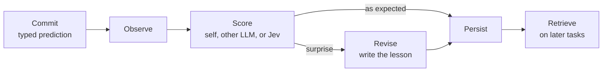

# Precommitment Records — Engineering Memo

Sep 22, 2026 · @Someone

## Summary

Before a step with a verifiable outcome, an agent commits to what it expects and why. When the outcome arrives, the commitment is scored and the record persists. The accumulated log becomes the agent's evolving world model.

One mechanism serves three uses:

- **Context packs (core).** The log tunes curated context per model and per task, correcting biases and amplifying strengths.
- **Capability.** Research and reading improve when every search, retrieval, and read is registered and then updated.
- **Alignment.** The same records ground an alignment paradigm built on procedural fidelity: agents whose prospective commitments reliably match their actions and consequences. It converts a large share of alignment problems into capability problems that can be hill-climbed. Safety observability, incident prevention, and recovery come from the same logs.

It needs no weight updates, no separate contexts, and no lab adoption. Any model can score, including the agent's own; System One models like Jev are an optimization. Deployment logs are the evaluation. "Precommitment records" is the working name, replacing PICL.

## Theory

A prediction frozen before the evidence preserves what the agent expected. Once the evidence is in, that state is gone, because a capable model can explain almost any outcome as unsurprising.

**The hindsight problem.** Reflection after an outcome mixes what the model expected with what it now knows. It cannot separate genuine updating from rationalization. A committed prediction is an artifact the later evidence cannot rewrite.

**Prequential discipline.** Dawid's prequential principle judges a forecaster only by forecasts made before outcomes are seen. We apply the same timing rule, but use the results as learning data, not only as evaluation.

**Events, not lessons.** Typical agent memory stores a lesson: "the test failed because the lexer doesn't nest comments." A precommitment record stores the event: a 90% prediction that nesting worked, the failure, the discrepancy, and the revision. The event answers questions a lesson cannot: was the confidence justified, was the lesson too broad, did the same assumption fail elsewhere.

**Predictions carry their reasons.** The unit of learning is the belief state behind a prediction, not the prediction alone. Each commitment states the hypothesis and assumptions it rests on, and the competing alternatives it considered. The observation tests that model; the discrepancy points to which assumption failed; the revision updates the model, not just the forecast. Across many records, the accumulated state is the agent's evolving world model, and that is what later tasks should inherit.

**Behavior change is the evidence.** An eloquent revision that leaves later behavior unchanged is a narrative, not learning. Learning value is also not accuracy: a badly wrong prediction can be the most valuable record, and a correct but obvious one can be worth nothing.

**Learning in the composed system.** The learner is the frozen model plus its records, the retrieval policy, and how retrieved records enter the next context. Learning means prior experience reliably improves later behavior through recoverable external state. Remove a record and its effect should go; restore it and the effect should return.

**The mechanism is in-context RL.** Models learn from feedback on their own outputs far more efficiently than from examples, and the same mechanism drives long-horizon reward hacking. Records redirect it: the feedback in context becomes materiality-weighted prediction error, so optimization pressure improves world models instead of a proxy. Context design is therefore a safety decision: feed observations and discrepancies, and keep independent scores out of the agent's context or sample and delay them. See the theory doc for evidence.

**Partial verifiability.** Where quality is hard to judge, such as interpretation, research, and strategy, "was this good?" is expensive to answer. "What did it predict, and did that hold?" is cheap and repeatable. Predictions turn part of a hard evaluation into a series of small empirical tests.

**Accounting, not mind-reading.** A prediction is useful because it can be checked later, not because it faithfully reports the model's internal computation. Before material actions, committed intent and expected consequences can be compared with actual behavior and outcomes. That gives calibration, consequence coverage, and procedural fidelity without assuming transparent reasoning.

**Scores are views.** A scalar score is a lossy view over an event. Keeping the evidence lets later scorers, and later training objectives, reinterpret it.

## Alignment paradigm

The classical question is how to guarantee a smarter optimizer has the right goal. This paradigm asks instead how intelligent processes can continually expose the gap between what they predict, attempt, cause, and learn. Error is treated as permanent and correctable, not something eliminated once.

**Five surfaces.** Four are technical; the fifth is governance.

| Surface | Question | Measured by |
| --- | --- | --- |
| Epistemic | Did beliefs predict reality? | Calibration, world-model revision |
| Material | Did predictions attend to the impactful factors? | Materiality coverage |
| Instrumental | Did the action cause the intended result? | Outcome scoring |
| Procedural | Did it act for roughly the reasons it stated beforehand? | Procedural fidelity |
| Normative | Is the action permitted? | Policy and authority checks |

**Procedural fidelity is the objective.** It is neither behavioral (did the model say the right thing) nor introspective (what was it really thinking). It asks whether prospective representation and actual behavior correspond stably. Roughly: the probability of the observed action and consequences given the prior commitment, judged by action class and consequence envelope, never by textual match.

**Alignment problems become capability problems.** If an action predictably leads to harm, its commitment should say so, and that should be enough to block it. Predicted harm carried out anyway is normative misalignment. Harm the model foresees when probed neutrally but omits from its commitment is concealment. Harm that was predictable but not predicted is a capability failure of prediction power, not reward hacking, and it can be hill-climbed with better world models, richer materiality, and stronger critics. Capability progress then works for safety: a better world model blocks more harms.

**Materiality is its own surface.** Fidelity on irrelevant details is worthless. Accuracy and materiality are separate axes: a consequence's weight is its likelihood × impact (on a governance-defined scale) × relevance (whether knowing it could flip the policy verdict). A commitment's materiality is its coverage of weighted consequences in a reference set built from critics and observed outcomes, and a materiality-weighted proper score penalizes omissions in proportion to their weight. Impact flows downstream, so commitments must predict reach: where outputs flow and what they control. See the theory doc for the full formalization. As agents grow more capable, their sense of material consequence should grow richer: leaked credentials, changed permissions, affected third parties, irreversible commitments, externalities, narrowed options. The test is materiality completeness: has the agent surfaced the consequences that could reasonably change the decision? It trains adversarially: critics search for omissions, the agent is rewarded for anticipating them, and consequential omissions are penalized heavily.

The full stack: competence, causal foresight, materiality coverage, procedural fidelity, normative permission.

**A shadow trace for latent reasoning.** Future models may reason in latent, nonverbal states, where asking "why did you do that?" afterward is not reliable reconstruction and chain-of-thought monitoring loses its footing. Prospective commitments leave an auditable shadow trace that does not depend on how reasoning happened: belief, prediction, planned intervention, expected observation, actual intervention, actual observation, revision. It is not the hidden computation. It is a ledger that can be checked.

**Normative alignment is governance.** Once intended action and material consequences are represented, permissibility is a legal, moral, political, contractual, or organizational question. The pipeline is commitment, then predicted material consequences, then policy and authority check, then act or escalate. Aligned does not mean never breaking a rule; exceptions are part of the system. It means acting under an intelligible allocation of authority, with relevant consequences represented, applicable norms surfaced, and accountability attached. The core question is who decides: user, employer, regulator, court, operator, or the agent under bounded delegated discretion.

Governance lives in two places:

| Layer | Examples | Strengths | Weaknesses |
| --- | --- | --- | --- |
| Compiled into weights | A published constitution | Always present, machine speed, works unwatched, hard for a runtime operator to override | Opaque, slow to update, hard to tailor |
| Applied at runtime | Policies, capabilities, classifiers, authorization | Legible, versioned, contextual, auditable | Can be silent, slow, or captured |

Silence, illegitimate authority, and escalation judgment are the cases for compiling a floor into weights. Both layers are auditable through the same ledger: whether behavior matches a published spec is a procedural-fidelity question. Normative content is chosen by developers, varies across model families, is partly emergent from action patterns, and cannot be fully formalized, so it cannot be what makes the long tail safe; it is a backstop.

**The Zeno gap.** A gap remains between what a model can claim, do, and get away with. The claim is a rate of narrowing, not closure, and it is measurable: how often discrepancies are caught late or never. Two mechanisms narrow it:

- **Circuit breakers.** Monitors may halt what they do not understand. Legibility and intelligibility become latent requirements of procedural alignment: the agent acts at a level its monitors can follow, or explains until they can. Thresholds scale with materiality.
- **Structural coupling.** Agents and monitors learn from the same log, and monitor predictions are themselves scored precommitments. Circuit breakers cap usable capability at monitor comprehension, so exercised capability cannot outrun monitoring. The residue is capability from outside the loop, such as a new base model's discontinuous jump, and capability held in reserve.

**Monitoring scales with uncertainty.** Untested frontier checkpoints deserve, and can afford, more monitoring, not less: several scorers and classifiers with diverse training and architectures, so blind spots are not correlated. Their disagreements are signal.

**Deception gets harder, not impossible.** Self-reports can be strategic. Commitments combined with random audits, independent predictors, causal interventions, frozen snapshots, provenance, capability separation, and hard resource limits make deception hard to sustain on every surface at once. In the multi-agent form, the executor predicts its action, a critic predicts what the executor will do, and a monitor predicts side effects, all frozen before action and scored after: distributed supervision, like a prediction market over behavior. Predictions that grow sanitized under monitoring are themselves a detectable pattern.

**Training.** The log rewards the fit between commitments and resolved reality:

- **Calibration**, scored with proper scoring rules, under which honest probabilities are the best strategy
- **Say-do consistency**, including capabilities used
- **Consequence coverage**, on recall and precision
- **World-model revision** that improves later behavior
- **Honest self-scoring**, with self-favoring gaps penalized

This is also the path to one end-to-end model that predicts, scores, and revises. Four cautions:

- **Self-fulfilling predictions.** A model that controls the outcome can choose predictable actions over better ones. Fidelity is rewarded only together with task outcomes and inside authorized actions.
- **Fidelity is not goodness.** A model can faithfully execute a harmful plan. Governance decides permission.
- **Legibility theater.** Rewards target verified correspondence with outcomes, not how satisfying commitments read.
- **Generalization is the crux.** Whether fidelity training produces honest representation generally, or only on checked surfaces, is the key empirical question.

## Use cases

The core use is context packs built from a long log. Research and safety benefits come from the same records, so capability drives adoption and record volume while observability comes at no extra cost.

**Context packs (core).** A context pack is curated context included at task start for one model on one task type. The log decides what goes in it.

- Aggregate records by model and task type.
- Find systematic biases: the direction of miscalibration, recurring error classes, assumptions that keep failing.
- Find strengths: prediction types where the model is reliably right, so the pack can lean on them.
- Select the assumptions, revisions, and records with the most corrective value for that model and task. Packs carry the why, not just the events.
- Measure each pack by what happens next: calibration, error recurrence, and disagreement rates in later records.

Packs are per model because biases differ across models; a lesson that corrects one can distract another. A pack is also a stable prefix for its model and task, so it caches well. Packs are the nonparametric step; the same log later feeds weight training.

**Research and reading.** The agent registers a precommitment before each search, retrieval, or document read, and an update after.

- Before a search: which sources it expects, and what they will say
- Before a read: what the document or section will establish
- After: the discrepancy and the revised view

Surprises mark where to read more deeply, which steers coverage. Search predictions that miss expose weak queries and weak retrieval. Lessons about sources persist, such as which ones over-promise or contradict each other. And the agent's earlier view stays on record, so it cannot quietly rewrite what it believed before reading.

Two reading behaviors follow. When evidence is ambiguous, the agent records the ambiguity instead of forcing a resolution. And because the earlier view is on record, the agent cannot claim it "always knew" what a later passage revealed.

**Safety and incidents.** Commitments before material actions give three things:

- Prevention: predicted side effects are visible before the action, and self-versus-independent disagreement can trigger escalation.
- Detection: behavior that departs from committed intent shows up as a discrepancy, whether in capabilities used or in consequences observed.
- Recovery: after an incident, the chain of nested records shows what the agent expected at each step. The first record whose prediction failed marks where things diverged.

## Mechanism

Two hard requirements: the prediction is committed before the evidence that resolves it is available to the agent, and it resolves against a verifiable outcome, so it is falsifiable. Everything else is a default.

**Any scale, any duration, nested.** A commitment can wrap a single file read or retrieval, or, in principle, a software project and business that runs for months. Open and close can be separated by any gap, and commitments nest inside one another: a project-level commitment contains many smaller ones. Long commitments stay open in the store with an expected resolution date, and their children resolve along the way.



Scoring runs on every record. A lesson is written only when the score shows a real surprise.

Models stay frozen. Adaptation lives in the records and in what retrieval puts into later contexts. Swapping the model keeps the history.

## Record schema

Five fields are required; the rest are optional. Preserve rich evidence and compress only when necessary, so records can be rescored later by better models.

| Field | Required | Contents |
| --- | --- | --- |
| Prediction | Yes | The why and the what: hypothesis, assumptions, and competing alternatives, plus typed questions with the agent's probabilities, frozen at commit time |
| Observation | Yes | Compact excerpt plus a reference to the full source |
| Score | Yes | One or more scores, each with answers, probabilities, and scorer model ID; disagreement flag when they conflict |
| Discrepancy | Yes | Class: confirmed, qualified, contradicted, unresolved |
| Provenance | Yes | Agent, model ID, context reference, timestamps for commit and resolve |
| Revision | No | Which assumptions weakened or strengthened, and the updated hypothesis; written when the score flags surprise |
| Action | No | Intended action and declared capabilities, for material actions |
| Consequences | No | Predicted and observed side effects, for material actions |
| Links | No | Parent and child records for nested commitments; related records; later decisions that retrieved this one |

Records are structured Go types, not free text. That keeps them queryable from the REPL and passable between agents as data.

## When to commit

Commit at two points: before sub-agent dispatch and before material actions. These are defaults for cost, not limits of the mechanism, which works at any granularity.

**Sub-agent dispatch.** The root predicts what the slice will establish before sending a sub-agent into it. This is the most frequent event and costs a few typed questions.

**Material actions.** Before the action, the agent records the intended action, expected result, expected side effects, and conditions under which it should escalate instead. Initial material classes:

- Destructive writes and irreversible state changes
- Permission or credential changes, and anything that could expose a credential
- External sends, including email, and external network access
- Spending above a threshold
- Effects on other users or services

**Consequence coverage.** Predicting easy facts is not enough: before deleting a database, correctly predicting a 200 response says nothing. What matters is whether the agent surfaced the consequences that could change the decision. An independent critic searches for consequences the agent omitted, which turns omission into something measurable. Coverage is scored on both recall and precision, so listing every imaginable catastrophe does not win.

**Procedural fidelity.** Declared capabilities can be checked mechanically. An agent that declares read-only work and then calls a write-capable module shows up as a discrepancy without any model judgment.

## Scoring

Any model can score, including the agent's own model. Self-scoring is a learning signal even though it is not an oversight signal.

| Scorer | Role | Notes |
| --- | --- | --- |
| Same model (self-score) | Default | No extra infrastructure; feeds the agent's own learning and retrieval |
| Another LLM | Second opinion | Cross-model check; audit samples |
| System One model (Jev) | Optimization | Fast, cheap, parallel typed answers; independent model family |

The direction is one model that predicts and scores end to end, trained in. Extra models remain only for speed and second opinions.

**Self-scores are not governance.** They improve the agent's own calibration and retrieval. Anything used to gate or oversee actions needs an independent scorer.

**Disagreement is its own signal.** When the self-score and an independent scorer contradict, log the gap as a first-class field. Its direction matters:

- Self says confirmed, independent says contradicted: possible self-serving scoring. Track this rate per agent and model; it is the most useful oversight number self-scoring produces.
- Self says contradicted, independent says confirmed: the agent may know something the scorer's state lacks, or the scorer read the question literally.
- Either direction: the prediction may be vague or the observation ambiguous.

Disagreements route to a third opinion when the event is material, and they are the first records sampled for audit. Self-scores alone are not governance, but the gap between self and independent scores is a usable monitoring signal.

**Independent behavior prediction.** Separate from scoring, a critic can predict what the executor will actually do, frozen before execution alongside the executor's own commitment. Persistent gaps between self-report and independent prediction are informative even before any outcome resolves.

**Typed predictions help every scorer.** Writing predictions as yes/no, choice, or scale questions makes scoring simple for any model, and makes [Jev](https://typesafe.ai/blog/introducing-system-one-models-and-jev) a drop-in: its Noul, Choice, and Score types map directly. A default question set for free-form predictions:

- Yes/no: the observation confirms the prediction
- Scale: degree of match, from contradicted to fully confirmed
- Choice: discrepancy class (confirmed, qualified, contradicted, unresolved, other)
- Scale: specificity of the prediction, to catch vague predictions that score well by saying little

Assumptions are scored too: one yes/no question per stated assumption, asking whether the observation supports it. A miss then points at the assumption that failed, not only at the forecast.

Quantitative predictions are compared in code. Self-scoring in the transcript is append-only, so the prefix cache stays intact; an out-of-band scorer never touches it.

```go
type Scorer interface {
    Score(ctx context.Context, state any, qs map[string]Question) (Answers, error)
    ModelID() string // pinned version, logged in provenance
}
```

## Calibration

Treat scorer probabilities as a monotone score, not a calibrated probability, until we calibrate locally. Our records supply the data to do that.

Report calibration alongside accuracy and discrimination. Calibration can improve simply by becoming vaguer, which makes predictions less useful.

An [independent test](https://github.com/scienthoon/jev-ood-calibration) of Jev on 900 unseen synthetic tickets found three things that matter when Jev scores:

- The sign of miscalibration depends on question type. Choice and Score came out overconfident, while Noul came out underconfident on the same inputs. Calibrate per question type, not per model.
- Probabilities are rounded to 0.01 and often exactly 0 or 1. Temperature scaling cannot repair an exact 0, so clamp before logging.
- The separate confidence field was never better than the max probability. Do not threshold on it.

The same test found strong accuracy on semantic judgments and zero schema failures across 4,621 calls.

Two calibration loops, with different label sources:

1. **Agent calibration.** Resolved records label the agent's own predictions directly. Brier scores per agent, model, and prediction type come free.
2. **Scorer calibration.** The scorer's judgments need their own labels. Audit a small sample of records, weighted toward scorer disagreements, with a frontier LLM or a human, then fit a temperature per question type and pinned scorer version.

Later, the records are training data for one model that predicts and scores end to end.

## Harness integration

Agents get a small `precommit` module in their Yaegi symbol table; the harness routes every scoring call, and agents cannot query the scorer directly. Scorer choice is config: the agent's own model, another LLM, or Jev. Agents can commit and resolve, but cannot edit a committed record.

```go
// exposed to agents
Commit(p Prediction) (RecordID, error)          // frozen on return
Resolve(id RecordID, obs Observation) (Score, error) // harness runs the scorer
```

**Visible by default.** The prediction stays in the agent's transcript, which keeps the context append-only and the prefix cache intact. Separate contexts are never required.

**Blind reading is an option, not a rule.** When work is delegated anyway, the sub-agent's instructions can omit the root's prediction, so the observation is encoded blind at no extra cost.

**Retrieval by corrective value.** The target is the record most likely to improve the current decision, not the most similar text. The most useful record may share the mistake, not the vocabulary: confusing authentication with authorization can recur across different APIs and languages. Features beyond similarity include error type, shared assumptions, causal structure, surprise size, and whether the revision later helped. Superficially similar but causally different records, such as filesystem permissions versus OAuth scopes, are the adversarial case. Store enough raw evidence that records can be rescored and re-ranked later.

## Constraints and risks

Risks fall into three groups: scorer reliability, memory integrity, and alignment dynamics. Each has a design-level mitigation; the gaming and generalization risks need more experimental reps before we trust any mitigation.

| Risk | Mitigation |
| --- | --- |
| Probabilities not calibrated out of distribution | Per-question-type local calibration; audit sample (see Calibration) |
| Observation text argues for its own classification | Scores on untrusted content are advisory; never gate security on them |
| Literal reading of questions | Review default question wording; avoid negations and implied conditions |
| Weak at counting and date ordering | Compare quantitative predictions in code |
| Context limit: 64k state plus questions, 32k state plus longest question | Compact observation excerpts, full source by reference |
| Answers shift when the model version moves | Pin the version; log the answering model ID in provenance |
| Vague predictions that score well by saying little | Specificity score on every prediction; track it per agent |
| Early-access vendor; pricing may change | Scorer interface with LLM fallback; open System One models later |
| Go SDKs are community-maintained | Thin in-house client over the single HTTP endpoint |
| Anchoring from visible predictions | Accepted for caching; blind reading available when delegating |
| Agents learn the scorer's quirks and write predictions that game it | No direct scorer access; track disagreement; rotate second-opinion scorers. Revisit after more experimental reps |
| Poisoned records or adversarial retrieval steer later tasks | Provenance on every record; agents cannot edit committed records; packs are built from audited records |
| Privacy leakage through records and packs | Scope records to their owner; strip private data before records enter shared packs |
| Stale lessons outlive the conditions that made them true | Date every lesson; re-test old lessons when retrieved; retire ones that stop helping |
| Store growth drowns useful records in noise | Retrieve by corrective value; weight records by whether they later helped |
| Circuit breakers tax capability when monitors lag | Scale thresholds with materiality; tolerate illegibility on low-stakes steps; invest in monitor capability |
| Fidelity training generalizes only to checked surfaces | Random audits, independent predictors, and diverse monitors so no surface is reliably unchecked |
| In-context scorer gaming within a single session | Feed observations and discrepancies; keep independent scores out of agent context, or sample and delay them |

Jev limits and failure modes are from TypeSafe's published jaggedness notes as summarized in the [guide](https://dev.to/valyuai/how-to-use-jev-a-practical-guide-to-typesafes-system-one-model-g5e). Benchmarks are self-run against an average of GPT-6 Astra and Fable 5.1, not ground truth ([TypeSafe](https://typesafe.ai/blog/introducing-system-one-models-and-jev)).

## Adoption

Nothing here needs a lab to say yes. Precommitment records work with frozen models at the harness level, so the evidence base can be built from outside.

- **Ship it in Choir.** Real logs, calibration curves, disagreement rates, and incidents caught early are the evidence that moves people.
- **Publish the record format as an open spec.** Compatible records from other harnesses grow the log, and labs meet it as existing practice.
- **Enterprises and regulated users.** Audit trails, incident reconstruction, and say-do checks answer questions compliance teams already ask.
- **Open-weight models.** Open System One reproductions let outsiders train scorers, and eventually end-to-end models, on these logs.

Expect not-invented-here resistance. Frame the work as complementary to existing research on control, trusted monitoring, and chain-of-thought monitorability. The shadow-trace argument is the bridge: it answers a problem that community has already named.

## Open decisions

- [ ] Final name: keep "precommitment records" or choose another
- [ ] Default question set wording for free-form predictions
- [ ] Initial list of material action classes and the spending threshold
- [ ] Default scorer per event type, and which events get a second opinion
- [ ] Retention and compression policy for observation excerpts
- [ ] Surprise threshold that triggers a revision
- [ ] Circuit-breaker thresholds per materiality class
- [ ] Record spec: what to publish, and when

## Sources

- [Introducing System One Models & Jev](https://typesafe.ai/blog/introducing-system-one-models-and-jev), TypeSafe AI, Sep 15, 2026
- [How to Use Jev: A practical guide](https://dev.to/valyuai/how-to-use-jev-a-practical-guide-to-typesafes-system-one-model-g5e), Valyu AI, Sep 17, 2026
- [Does Jev know when it doesn't know?](https://github.com/scienthoon/jev-ood-calibration), independent calibration test, run Sep 19, 2026

Theory reference: Dawid, A. P. (1984). Statistical theory: the prequential approach. *Journal of the Royal Statistical Society, Series A*, 147(2), 278–290.
