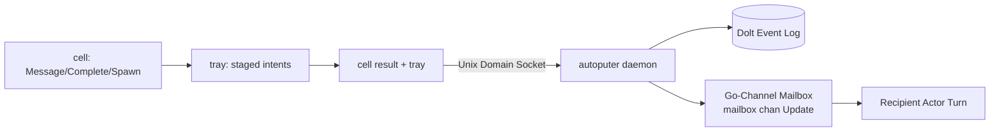

# RLM Target Architecture (proposal, 2026-09-04, rev 5)

Status: draft incorporating agentic consensus review (8/8 panel models:
Codex, Cursor, Sol, Terra, Luna, Gemini, Grok, Opencode). No code changes.
Rule: no dual paths. One broker, one exec, one message protocol, one
surface per plane.

Rev 5 folds the consensus panel's unanimous technical adjudications:
1. **Spatial Isolation Invariant**: One activation $\leftrightarrow$ one
   dedicated, disposable capsule. No shared namespaces across desks. The only
   shared asset is the immutable, content-addressed lower layer (EROFS / Nix store).
   Super runs in `autoputer` as the lifecycle supervisor, never in a capsule.
2. **Reconciled REPL Context & Restart Durability**: Within an activation,
   working variables and objects live in the Go runtime heap, keeping the model's
   prompt lean. Settlement-critical state (work items, trajectory evidence,
   and unread backlogs) lives durably in Dolt / `actor.Log`. New activations
   hydrate from durable state.
3. **Inbox Snapshot & Two-Phase Ack**: `choir.Inbox()` is a side-effect-free
   read of a cell-start snapshot injected by `autoputer`. The durable cursor
   advances in Dolt only upon successful cell reduction; failed or timed-out
   cells never acknowledge unread mail.
4. **Bounded Adaptive Coalescing**: Parent wakes are coalesced via bounded
   quiescence (e.g. 500ms window, all-complete, timeout deadline, or error
   tombstone). Never an unbounded barrier that induces deadlocks.
5. **Role-Bounded Fan-Out & Scoped Fan-In**: `choir.Spawn()` strictly enforces
   role capabilities (Research cannot spawn Engineering). Child workers report
   exclusively to their durable return target in `autoputer`.
6. **Command Runner Allowlist**: Strict environment allowlist (`PATH`, `HOME`,
   `TMPDIR`, `LANG`) plus explicit capability grants, replacing denylisting.

---

## 1. Principles

1. **Orchestration as code**: Code is closed under composition;
   tool DSLs are not. The cell is a full computational shell:
   orchestration, control flow, loops, branching, data
   transformation, and in-memory pipelining are written directly in
   Go, not mediated turn-by-turn as JSON tool calls.
2. **Full computational expressivity, narrow gated authority**:
   The model has unbounded expressivity to compute, inspect, and
   transform workspace state in code, but narrow, strictly gated
   authority for external action. External effects pass exclusively
   through typed capability gates and reducers.
3. **Context in the REPL; durability in the log**: Within an activation,
   working memory lives as Go variables, preventing prompt context bloat.
   Across restarts, passivations, and crashes, all settlement-critical state
   is reconstructible from the durable Dolt event log and mailbox records.
4. **Local syscalls vs. external staged intents**: Files and
   processes inside the capsule are synchronous guest syscalls.
   External communication and task settlement are intents staged
   in an in-memory tray, returning in microseconds without blocking.
5. **No function claims success the runtime has not performed**: Local
   IDs are tray bookkeeping, never delivery receipts. The guest daemon
   (`autoputer`) commits the batch, mints durable IDs, binds execution
   receipts, and delivers into recipient Go channels.
6. **Async messaging & supervision as code**: Sends never block on
   the recipient; wake is the guest daemon's job after commit, always.
   Multi-agent supervision and verification panels are first-class,
   inspectable code within the pipeline, improvable via self-development.

---

## 2. Virtualization Boundaries and System Ontology

Strict terminology is enforced across all documentation and code:

* **NixOS Host**: The physical server or cloud instance running base
  infrastructure (`vmctl`, Firecracker hypervisor, Node B).
* **Guest MicroVM (User Computer)**: The persistent virtual machine
  running the NixOS guest kernel and the `autoputer` daemon. Super,
  CoSuper, Researchers, Dolt database, and the causal event log all
  run INSIDE the microVM.
* **Capsule**: An ephemeral sandbox *inside* the microVM, created via
  Linux namespaces (PID, mount, net, IPC, UTS), cgroups v2, and
  overlayfs (`internal/capsule/executor.go`). All agent code execution
  lives exclusively inside capsules.

### Desks ("Agents are desks, not people")
* **Management Desk** (`Super`): Owns trajectory, strategy, budget, and supervisor decisions.
  Runs directly in `autoputer` as the lifecycle supervisor; does NOT run in a capsule.
* **Engineering Desk** (`CoSuper`): Owns code implementation, builds, tests, and candidate bundles.
  Runs in a dedicated, isolated capsule with write and build authority.
* **Research Desk** (`Researcher`): Owns codebase inspection, source verification, and evidence gathering.
  Runs in a dedicated read-only capsule.

### Capsule Allocation Invariant: One Activation ↔ One Dedicated Capsule
1. **Uncompromised Spatial Isolation**:
   Every agent activation receives its own dedicated, disposable capsule
   and its own private Yaegi session worker process.
2. **Never Share Linux Namespaces**:
   Namespaces (PID, mount, net, IPC, UTS) are never shared across desks or
   activations. Sharing namespaces introduces `/proc` visibility, IPC snooping,
   and `/tmp` scratch file contamination.
3. **What Is Shared**:
   Only the **immutable, content-addressed lower layer** (read-only EROFS /
   Nix store baseline source tree) and immutable artifact blobs are shared
   across capsules.

---

## 3. Communication Topology: Mesh vs. Scoped Fan-Out/Fan-In

```
          [ Management Desk (Super) ]
                   ▲         ▲
                   │ (Mesh)  │ (Mesh)
                   ▼         ▼
     [ Engineering Desk ] ◄─────► [ Research Desk (Root) ]
                                            │
                             ┌──────────────┼──────────────┐
                             │ (Async       │  Fan-Out)    │
                             ▼              ▼              ▼
                       [Sub-Res 1]    [Sub-Res 2]    [Sub-Res 3]
                             │              │              │
                             └──────────────┼──────────────┘
                                            │ (Scoped Fan-In ONLY)
                                            ▼
                                  [ Research Desk Inbox ]
                                  (Adaptive Coalesced Wake)
```

### A. Peer-to-Peer Mesh Across Root Desks
Management, Engineering, and Research desks communicate directly in a
peer-to-peer mesh. Engineering can query Research directly without
bouncing through Management.

### B. Asynchronous Fan-Out (`choir.Spawn`)
When a desk needs to parallelize work, it spawns child workers asynchronously
via `choir.Spawn(role, objective)`.
* **Capability Bound**: `Spawn` enforces strict role policies. The Research desk
  cannot spawn an Engineering CoSuper or request Bash tools.
* **Non-Blocking**: The spawning desk does NOT block; it continues or finishes its cell.

### C. Scoped Fan-In (Durable Return Binding)
Spawned child workers are transient, task-bound nodes. They are strictly
fenced to report back **only to their assigned return target** (`ReturnToActorID` /
`AssignedWorkItemID`), validated by `autoputer` during reduction. They cannot
broadcast to other desks.

### D. Bounded Adaptive Coalescing
When child workers finish, their completions stream into the parent's mailbox.
To eliminate distributed deadlocks and token waste:
* `autoputer` uses **bounded adaptive quiescence** (e.g. 500ms quiescence debounce,
  all-children-complete, or a timeout deadline).
* It wakes the parent for **one unified synthesis turn**.
* If a child worker crashes, is OOM-killed, or times out, `autoputer` immediately
  injects an error tombstone into the parent mailbox to release any wait.

---

## 4. In-Capsule Go API (`choir` package)

```go
package choir

// --- Workspace Syscalls (synchronous in-capsule) ---

func ReadFile(path string) (string, error)
func WriteFile(path, content string) (int, error)
func ListDir(path string) ([]string, error)
func Exec(command string, args []string) (ExecResult, error)
func Context() ActivationContext

// --- Asynchronous Messaging & Delegation ---

// Message stages an asynchronous outbound message to a peer desk (Mesh)
// or to parent (Fan-In). Non-blocking; returns immediately.
func Message(toDesk, body string) (string, error)

// Inbox returns the cell-start snapshot of unread messages.
// Side-effect-free inside the cell; durable cursor commits on successful reduction.
func Inbox() []IncomingMessage

// Spawn asynchronously delegates a subtask (Fan-Out) within allowed role policy.
// Returns a child task handle.
func Spawn(role, objective string) (string, error)

// Complete marks the assignment finished with a typed verdict.
// Reducible only from a successful cell; binds execution receipts.
func Complete(result, verdict, summary string, evidenceRefs []string) error
```

Supporting structures:
```go
type IncomingMessage struct {
    ID           string    `json:"id"`
    FromDesk     string    `json:"from_desk"`
    ToDesk       string    `json:"to_desk"`
    Kind         string    `json:"kind"`
    CreatedAt    time.Time `json:"created_at"`
    EvidenceRefs []string  `json:"evidence_refs,omitempty"`
    Body         string    `json:"body"`
}

type ExecResult struct {
    ExitCode   int    `json:"exit_code"`
    Stdout     string `json:"stdout"`
    Stderr     string `json:"stderr"`
    DurationMs int64  `json:"duration_ms"`
}

type ActivationContext struct {
    ComputerID   string `json:"computer_id"`
    Epoch        uint64 `json:"epoch"`
    ActivationID string `json:"activation_id"`
    Desk         string `json:"desk"`
    Role         string `json:"role"`
}
```

---

## 5. Execution Semantics: Non-Blocking Staging to Go-Channel Mailbox



1. **Cell-Start Hydration**: `autoputer` injects a snapshot of unread messages
   into the worker frame at cell launch. `choir.Inbox()` returns this snapshot
   idempotently without network roundtrips.
2. **In-Cell Phase**: `choir.Message()` or `choir.Spawn()` appends intents to the
   cell's in-memory tray in microseconds. No blocking; zero deadlock risk.
3. **Cell Completion & Frame Packaging**: When the Go cell finishes, the capsule
   broker packages the execution status, manifest digests, and staged intent tray
   into an atomic frame over the Unix domain socket to `autoputer`.
4. **Guest Runtime Reduction & Two-Phase Ack**:
   * **Validate & Fence**: `autoputer` verifies sender authorization and restricts
     spawned workers to their assigned return target.
   * **Dolt Persistence**: `autoputer` appends updates to the durable Dolt log,
     minting durable IDs.
   * **Advance Mailbox Cursor**: `autoputer` advances the unread cursor in Dolt
     for messages consumed by the successful cell. Failed or timed-out cells never ack.
   * **Go-Channel Delivery & Adaptive Wake**: Delivers updates into the recipient's
     in-memory Go channel (`mailbox chan Update` in `internal/actor`), scheduling
     its next LLM turn via adaptive quiescence.

---

## 6. Command Runner Unification & Strict Environment Allowlist

1. **Direct-Argv Semantics**: Port `internal/yaegikernel/broker.go` direct
   `exec.Command(binary, args...)` execution natively into `cmd/capsule-broker`.
2. **Strict Environment Allowlist**:
   - Baseline environment defaults strictly to `PATH`, `HOME=/tmp`, `TMPDIR=/tmp`,
     and `LANG=C.UTF-8`.
   - Replaces fragile substring denylisting (`!strings.Contains("KEY")`) with an
     authoritative allowlist. Additional variables pass only if declared in signed
     capsule capability grants.
3. **PID Namespace Reaping**:
   - The capsule broker relies on the capsule's dedicated Linux PID namespace
     (`CLONE_NEWPID`). On timeout, killing the root process in the namespace
     guarantees that all descendants are cleanly reaped without leaking background daemons.
4. **Legacy Runner Freeze**: The shell-based runner (`sh -c`) is frozen strictly
   for rollback of legacy JSON tools, completely unreachable in RLM mode.

---

## 7. Migration Sequence

1. **Control Plane Boot Channel**: Wire the machine setting through
   `choir.actuator` into the guest microVM boot parameters.
2. **Multiplexed Transport Pipe**: Establish the dedicated Unix domain socket
   and frame protocol between worker and broker.
3. **Canonical Command Runner**: Implement direct-argv, strict-allowlist
   command execution in `cmd/capsule-broker`.
4. **Intent Tray & Reducer**: Deploy in-memory tray buffering in Yaegi and
   the reduction engine in `autoputer` (Dolt log + Go channel delivery + `choir.Inbox()` snapshot).
5. **Tool Surface & Prompt Update**: Update agent tool profiles to expose only
   `capsule_go_eval`; enable mode-aware system prompts.
6. **Live Staging Verification**: Run the end-to-end self-development task on the
   retained staging microVM; verify all receipts.
