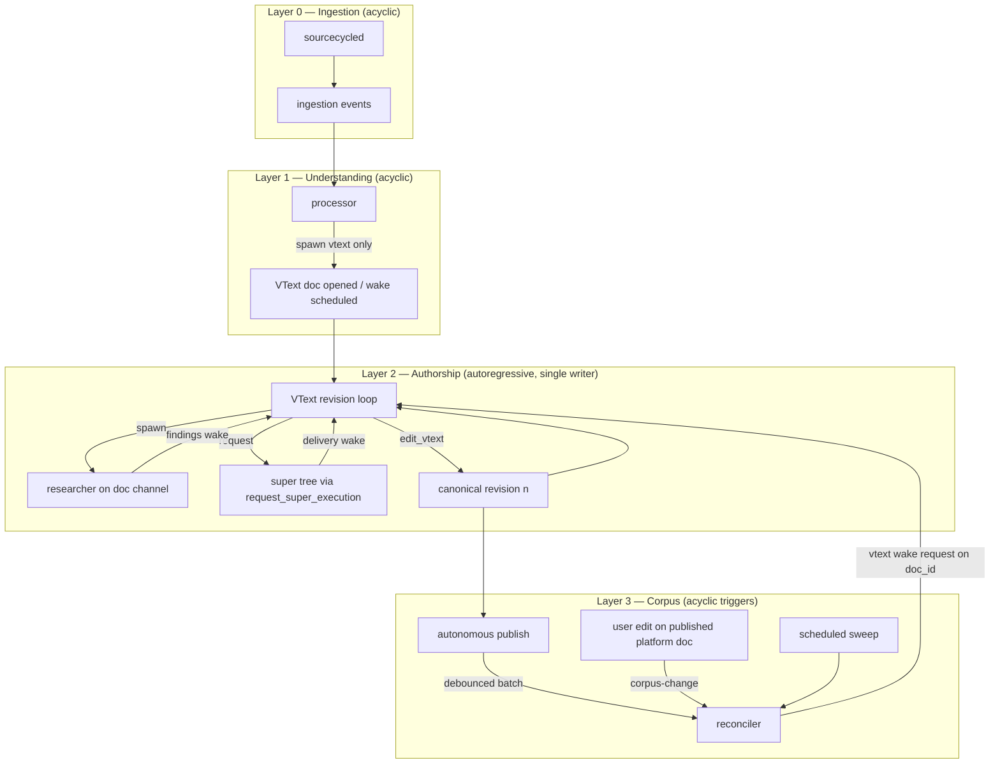

# Universal Wire — Activation Topology Checkpoint

Date: 2026-06-10

Status: **Workstream (d) in progress** — activation graph implementation (2026-06-10).

Requirements contract:
[choir-wire-source-to-vtext-spec-2026-06-09.md](choir-wire-source-to-vtext-spec-2026-06-09.md)
(amendments in this document supersede conflicting activation prose until spec
is patched).

Mission:
[mission-wire-community-news-v1.md](mission-wire-community-news-v1.md)

Belief ledger:
[mission-report-wire-community-news-2026-06-09.md](mission-report-wire-community-news-2026-06-09.md)

---

## Product name

**Universal Wire** is the product name (formerly Global Wire / Community Wire in
user-facing copy). This is a product decision, not a compatibility shim.

| Surface | Rule |
|---------|------|
| User-visible copy, app name, mission/docs | **Universal Wire** (Workstream c — landed 2026-06-10) |
| Canonical edition alias | `universal-wire/Wire.vtext` replaces `global-wire/Wire.vtext` |
| Old edition alias | **Deleted** after one-time migration (migration run id + zero-references proof); no redirect |
| API routes | `/api/universal-wire/*` replaces `/api/global-wire/*`; **no route aliases** |
| Infra ids | `universal-wire-platform` owner, `vm-universal-wire-platform` VM — renamed with product (no `global-wire-*` infra ids) |
| SourceMaxx / source-maxx symbols | **Not renamed** — deleted per Workstream 1 (Deletion Ledger) |

---

## Core invariant

**Only VText agents and humans write VText revisions** — and humans write only
versions they own.

Every architecture error is an agent or role being handed a pen it must not
hold. Processors and reconcilers emit **requests** and **evidence**; VText runs
the single-writer autoregressive loop.

---

## Four-layer topology (approved)



**Edition** `universal-wire/Wire.vtext` is an ordinary VText document. Reconciler
schedules a **VText wake request** on the edition `doc_id`; there is no
edition-writer role and reconciler never calls `edit_vtext`.

**VText loop:** autoregressive, not recurrent — each revision conditions on
explicit `base_revision_id` plus worker deliveries. Workers are inputs to the
next step, not parallel authors.

---

## Activation matrix

| Role | Lawful inbound | Lawful outbound | Loop? |
|------|----------------|-----------------|-------|
| **sourcecycled** | adapter fetch cycles | ingestion events, processor dispatch queue | No |
| **processor** | ingestion events **only** (via sourcecycled dispatch) | `spawn_agent role=vtext` only; watch-lists/checkpoints for low-signal items | No |
| **VText agent** | processor/reconciler wake requests; worker deliveries; human edits **on owned docs** | `spawn_agent role=researcher` on doc channel; `request_super_execution`; `edit_vtext` | **Yes** (Layer 2) |
| **researcher** | VText spawn on document channel | evidence packets → wake VText | No |
| **super tree** | VText `request_super_execution` | deliveries → wake VText | No |
| **reconciler** | debounced post-publish batch; scheduled sweep; corpus-change (user fork/edit on **published platform** docs) | VText **wake requests** (correction/synthesis/edition doc); durable checkpoints — **never** `edit_vtext` | No |
| **human** | product UI on owned or platform docs | `edit_vtext` on **owned** docs only; platform published edit → user-owned version + corpus-change | Owned docs only |
| **prompt bar / conductor** | owner prompts | editorial supervision; **not** ingestion, processor, or story creation | No |

### Forbidden edges (negative proofs required)

- prompt bar → ingestion event or processor run
- processor → researcher or super
- reconciler → `edit_vtext` or direct edition mutation
- per-cycle reconciler queued on ingestion handoff (current code violation)
- user edit on published **platform** canon → in-place canonical mutation
- `universal-wire` routes, aliases, or user-visible strings after Universal Wire migration

---

## Event catalog (dispatch owners)

| Event | Emitter | Dispatches | Notes |
|-------|---------|------------|-------|
| `ingestion_event` | sourcecycled after `SaveItems` | processor run(s) | Only lawful story-creation entry |
| `vtext_wake_request` | processor, reconciler | VText agent revision run | Carries `doc_id`, brief, source handles |
| `vtext_revision` | VText `edit_vtext` | (internal) next loop or publish eligibility | Provenance recorded at write time |
| `publish` | autonomous publish path (Community Cloud policy) | platformd projection; debounced reconciler | No operator approval gate on Community Cloud |
| `corpus_change` | publish; user fork/edit on published platform doc; promotion | reconciler (debounced) | Idempotent reconciler key TBD in implementation |
| `reconciler_sweep` | scheduler | reconciler | Periodic corpus review |

**Reconciler debounce (approved defaults):** **10** eligible platform publishes
**or** **300** seconds since the last reconciler dispatch — whichever comes
first. Never on processor submit, never on in-flight drafts, never per ingestion
cycle.

**Processor low-signal path:** watch-lists and `submit_coagent_update`
checkpoints only; do not open a VText per noise item.

---

## Publication policy

| Deployment | Publish path |
|------------|--------------|
| **Universal Wire (Community Cloud)** | Autonomous — no operator approval gate |
| **Private Wire instances** | Per-deployment policy may enable human gating |

Load-bearing guards (must be verified in acceptance, not assumed):

- no edition inclusion without eligible article VText (programmatic guard — not anthropomorphic “approval”)
- fidelity checks on publish projection
- update-awareness rendering for corrections (publish-then-correct is intended behavior)

### What publishes (not every VText revision)

Publication is a **platform policy hook** after `edit_vtext`, not a VText agent
tool and not “every revision automatically.”

| Revision | Publishes? |
|----------|------------|
| `revision_role: input` (conductor user prompt, processor handoff, reconciler brief) | **Never** |
| VText `edit_vtext` on user-owned docs | Per-deployment policy (user/proxy path) |
| VText `edit_vtext` on platform wire article runs | **Autonomous** when eligibility passes |

```text
edit_vtext completes on platform computer
  -> runtime evaluates publication policy (owner + revision metadata + content)
  -> if eligible: platform-internal publish (Dolt -> platformd projection)
  -> emit publish event -> debounced reconciler (N=10 or T=300s)
```

**Eligible wire canonical revision** (replaces `article_version` booleans on new
writes):

- `revision_role: canonical`
- `source: edit_vtext`
- wire provenance present (e.g. `source_network_cycle_id` / processor handoff lineage)
- content passes guards (non-empty; not input/brief heuristics)

Multiple publishes per doc are allowed (publish-then-correct). Reconciler
debounce batches **publish events**, not every VText run that did not publish.

No VText-only `publish` tool — avoids harness branching; Community Cloud Wire
news is public by policy.

---

## Unified VText handoff (one primitive, three kinds)

Every role wakes VText the same way: **open/target doc → persist input revision
→ wake VText agent → VText authors canonical prose via `edit_vtext`**.

| Kind | Caller | Trigger | Doc | Input author |
|------|--------|---------|-----|--------------|
| `user_prompt` | conductor | prompt bar | usually new | `AuthorUser` |
| `source_open` | processor | `ingestion_event` | usually new | handoff (`AuthorAppAgent`) |
| `corpus_wake` | reconciler | publish debounce / sweep / corpus-change | **existing** `doc_id` | handoff (`AuthorAppAgent`) |

**Input revision metadata** (replaces `article_version: false` on new writes):

```json
{ "revision_role": "input", "input_origin": "user_prompt|processor_handoff|reconciler_handoff" }
```

**Canonical wire revision:**

```json
{ "revision_role": "canonical", "source": "edit_vtext", "artifact_kind": "article_revision" }
```

Remove `article_version` from new writes; drop from durable metadata
carry-forward. Legacy revisions may still carry the old fields during transition.

**Implementation target:** `ensureVTextHandoff(req)` replaces
`ensureConductorVTextRoute` and `ensureCoagentVTextRevisionRoute`. Do **not**
normalize reconciler as an ingestion peer — `corpus_wake` dispatches only from
publish debounce, sweep, or corpus-change.

**Verticals:** pass as batch hints in reconciler run metadata/prompt only; one
reconciler identity (`reconciler:story-corpus`). No per-vertical reconciler
fleet until embeddings (Qdrant) justify similarity-based sharding.

---

## Wire news model policy (cost)

Universal Wire processor, reconciler, and VText runs should use the **lowest
price** models that meet turn requirements:

- **Primary:** `mimo-v2.5` (non-pro) via Xiaomi provider
- **Future:** `deepseek-v4-flash` when DeepSeek credits are available

Do not branch the harness per role beyond per-computer model policy. Orchestration
roles that today default to pro variants should align to the same cost floor unless
a turn requires capabilities only pro models declare.

---

## Human fork/claim loop (platform published docs)

A human edit to a **published platform** VText never mutates platform canon.

```text
user edit on published platform doc
  -> user-owned version (canonical for that user)
  -> corpus_change signal
  -> reconciler assembles evidence packet from published corpus
  -> reconciler emits vtext_wake_request on platform canonical doc_id
  -> VText agent revision (Layer 2 loop: optional researcher/super)
  -> new platform canonical version confirms / disputes / acknowledges
  -> MUST cite or transclude the user version responded to
```

Authorship provenance (`human` | `vtext-agent`, plus run id) is recorded at
**write time** on every revision, never inferred afterward.

On docs the user owns (their computer's VTexts, forks, editions), human edits
are simply canonical revisions — no fork/claim loop.

**Dependency:** provenance-on-`edit_vtext` may need implementation before
fork/claim staging proof (deliverable e).

---

## Workstream execution order

Execute **sequentially**. Do not start later workstreams until the prior
deliverable evidence is recorded in the mission report.

```text
(a) Architecture checkpoint + mission doc amendments (docs only)     <- done
(b) Workstream 1 — Deletion Ledger                                   <- done
(c) Workstream naming — Universal Wire rename/migration              <- done
(d) Workstream 2 — Activation graph (Slice 3 dispatch + negative proofs) <- NOW
(e) Staging acceptance (two proofs)
```

### (b) Workstream 1 — Deletion Ledger (Slice 0 debt)

**Problem:** `BuildSourceMaxxHandoff` and related symbols survive on the active
ingestion path while invariant 23 treats SourceMaxx as deleted. Slices 1–2
landed on this spine.

**Order inside Workstream 1:**

1. **Replace** ingestion handoff + dispatch with neutral vocabulary (same
   behavior, non-legacy names).
2. **Delete** legacy symbols per mission invariant 23 list.
3. Grep-clean proof per symbol (recorded command, empty output).
4. Types/routes deleted with tests in the same commits.
5. Staging data purge (run id + zero-row queries).
6. Remove read-compat shims after purge.

Renaming, wrapping, or view-hiding is not deletion. If a symbol cannot be
deleted, stop and document evidence — do not shim.

**Named symbols (non-exhaustive; see mission v1 invariant 15):**

- `UniversalWireStory` types and stored seed rows
- StoryGraph authority
- all `SourceMaxx` / `source_maxx` / `source-maxx` forms including
  `BuildSourceMaxxHandoff`, `sourceMaxxRuntimeDispatcher`, `source-network` shims
- seeding helpers; legacy style-source / publication / newsletter / autoradio routes

### (c) Universal Wire rename/migration — **done (2026-06-10)**

After (b). User-visible copy, app name, docs; API route cutover; edition alias
migration; delete `global-wire/Wire.vtext` alias with zero-references proof.
Node B imperative SSH steps:
[runbook-node-b-universal-wire-migration-2026-06-10.md](runbook-node-b-universal-wire-migration-2026-06-10.md).

### (d) Workstream 2 — Activation graph

**Order:**

1. Remove per-cycle reconciler from `BuildIngestionHandoff` and ingestion dispatch
2. Processor outbound **vtext-only** (no researcher/super spawn); update negative tests
3. Reconciler outbound **vtext-only**; dispatch from publish debounce (N=10, T=300s),
   sweep, corpus-change — not ingestion
4. `ensureVTextHandoff` normalization (conductor + processor first; reconciler as
   `corpus_wake` on debouncer)
5. `revision_role` metadata; retire `article_version` on new writes
6. Publication policy hook on eligible wire `edit_vtext` → publish event → debouncer
7. Negative proofs in CI

**Non-goals for (d):** VText `publish` tool; per-vertical reconciler fleet; Qdrant;
Telegram proof.

### (e) Staging acceptance

**Proof 1 — ingestion chain:**

```text
ingestion cycle
  -> processor (activation_origin=ingestion_event)
  -> VText
  -> autonomous publish (through publication guard)
  -> debounced reconciler (activation_origin=publish event)
  -> reconciler correction-request
  -> VText-agent revision on existing doc
```

**Proof 2 — fork/claim loop:**

```text
user edit on published platform doc
  -> corpus-change signal
  -> reconciler evidence packet
  -> VText-agent response version citing/transcluding user version
```

Plus Phase A negative proofs (prompt bar cannot create Wire stories) per Slice 4.

---

## Spec / mission contradictions resolved here

| Prior text | Resolution |
|------------|------------|
| Slice 3: processor → researcher/VText | processor → **VText only**; VText owns researchers |
| Slice 3b separate from autonomous publish | Community Cloud autonomous publish is in Workstream 2 acceptance; platform-internal platformd projection remains implementation detail |
| Reconciler per-cycle on handoff | **Removed** — violates feed-forward |
| Spec: processor requests researchers | **Request via VText wake brief**, not processor spawn |
| Slice 0 marked done while SourceMaxx active | **False** — Workstream 1 reopens Slice 0 until grep-clean |
| `universal-wire/Wire.vtext` | **`universal-wire/Wire.vtext`** after migration (c) |

---

## Related documents to update when implementing

- [mission-wire-community-news-v1.md](mission-wire-community-news-v1.md) — phased route, checkpoint state
- [choir-wire-source-to-vtext-spec-2026-06-09.md](choir-wire-source-to-vtext-spec-2026-06-09.md) — Activation section
- [mission-report-wire-community-news-2026-06-09.md](mission-report-wire-community-news-2026-06-09.md) — evidence per deliverable (a)–(e)
