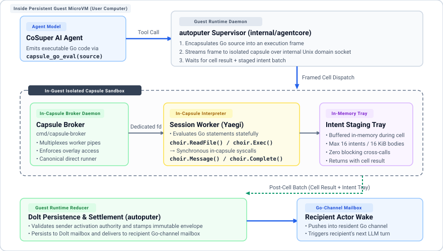
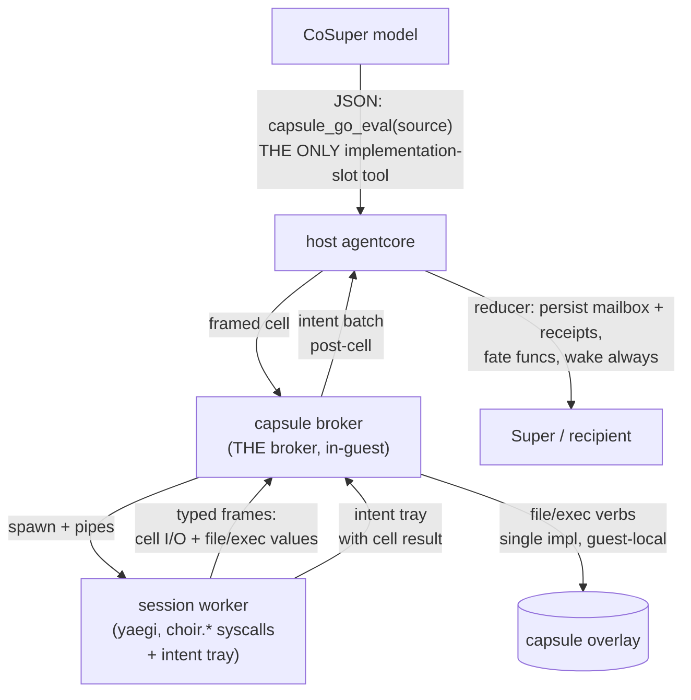
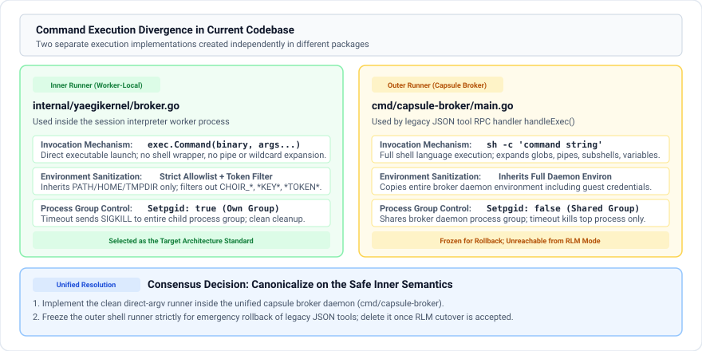
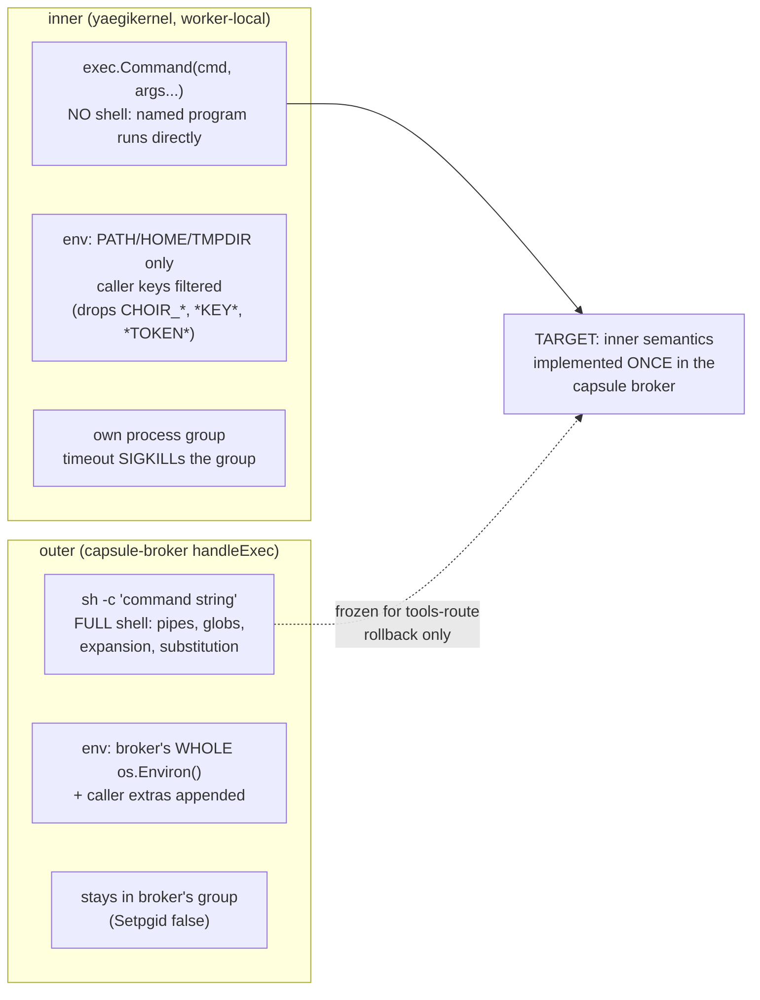
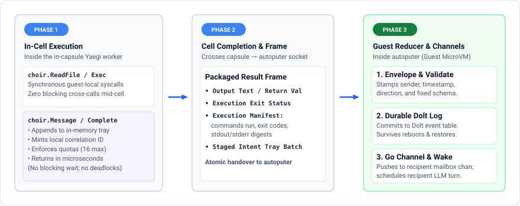
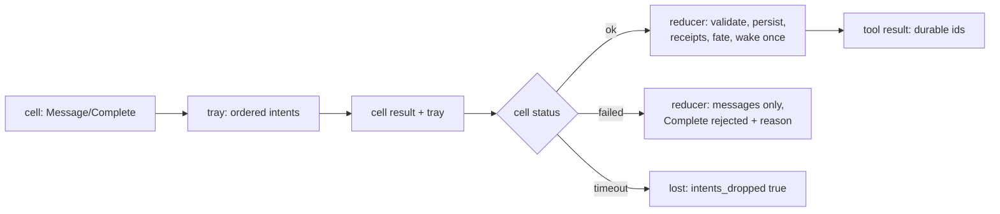

# RLM Target Architecture (proposal, 2026-09-04, rev 3)

Status: draft for owner review. No code changes.
Rule: no dual paths. One broker, one exec, one message protocol, one
surface per plane.
Rev 3 folds the rev-2 panel (7 approve-with-changes, 1 block whose
substance matches the majority's fix list — convergent). Raw:
`.agentic-consensus/agentic-consensus-20260904-140742/`.
Prior round: `.agentic-consensus/agentic-consensus-20260904-133048/`.

## Principles

1. **Orchestration as code**: Code is closed under composition;
   tool DSLs are not. The cell is a full computational shell:
   orchestration, control flow, loops, branching, data
   transformation, and in-memory pipelining are written directly in
   Go, not mediated turn-by-turn as JSON tool calls.
2. **Full computational expressivity, narrow gated authority**:
   The model has unbounded expressivity to compute, inspect, and
   transform workspace state in code, but narrow, strictly gated
   authority for external action. External effects pass exclusively
   through typed capability gates and host reducers.
3. **Local syscalls vs. external staged intents**: Files and
   processes inside the capsule are synchronous guest syscalls.
   Anything touching another actor, durable persistence, or task
   settlement is an intent staged in an in-memory tray, never a
   live mid-cell network call.
4. **No function claims success the host has not performed**: Local
   ids are tray bookkeeping, never delivery receipts. The host
   commits the batch, mints durable IDs, binds execution receipts,
   and triggers recipient wakes.
5. **Async messaging & supervision as code**: Sends never block on
   the recipient; wake is the host's job after commit, always
   (with fate exemptions, not content suppressions). Multi-agent
   supervision and verification panels are first-class, inspectable
   code within the pipeline, improvable via self-development.
6. **No legacy carries weight**: update_coagent's cell-facing kinds,
   summaries, and wake suppressions do not constrain the new
   protocol. The host adapter to existing durable machinery is
   specified exactly below — one fixed envelope, not a table.
## Topology (target)

The model sees exactly ONE JSON tool (implementation slot).
Everything else is a Go spelling inside cells, reduced by the host
after the cell ends.

Crossing notes: file/exec values round-trip mid-cell, but stay
guest-internal (worker↔broker pipes). NOTHING crosses guest→host
mid-cell. All host effects travel post-cell as one intent batch,
reduced by existing fate functions. This dissolves the deadlock
objection by construction: there is no mid-cell host roundtrip to
deadlock.

## The exec split, and its resolution

Two runners exist today with different languages, environments, and
kill semantics:

Why `sh` first and not bash: the minimal guest image is only
guaranteed to have `sh`; bash may not be installed. The code tries
`sh`, then `bash --noprofile --norc` (startup files skipped, so no
profile-injected env), then a Nix store bash, then `/bin/sh`.

Resolution (convergent): inner semantics win — argv, clean env,
secret scan, per-cell process group + SIGKILL on cell deadline
(broker children keyed by cell id, reaped explicitly so worker-group
kill cannot orphan them). Canonical exec additionally returns effect
manifest entries (command, args, cwd, exit code, output digests,
local effect token) that ride the cell result so the host can mint
real `ExecutionReceipt`s. The outer shell form stays frozen for the
tools-route rollback only (separate retirement commit); it is never
reachable from RLM.

## The message protocol v2 (rev 3)

No cell-chosen kinds. No live mid-cell host calls of any kind:

- Cell calls `choir.Message(to, body)`. The call appends an intent
  to the cell's outbound tray and returns a local intent id
  immediately. Nothing is sent; nothing is claimed.
- Intent ids are host-derived, never worker counters: derived from
  (spawning activation, host tool-call id, host cell id, sequence).
  Same id + same payload on retry returns the original durable id;
  different calls get distinct ids even with identical bodies.
- Tray caps, first slice: at most 16 intents per cell, 16 KiB per
  body, 256 KiB serialized tray aggregate, plus a per-activation
  mailbox quota. Over-cap calls fail in-cell; over-quota fails
  closed in the tool result. (Numbers are tuning from receipts;
  the caps' existence is the contract.)
- When the cell ends, the tray travels as a field on the cell
  result. The host reducer, in intent order:
  1. validates `to` (must equal the bound parent Super this slice;
     terminal/revoked actors fail closed with reason);
  2. persists each intent to the recipient's durable mailbox with a
     FIXED host-built envelope — sender/role/direction from the
     spawning activation, `Kind=evidence_update`,
     `schema_version=v1`, summary plus one claim carrying the body
     verbatim. The cell chooses nothing but `to` and `body`;
  3. mints durable packet ids; replays return originals, never new
     rows or wakes;
  4. wakes the recipient exactly once per fresh committed batch via
     a dedicated mailbox wake (ensure-schedule + coalesce if live),
     NEVER the existing producer-report-suppressed wake path.
- Wake exemptions (fate, not legacy): no wake on replayed intents;
  no wake/reopen on late evidence after cancel/revoke; one wake per
  batch when the recipient is already live.
- The tool result reports per-intent durable ids or explicit
  rejection with reason. Timeout loses undrained intents loudly
  (`intents_dropped: true`). Failed non-timeout cells still deliver
  Message intents tagged with cell status — but never a Complete.
- Delivery surfaces on the recipient's next turn through the
  existing update path. Ordering: FIFO per recipient by commit
  sequence. Bodies are untrusted evidence, never executable: no
  intent can imply `execution_request`.

## Completion (rev 3)

- Spelling: `choir.Complete(result, verdict, summary,
  evidence_refs)` with `result ∈ {completed, failed, blocked}`.
  Partial progress is a Message, not a Complete. No
  `execution_refs` parameter: the host binds this activation's
  persisted broker exec receipts when assembling the report.
- At most one Complete per activation; it must be the final tray
  entry — later appends fail in-cell. Reducible only from a
  successful cell. Reporting assignment failure = successfully
  returning `Complete(failed, …)`.
- The reducer runs the existing assignment-fate path
  (freeze → bind receipts → record → revoke) and returns the
  durable report identity. Crash-safety: the batch persists before
  effects run; reduction resumes from per-intent disposition;
  replays return originals.

## Surface table (target): one model tool, named exceptions

| Symbol | Plane | Fate |
|---|---|---|
| capsule_go_eval | the ONLY implementation-slot JSON tool | doorway; cells in, results + intent batch out |
| choir.ReadFile/WriteFile/ListDir/Exec | capsule syscalls in-cell | real, via the one broker, per-call verified |
| choir.Context | capsule syscall in-cell | read-only activation identity |
| choir.Message(to, body) | capsule spelling, host act | intent now; durable mailbox + wake after cell |
| choir.Complete(...) | capsule spelling, host act | terminal intent; fate path post-cell |
| choir.Assign | — | DELETED (never designed, no counterpart) |
| choir.Outcome | — | REMOVED for now (goal completion deferred) |
| record/update/commit | host functions, NOT model tools | the reducer calls these; the model never sees them |

Implementation overlay registers EXACTLY `{capsule_go_eval}`:
delete `update_coagent`, `record_assignment_result`,
`commit_transaction` from it. Named exceptions, both tracked for
Def 3 removal: (1) verifier slot keeps
`inspect_self_development_bundle` +
`record_self_development_verification`; (2) `commit_transaction`
stays JSON on the implementation slot until the Complete reducer
owns bundle classification (it does not today — assignment fate
and bundle commit are different functions with different refs).

## Worker↔broker framing (guest-internal only)

Typed frames with correlation ids (`cell`, `effect_request`,
`effect_response`, `result`, `close`) over a DEDICATED inherited
pipe — never the stdout the cell can write to. Chunked payload
frames with bounded reassembly; the governing inequality is
result-frame bound ≥ tray bound, and it is stated in the code, not
assumed. Bounded outstanding calls; deadline inherited from the
parent call; tray cleared at cell start. Fallback one-shot workers
have no tray path: cells importing `choir` fail closed there.

## Migration order (load-bearing — out of order deadlocks or lies)

1. Machine-setting boot channel for the route flag (rollback and
   schema/dispatch unity depend on it; overlay follows broker
   `get_actuator`, never a second env read).
2. Frame multiplexer on the dedicated fd + canonical argv exec in
   the capsule broker (per-cell pgid, group kill).
3. Move worker file/exec onto frames; bind sessions to spawning
   capabilities with per-effect revocation rechecks; wire the
   revocation verb or make revoke-destroys-capsule the invariant.
4. Intent tray + post-cell reducer (mailbox, receipts, Complete
   fate, dedicated wake).
5. Overlay exact sets per slot + mode-aware prompt fix +
   `run_acceptance` freeze-event recognition.
6. Retire, in tracked order: shell exec, CoSuper JSON
   `update_coagent`, verifier exception, commit exception.

Rollback throughout: route flag unset + refresh returns today's
tools behavior; every commit reverts independently. Revocation and
epoch gaps ship as problem receipts in the code phase, not as
silent claims.
