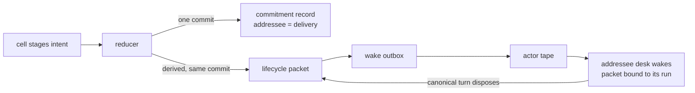

# The Desk System — Harness Architecture

**2026-10-01 · Status: describes the live system plus explicitly labeled Target
transitions.** Companion to [current-architecture.md](current-architecture.md)
(landed-state tracking) and
[Precommitment Records — Engineering Memo.md](Precommitment%20Records%20—%20Engineering%20Memo.md)
(the learning theory). This document explains the multi-agent machinery itself:
desks, cells, records, packets, wakes — and the record-native messaging
redesign the owner directed on 2026-10-01.

## Naming

The system outgrew its vocabulary. Working names → what they are:

| Working name | What it is | Used in this doc |
|---|---|---|
| RLM | a model running in a code-execution cell with staged side-effects | **cell** |
| yaegi | the Go-interpreter the cell runs on | (implementation detail) |
| desk | a persistent agent identity with a role | **desk** |
| update_coagent / lifecycle packet | the authenticated inter-desk delivery record | **packet** |
| channel_message | append-only audit mail log | **channel log** |
| commitment record | the semantic act on the ledger | **record** |
| precommit | a record that stakes a checkable prediction | **precommit** |
| actor tape / outbox | the durable wake pipeline (two layers) | **wake outbox** + **actor tape** |

The unit of work is not a message; it is a **cell** — one bounded evaluation
of model-authored Go code inside a Go interpreter (`yaegi` kernel — an
attenuated vocabulary, not a security boundary), fed a prompt, bindings
(inbox snapshot, pending delivery packets, commitment pack), and a verb
surface. The cell stages **intents** (proposed actions) into its **tray**;
after a successful cell returns, the **reducer** — host code that validates
and persists proposed actions — commits each intent, sequentially and
idempotently (a re-run converges onto the same rows). **Live:** a failed
cell commits no staged intents (a deterministic `cell_fate` note is still
written), and a crash inside the reducer can leave partial commits repaired
by deterministic replay — the ledger, channel log, and cursor do not share
one transaction today.

## The desks

Four desks hold authority; the ontology is deliberately small
(`docs/choir-doctrine.md`):

- **Texture** — the sole **agent** writer of canonical revisions (owner edits
  are a separate `AuthorUser` writer class).
- **Management** — coherence, admission; designated **scorer of record**
  (owner ruling, target — no live scoring path yet).
- **Engineering** — capsule-bound mutation; assignments, freeze/verify,
  completion fate.
- **Research** — read-only world evidence.

Processor/reconciler/conductor/email are legacy tool surfaces without staged
verbs; they ride the same delivery substrate.

## Why desks — the Luhmann/Simon frame

Owner-supplied theoretical grounding (2026-10-01 note). This is explanatory
frame, not derivation — it clarifies which design choices are principled.

**Three forms of differentiation.** Luhmann classified societies by how they
divide themselves: *segmentary* (identical units side by side — clans,
villages), *stratified* (ranked layers — estates, castes), *functional*
(subsystems specialized by function — economy, law, science, politics). The
multi-agent landscape maps exactly:

- a **swarm** is segmentary — many interchangeable agents coordinated by
  volume; useful for breadth, structurally redundant;
- **role-based multi-agent systems** are stratified — manager agents over
  worker agents, org-chart personas;
- **desks** are functional — differentiated by *what they do*, not by rank.

**Operational closure and codes.** Each Luhmannian function system processes
the world through its own binary code (science: true/false; law: legal/
illegal; economy: pays/doesn't) and reacts only according to its own
operations. A desk works the same way: research's code is roughly
sourced/unsourced; texture's is canonical/not; management's is admitted/
coherent/not. The desk's module surface plus its own context IS its closure.

**Structural coupling = the records protocol.** Operationally closed systems
cannot instruct each other; they can only *irritate*, and the receiver
interprets the irritation under its own code. Society's couplings are stable
interfaces (contracts couple law and economy; constitutions couple law and
politics). The commitment record is ours: a typed record delivered to a desk
is not obeyed — it is evaluated under that desk's code by its own cells.
This is the security property in the cleanest form: **lateral prompt
injection is an attempt to turn an irritation into a command**, and closure
resists it by design. It is also the deepest argument against raw messaging:
an untyped envelope carries no structure a code can evaluate — only typed
records admit evaluation. Raw mail retiring in favor of records is not
aesthetics; it is what makes closure enforceable.

**Simon's near-decomposability** ("The Architecture of Complexity", 1962):
working complex systems have strong interactions within subsystems and weak,
well-defined ones between — which is why they evolve and repair one part at
a time. Desks are the nearly-decomposable units; records are the weak,
typed coupling. Empirical instance: the research→texture return-path bug
was repaired entirely inside the coupling (dispatch + provenance), never
inside either desk.

**The Zettelkasten is the object graph.** Luhmann's ~90,000-card slip box
was built so that following cross-references produces surprising
connections — he described it (1981) as communicating with the card file as
a partner. The object graph is the same construction: addressable, linked,
content-hashed records a desk's cells navigate as a thinking surface.

**The caveat is the supervision surface.** Function systems are blind outside
their own codes — modern society's coordination failures are that blindness.
Luhmann's answer is second-order observation: observing how other systems
observe. For desks, the couplings themselves need a watcher: management is
the early version (coherence, admission, scorer of record); texture's live
supervision is a second instance; the owner is the final one.

**On the name:** "desk" is already the newsroom's own unit — city desk,
foreign desk, copy desk are a newspaper's function systems. The vocabulary
fits the automatic newspaper it serves.

## The core idea — records, not messages

**Live:** every staged *semantic* act (ask, note, report, precommit, …)
already mints a `commitment_record` before it mails — raw `Message`/
`Outcome`/`Spawn` envelopes do not. **Target (owner-directed):** the record
*is* the act, and raw messaging disappears as an authored verb class.

A record has an `Addressee`. The addressee is the delivery instruction.
**Target:** when the reducer commits an addressed record, it derives the
delivery artifact — a lifecycle **packet** — in the same store batch, so no
record lands without its delivery obligation. (Live: record and envelope
are sequential writes; `recoverPartialActCommit` exists because they can
diverge.) No addressee → pure ledger observation → no wake. The guarantee
this buys is narrower than "delivery is guaranteed": **a committed record
always carries its delivery obligation** — the packet can still die
unconsumed downstream, which is why the materiality projection is the
backstop, not a footnote.

The invariant this buys, in the plainest terms: **delivery failure degrades
to a scored commitment failure, never silent loss.** An unanswered ask ages
on the materiality projection (the supervision view that tracks each open
claim's age — open → overdue → falsified) and becomes escalation evidence.
Today's failure mode — a report that mints a record and a dead channel
letter while the addressee never wakes — is impossible by construction.

### The five record kinds (target, panel-adjudicated)

The legacy verb set collapses to five primitives
(`docs/reports/agent-messaging-system-state-2026-10-01.md` §12):

- **`precommit`** — staked prediction. Addressed to a desk, it IS the ask:
  "this question will yield material evidence" — and waking the addressee is
  one of its durable consequences. Empty addressee → self-directed
  prediction, ledger-only.
- **`report`** — claim + evidence. A research answer to an ask is a `report`
  whose `ParentID` names the ask's precommit; **arrival mechanically
  resolves** the ask (an authenticated, committed, linked answer counts as
  "answered" — "answered" ≠ "material"; materiality is the scorer's call).
- **`resolve`** — an authored verdict on an open record.
- **`disagreement`** — a scorer verdict contesting a resolver's verdict.
  Deliberately non-governing (it must not overwrite the resolution); kept
  first-class so scorer≠resolver divergences stay queryable.
- **`directive{note, escalate, cast, retract}`** — operational, unscored
  acts: FYI, escalation to management/owner, delegated admission (**cast** —
  how management opens an engineering assignment under delegated authority),
  retraction. Authority lives in the `Addressee` + authority checks, not the
  kind.
Collapses the panel ratified: `ask`→`precommit`, `reply`→`report`-with-parent
(answering desks never resolve their own stake — conflict of interest),
`note`/`escalate`/`cancel`→directive subtypes, `cast` stays operational
(admission ≠ prediction). `Message`/`Outcome`/`Spawn`/`EscalateActions`
retire. `Complete`/`Freeze`/`Verify` are not messaging — they stay as
dedicated fate machinery.

## Waking is the record's liability

An addressed record spends compute: it wakes a worker. That spend is
visible, and therefore chargeable:

- **Issuer-side:** asks that resolve `contradicted` or trivially (materiality
  scored against the canonical-revision delta — an answer that changes
  nothing earns nothing) charge the issuer. Over time a desk's ask-quality
  becomes a measured behavior.
- **Target-side:** an ask that was delivered and consumed but never answered
  charges the target. Transport failure is a substrate fault, not the
  target's — scoring joins delivery state before charging silence.
- **The pack loop (owner-directed):** the issuer's own cell frame carries
  its tallies — asks made / material / contradicted / unanswered — as cell
  variable state and prompt context. Follow-up quality becomes improvable
  without weight updates. Tallies, not per-record scores: this is a
  deliberate, owner-directed relaxation of the score-free ActingPack
  boundary (`commitment_views.go:84-96`, doctrine I26) — aggregate signal
  only, doctrine wording promotes with the cutover.

- **Management stays scorer of record.** The issuer never resolves its own
  stake; the target never resolves the issuer's. Arrival resolves mechanics;
  materiality resolves on the scorer's tape.

## The delivery substrate (live, unchanged by the redesign)

The transport stack underneath records stays as-built:

1. **Packets** (`choir.worker_update`, direction `control` |
   `producer_report`) — authenticated, work-item-bound, trajectory-scoped,
   digest-verified. `QueueLifecycleUpdate` writes packet + event + outbox
   atomically.
2. **Wake outbox** (`choir.actor_wake_outbox`) — every committed lifecycle
   transition derives its wake rows in the same commit; the projector pushes
   them to the actor tape. Crash-gap repair is structural, not best-effort.
3. **Actor tape** (SQLite `actor_updates`) — the serialized per-agent
   execution queue; the dispatcher consumes occurrences, runs the handler,
   commits emitted rows + processed marks + head atomically.
4. **Channel log** — the append-only mail/audit surface. **Live:** it still
   delivers semantic-act envelopes. **Target:** audit + human observability
   only; the `channel_message` wake retires in the final cutover.
5. **Deadline family** — `delegated_assignment_spawn_deadline`,
   `engineering_progress_overdue_deadline`, resume watchdogs, cell terminal
   deadlines: durable obligations that re-drive themselves. Records extend
   this pattern to authored intent.

Two substrate fixes are load-bearing prerequisites (panel-flagged):

- **Bound-but-unconsumed packets** (bound = claimed by a run; consumed =
  disposed by that run's committed canonical turn) vanish from the unbound
  pending selector; stranded-bound repair exists today only for
  producer_report→texture (`ListBoundPendingUpdatesForTarget` filters to
  producer reports — control-direction needs a widened selector).
- **`management:*` delivery targets** need a validator contract — the
  agentcore producer-report authority requires texture targets and texture
  requesters (`tools_worker_update.go:490-534`), which blocks
  record-native engineering→management producer reports (the legacy
  `DispatchWorkerUpdate` survivor path still serves that pair; the store
  queue accepts `texture:`/`engineering:` targets).

## `ApplyTexture` narrows to what its name says

**Live:** the edit JSON carries a `controls` array — texture's "send a
control to research" is smuggled inside a document revision commit. Owner
ruling: `ApplyTexture` edits the document, period. Control issuance extracts
to a sibling command (`IssueLifecycleControl`) with the same packet schema
and authority checks (`store/lifecycle_texture_target.go`), invoked when a
texture-authored record has a delivery arm. The revision+control atomicity
coupling is replaced by record+packet ordering inside the reducer batch —
"must this turn ship a revision" is an authoring decision, not transport
coupling.

## What the cells see

A desk's cell frame exposes: `Inbox` (channel snapshot), `Updates` (bound
packets — content as REPL variables, not chat context), `Emits`, `Pack`
(commitment records the desk authored or is addressed by), and the verb
surface its profile exports. Under the target surface the verbs are records:
`Precommit`, `Report`, `Resolve`, `Disagreement`, `Directive` — plus
`ApplyTexture` (texture), `Complete`/`Freeze`/`Verify` (engineering fate),
and read affordances.

## Sequencing (adjudicated)

1. **Narrow repair first:** widen dispatch so lifecycle producers' addressed
   records take the packet path; stamp `requested_by_*` provenance at bind —
   `inheritRequesterMetadataFromWorkItem` copies it from the work item onto
   the run, and is used by the sweep path today, not yet the
   control-activation path. Restores research→texture on live plumbing.
2. **Prune dead machinery:** delete `ReduceCellIntents` (zero non-test
   callers), retire the `Spawn` envelope in favor of durable admission,
   drop `EscalateActions`, narrow `Outcome`.
3. **Extract `IssueLifecycleControl`** with behavior parity (same packets,
   same authority checks); packet IDs derived deterministically from record
   IDs; `management:*` target contract; stranded-bound repair for
   control-direction packets.
4. **Per-kind cutover** — envelope XOR packet, never both, per verb; prompts
   ship with the kind. Cheapest proof first (`directive{note}`), then
   `report`, then `resolve`/`disagreement`, then `precommit`+control arm,
   then `escalate`/`cast`/`retract`. Each cutover commit updates
   `current-architecture.md`'s messaging section so the two docs do not
   drift.
5. **Retire the `channel_message` wake** (red-class = protected-surface
   change); channel rows stay as audit.
6. **Issuer tallies into `Pack` last**, after supervision-only observation.

### Known seams to close in the cutover
- `choir.Emit` is an immediate side-effect outside the tray — an emission
  can persist from a cell that later fails; identical replays dedupe via a
  deterministic key, but content-differing replays can re-emit. Retire or
  reify.
- Legacy `ReduceCellIntents` envelope-casts everything and silently drops
  ledger-only kinds — zero non-test callers, delete.
- Today's ask/reply/note/escalate records mint **without their body** —
  the content lived only in the envelope. Record-native makes body-on-
  record mandatory (cancel keeps `TargetRef`; it has no body by design).
- `Addressee` is the only addressing field and serves both wake-target and
  resolution roles (derived `ToDesk`-first, `ResolverID` fallback; for a
  precommit the resolver IS the addressee) — asks need them split: research
  is woken, management scores.
- Record `kind` is implicit (RecordID string + which typed sub-object is
  non-nil); the `directive` subtype needs an explicit field. Directives must
  also be excluded from claim accrual — today operational records pollute
  the materiality projection as open claims.
