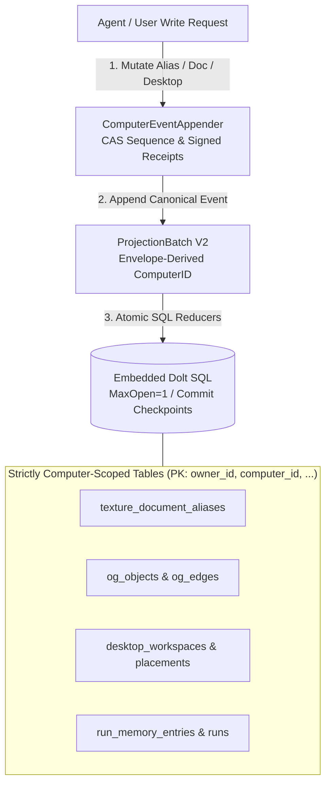
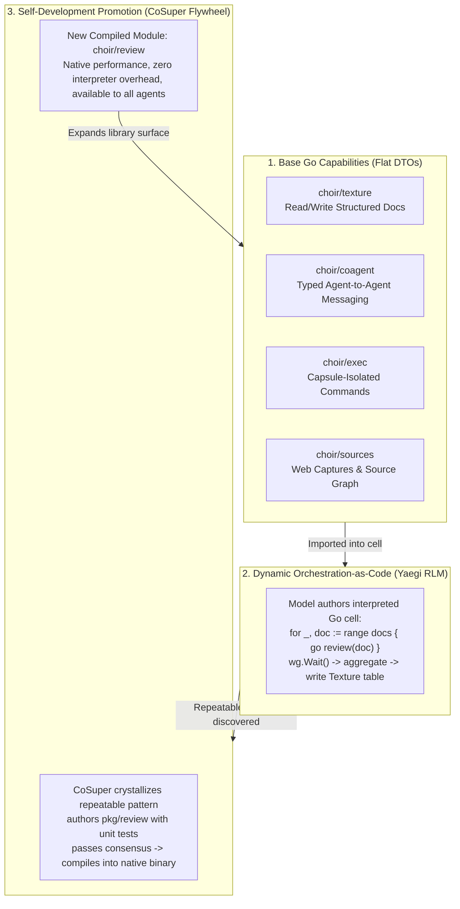
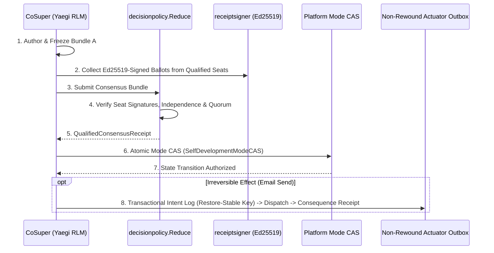
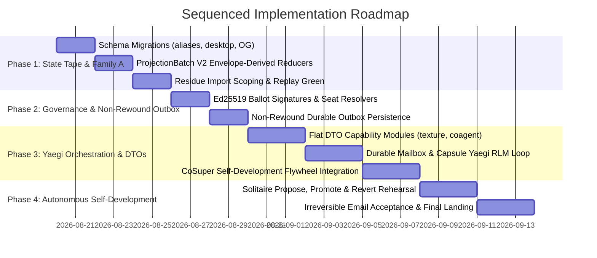

# Architecture Specification: Family A & The Yaegi Orchestration Flywheel (Finalized)

**Date:** 2026-08-18 (Status 2026-08-19)  
**Status:** Owner-Ratified & Unanimously Consensus-Approved Specification  
**Consensus Panel Review:** `.agentic-consensus/family-a-yaegi-flywheel-20260818/review/` (Unanimous `APPROVE_WITH_CAVEATS` across Claude, Gemini 3.7, Grok 4.6, Cursor, Devin, Opencode)  
**Authority:** `docs/choir-vision.md`, `docs/choir-doctrine.md`, `docs/computer-ontology.md`, `docs/memo-persistent-rlm-actors-2026-08-09.md`, `docs/definitions/choir-supervised-self-development-effects-2026-08-11.md`  
**Mutation Class:** Red (Protected State Authorities: Event Tape, Dolt Schema, Actor Execution, Replay Airworthiness)

---

## 1. Product Vision & Sovereign Tenancy Architecture

### 1.1 Multi-Tenant Account vs. Sovereign Computer
Choir strictly separates two distinct layers of authority:
1. **Platform Tenancy (`owner_id`):** The shared multi-tenant account and authentication envelope (user login, billing, auth sessions, host-level proxy isolation).
2. **Sovereign Computer Ownership (`computer_id`):** The persistent, self-contained, and exportable computer that the user owns.

```text
Platform Layer (Multi-Tenancy)
  └── Tenant Account (owner_id: "alice")
        ├── Computer A (computer_id: "computer-03335285...")  <-- Self-Contained Sovereign State
        │     ├── Event Tape (Genesis -> Sequence Head)
        │     ├── Embedded Dolt SQL (Docs, Revisions, Aliases, Desktops, Run Memory)
        │     ├── Staged Frontend & Desktop Workspaces
        │     └── Exportable / Self-Hostable State Bundle
        └── Computer B (computer_id: "computer-personal")
              └── Completely Isolated Event Tape & State
```

### 1.2 The Portability, Exportability & Self-Hosting Invariants
Because users are the sovereign owners of their computers:
* **Self-Contained Exportability:** A computer's entire state must be exportable as a single unified bundle: `Canonical Event Tape + Cryptographic Content Witness + Dolt Snapshot`.
* **Zero Host Entanglement:** A computer must not depend on ambient, unprojected host-side state, un-scoped SQL tables, or cross-computer owner databases.
* **Offline Coding Agent Inspection:** A user can export their computer state from `choir.news`, download the ext4 disk and event log, and point a local coding agent (OMP, Claude Code, etc.) directly at the Dolt database and filesystem to inspect, query, or develop on it completely offline.

---

## 2. Subsystem 1: Family A State Tape & Schema Migration

Under **Family A (Strict Computer Monism)**, all behavior-bearing state belongs to the computer's event tape. Rebuilding or restoring a computer cleanly rewinds its documents, revisions, aliases, desktops, and run memory.



### 2.1 Schema Migrations & Strict Equality Rule

#### A. Document Aliases (`texture_document_aliases`)
* **New Schema:**
  ```sql
  CREATE TABLE texture_document_aliases (
      owner_id VARCHAR(255) NOT NULL,
      computer_id VARCHAR(255) NOT NULL,
      source_path VARCHAR(2048) NOT NULL,
      doc_id VARCHAR(255) NOT NULL,
      created_at DATETIME NOT NULL,
      updated_at DATETIME NOT NULL,
      PRIMARY KEY (owner_id, computer_id, source_path),
      KEY idx_owner_computer_doc (owner_id, computer_id, doc_id)
  );
  ```

#### B. Desktop State Tables
* Add `computer_id VARCHAR(255) NOT NULL` to:
  * `desktop_workspaces` (PK: `owner_id, computer_id, desktop_id`)
  * `desktop_app_instances` (PK: `owner_id, computer_id, desktop_id, app_instance_id`)
  * `desktop_window_placements` (PK: `owner_id, computer_id, desktop_id, app_instance_id`)
  * `desktop_sessions` (PK: `owner_id, computer_id, desktop_id, session_id`)

#### C. Strict Scope Equality (Eliminating Compatibility Leaks)
* Empty `computer_id` fails closed with a rejection error.
* Purge all compatibility fallbacks (both `residue_import.go:511` and `project.go:494-503`).
* Point queries in `internal/objectgraph/dolt_store.go:409-417` and `internal/store/graph_store.go:113-121` enforce strict equality:
  ```sql
  WHERE owner_id = ? AND computer_id = ? AND ...
  ```

### 2.2 Envelope-Derived Reducer Scoping & True Replay Equivalence
* In `internal/store/project.go`, reducers read `computer_id` directly from `batch.ComputerID` (the event envelope header, validated in `projection_batch.go:158,170`), guaranteeing that historical events replay cleanly without payload mutation.
* Add `snapshotResidueAliases(ctx, ownerID, computerID)` to `residue_import.go` and cut over all direct SQL alias writers to event projection.
* Reclassify `texture_document_aliases` from `ReplayEmptyUntilSupported` to `ReplayEventProjected` in `internal/agentcore/replay_eligibility.go` **only after** residue import yields `result.Equivalent() == true` on staging.

---

## 3. Subsystem 2: The Yaegi Orchestration & Self-Development Flywheel



### 3.1 Orchestration-as-Code vs. Chat-Based Tool Chattering
* **The Problem:** Conventional LLM tool calling loops pass raw JSON back and forth over HTTP across every single primitive operation, producing massive token costs, 10–20x higher latency, and brittle retry handling.
* **The Orchestration-as-Code Solution:** An agent activation evaluates **interpreted Go cells** inside a private Yaegi instance inside an isolated guest capsule. The model writes real Go code: concurrency (`sync.WaitGroup`, channels), loops, error handling, and structured dataflow.
* **The Evolutionary Flywheel:**
  1. **Dynamic Exploration:** Agents dynamically author orchestration logic in Yaegi (e.g. tabular document diligence, multi-source synthesis).
  2. **Pattern Crystallization:** When a pattern proves repeatable, CoSuper authors native Go packages with typed DTOs and tests.
  3. **Autonomous Promotion:** The candidate promotes through policy-governed consensus, compiling the pattern into native Go and expanding the computer's built-in capability library.

### 3.2 Flat DTO Interface for Model Ergonomics & Operational Stability
To ensure rock-solid interpreter stability, clean concurrency, and serializable actor state:
* **MicroVM is the Security Boundary; Capsules & Yaegi provide Operational Isolation:** Capsules and Yaegi ensure clean diff overlays, reproducible builds, and prevent parallel agents from corrupting each other's workspaces.
* **Flat Data Transfer Objects (DTOs):** Exported modules expose stateless, flat DTO structs containing only primitive types, strings, slices, and maps (no unexported pointer graphs, live mutexes, or open network handles).

```go
// Clean Flat DTOs in choir/texture
package texture

type Document struct {
    ID        string           `json:"id"`
    Title     string           `json:"title"`
    Content   string           `json:"content"`
    Citations []SourceCitation `json:"citations"`
    UpdatedAt string           `json:"updated_at"` // RFC3339 formatted string
}

type SourceCitation struct {
    EntityID string `json:"entity_id"`
    NodeID   string `json:"node_id"`
    Hash     string `json:"hash"`
}
```

---

## 4. Subsystem 3: Consensus Governance & Non-Rewound Outbox



### 4.1 Asymmetric Ed25519 Ballot Signatures
* Upgrade `decisionpolicy.BallotAttestation` from a raw SHA-256 hash to a true asymmetric Ed25519 cryptographic signature.
* Reducer validates each ballot against an external `SeatKeyResolver` to prevent forged ballots.
* Deduplicate ballots by `SeatID` to ensure one seat gets exactly one vote.

### 4.2 Non-Rewound Outbox Persistence & Restore-Stable Idempotency
* Outbox persistence (`trusted_outbox_intents` / `trusted_outbox_consequences`) lives in the **non-rewound platform/actuator store** (event-tape consequence records and platform ledger).
* **Restore-Stable Idempotency Key:** Derive outbox idempotency keys from the content digest and proposal intent (not volatile live event heads), guaranteeing that computer restores cannot resurrect or duplicate already-dispatched external effects.

---

## 5. Sequenced Implementation Roadmap



### Sequenced Gates
* **Gate 1 (Post-Phase 1):** `replay-completeness` MUST return **`eligible: true`** with **0 table/content differences** on the staging computer before initiating Phase 2.
* **Gate 2 (Post-Phase 2):** Ed25519 ballot attestation and non-rewound outbox persistence pass deployed staging acceptance.
* **Gate 3 (Post-Phase 3):** Yaegi RLM kernel passes forced activation death, cross-model rewarm, and flat DTO isolation tests.
* **Gate 4 (Post-Phase 4):** Autonomous self-development completes end-to-end with zero human approval clicks under policy governance.
