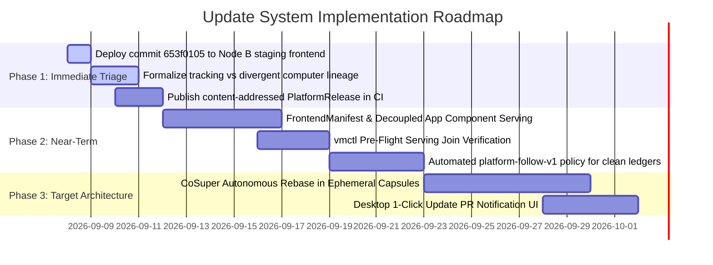

# Choir Platform Update System: Architecture for Persistent Divergent User Computers

**Date**: September 8, 2026  
**Subject**: Agentic Consensus Panel Findings on Updating Persistent Divergent Computers While Preserving Autonomous Self-Development  
**Author**: Choir Engineering & Agentic Consensus Panel (GPT-5.6 Sol, GPT-5.6 Luna, Gemini 3.8 Flash, Cursor Agent, Grok 4.6, OpenCode)  
**Status**: Architecture Formulated, Consensus Adjudicated, and Phased Roadmap Defined  

---

## 1. Executive Summary

Choir is building an autonomous computer system capable of supervised self-development. The core product object (`docs/computer-ontology.md`) is the **persistent user computer**: a stateful, enduring virtual machine world where apps, agents, files, package installs, local builds, Dolt state, prompts, and the user interface that renders that computer can **diverge** from the platform baseline.

A concrete incident on September 7, 2026, surfaced the core architectural tension of this model:
- Three owner-reported UI bugs were resolved in the repository: AppHost dynamic-import auto-recovery (`frontend/src/lib/AppHost.svelte`), keyset pagination and truthful message counts (`internal/maild/store.go`), and full-height flex reading pane redesign (`frontend/src/lib/EmailApp.svelte`), along with an underlying SQLite concurrency driver repair (`modernc.org/sqlite`).
- An inspection of the user account `yusefnathanson@me.com` (operating on retained staging microVM `candidate-fleet-e15cb89f25d963c220319b7b` / `computer-03335285269bdba4f94377e56879f9e6`) revealed that while host-level services (`maild`) updated globally, the computer's frontend remained pinned to a July build because its `snapshot_kind` is `"constructed-computer-version"`, which the CI deployment pipeline deliberately **preserves and skips** from VM refresh to protect checkpointed state.

To determine the correct long-term update architecture, an independent **6-model Agentic Consensus Panel** was convened across **GPT-5.6 Sol**, **GPT-5.6 Luna**, **Gemini 3.8 Flash**, **Cursor Agent**, **Grok 4.6**, and **OpenCode** (`.agentic-consensus/agentic-consensus-20260907-220539/`).

The panel reached **unanimous agreement** on the foundational law:
> **A platform update to a divergent user computer is a platform-authored self-development candidate.**
> It must flow through the existing, verified self-development pipeline:
> $$\text{PlatformDelta} \to \text{Ephemeral Capsule} \to \text{Build \& Tests} \to \text{CapsuleEffectBundle} \to \text{Accepted Event} \to \text{Root Guest Materializer} \to \text{Route CAS}$$
> There must never be a second promotion system, no raw SSH or host-side mutation of user computers, and no silent overwriting of user divergence.

---

## 2. Analysis of the Incumbent Topology & Incident Findings

### 2.1 The Two Divergent Realities in Staging
1. **The Shared Host Edge**:
   `maild`, `auth`, `proxy`, `corpusd`, and Caddy run directly on the Node B NixOS host. When a platform deploy occurs, `maild` is updated globally. Thus, the database schema migration and SQLite WAL pragmas deployed to `choir.news` immediately affected all mailboxes.
2. **The Preserved Constructed Computer**:
   The user's persistent computer (`computer-03335285269bdba4f94377e56879f9e6`) runs inside a Firecracker microVM with a constructed `ComputerVersion = (CodeRef, ArtifactProgramRef)`. In `.github/workflows/ci.yml:1163–1170`, the deployment workflow explicitly checks:
   ```bash
   | select((.snapshot_kind // "") == "constructed-computer-version")
   ```
   and skips it from the `/internal/vmctl/refresh` loop. This skip was introduced on July 17, 2026 (the G4 invariant) because blindly rebooting a constructed computer into the latest generic platform guest image erases its checkpointed code identity and breaks the reconstruction proof.
3. **The Frontend Skew**:
   Node B serves unauthenticated web traffic from a host-global SPA bundle at `/var/www/go-choir/frontend-current`, while doctrine (`docs/memo-per-computer-frontend-2026-08-13.md`, `C15`, `I25`) mandates that the UI rendering a computer belongs to that computer. In CI, run `34177879922` (carrying the frontend fixes) was auto-cancelled when a subsequent docs-only commit was pushed, leaving `frontend-current` pointing to older assets (`be9924dd`). Consequently, neither the host SPA nor the user's microVM received the latest frontend assets.

---

## 3. Evaluation of Candidate Updating Paradigms

The consensus panel evaluated four paradigms for propagating upstream updates ($P_0 \to P_1$) to divergent user computers ($P_0 \to U_1$):

| Paradigm | Architectural Role | Strengths | Critical Failure If Used Alone | Panel Verdict |
| :--- | :--- | :--- | :--- | :--- |
| **Paradigm A: Layered OS / OverlayFS / Nix Generations** | Immutable Host & Guest TCB | Fast, atomic rollback; reproducible appliance runtime. | **Fails across structured state.** Inode overlays cannot merge Dolt schemas, SQLite journals, or modified Svelte components; causes silent data corruption. | **Restricted to L1 Appliance Floor.** |
| **Paradigm B: Semantic Ledger-by-Ledger Rebase** | Canonical State & Transition Law | Preserves strict ledger boundaries; deterministic; auditable. | Halts on non-trivial source/schema conflicts without an intelligent rebase actuator. | **Mandatory as the Wire Contract.** |
| **Paradigm C: Modular Package Subscriptions** | Unit of Identity & Dependency Graph | Decouples shell from applications; allows unmodified apps to auto-follow upstream. | Retired `AppChangePackage` authority must not be revived. Packages are names for typed artifacts, not a second promotion authority. | **Adopted for L2 App Surfaces.** |
| **Paradigm D: Autonomous Agentic Rebase** | Non-Authoritative Rebase Planner & Merge Actuator | Automates complex 3-way merges in code and schemas without manual user cherry-picking. | Models are not merge authority (`C8`/`C14`). Latent, non-deterministic, and computationally expensive if run for simple upstream fixes. | **Restricted to L4 Divergent Conflicts.** |

---

## 4. The Recommended Architecture: Stratified Rebase

The panel synthesized a **Stratified Rebase Model** mapping Choir's ledgers to their exact merge laws:

```text
┌──────────────────────────────────────────────────────────────────────────────────┐
│ L0: Host Control Plane & Multi-Tenant Edge (OUT of Restore, Never Divergent)     │
│     • Edge TLS, Caddy Bootstrap, OAuth/Auth Tokens, Reverse Proxy Routing        │
│     • Shared Services: `corpusd` World Wire CAS, `maild` SMTP/Webhook Ingestion  │
│     • Deployment: GitHub main → CI NixOS Host Switch on Node B                   │
├──────────────────────────────────────────────────────────────────────────────────┤
│ L1: Guest Hypervisor & Core Appliance Substrate (Non-Forkable Appliance)         │
│     • Linux Kernel, cgroups v2, seccomp, Landlock, `choir-capsule-broker`        │
│     • Deployment: Immutable realization swap via vmctl; preserves /mnt/persistent│
├──────────────────────────────────────────────────────────────────────────────────┤
│ L2: Decoupled Computer Surface & App Modules (Forkable Packages, IN Restore)     │
│     • Desktop Shell, EmailApp, Texture, Settings Panes, Asset Graph              │
│     • Manifest-Driven Decoupling via `FrontendManifest`:                         │
│       - Unmodified Packages (diverged == false) → Fast-forward to P1 chunks      │
│       - Divergent Packages (diverged == true) → Retain local artifact digest     │
├──────────────────────────────────────────────────────────────────────────────────┤
│ L3: Computer Workspace Ledgers (IN Restore, Event-Authorized)                    │
│     • Embedded Dolt State, SQLite Actor Logs, Local File Trees, Prompts          │
│     • Deployment: Reconciled via typed platform deltas (migrations, diffs)       │
├──────────────────────────────────────────────────────────────────────────────────┤
│ L4: Conflict Actuator: Autonomous Capsule Rebase (CoSuper Agent)                 │
│     • Trigger: Upstream P1 conflicts with user-divergent code or Dolt schema     │
│     • Execution: Ephemeral Landlock/cgroup capsule executes 3-way merge & tests   │
│     • Output: Inert `CapsuleEffectBundle` surfaced as 1-Click Update PR on Desk  │
└──────────────────────────────────────────────────────────────────────────────────┘
```

### 4.1 Reconciling Tracking vs Divergent Computers
The panel noted that using `snapshot_kind == "constructed-computer-version"` as the sole deploy fence is too coarse. Construction $\neq$ divergence. Over time, every durable computer becomes a constructed version.

The system must maintain an explicit **Lineage and Divergence Ledger**:
- **Tracking Computer** (`diverged_components == []`): If the computer's components have zero local modifications against base $P_0$, the root guest updater automatically fast-forwards them to $P_1$ under a declared `platform-follow-v1` policy. This applies without human intervention and without spinning up an LLM.
- **Divergent Computer** (`diverged_components != []`): Non-divergent components (e.g. `EmailApp`) auto-update; divergent components (e.g. a modified `TextureEditor`) remain pinned. An ephemeral capsule performs a 3-way merge for the divergent component, runs tests, and leaves a verified proposal for the user.

---

## 5. Resolving the Per-Computer Frontend Serving Dilemma

Doctrine `C15` and Invariant `I25` demand that the UI rendering a computer belongs to that computer. However, cutting over to a guest-static frontend before an update propagation mechanism exists would freeze constructed computers onto their construction-time UI forever.

### 5.1 The Two-Tier Frontend Architecture
1. **Thin Platform Shell (Host-Global, OUT of Restore)**:
   - Hosted by Caddy on Node B at `https://choir.news/`.
   - Responsibilities: TLS termination, OAuth callback handlers, unauthenticated login screen, computer picker, and the outer iframe/web-component container.
2. **Authenticated Computer Surface (Per-Computer, IN Restore)**:
   - Reverse-proxied via the Go proxy to the vmctl-resolved guest microVM.
   - Bootloaded dynamically via a per-computer `FrontendManifest`:
     ```json
     {
       "schema_version": "choir.frontend_manifest.v1",
       "computer_id": "computer-03335285269bdba4f94377e56879f9e6",
       "surface_version": "v2026.09.08.1",
       "apps": {
         "desktop_shell": { "channel": "platform", "ref": "sha256:7f8a...", "diverged": false },
         "email": { "channel": "platform", "ref": "sha256:4b2e...", "diverged": false },
         "texture": { "channel": "user", "ref": "sha256:e1a9...", "diverged": true }
       }
     }
     ```
   - When platform CI deploys a new `EmailApp` fix, the manifest for a non-divergent user updates the chunk reference to point to the new content-addressed platform asset. The browser loads the updated component without touching the user's custom Texture editor.

---

## 6. Failure Fencing, Health Probes, and Rollback

### 6.1 The Rollback Invariant
**A failed update must never degrade or disrupt an actively serving realization.** (`docs/computer-ontology.md:248–250`).

### 6.2 The Verification State Machine
1. **Isolated Preparation**: Updates are prepared in an unrouted staging directory (`/releases/<new-digest>`) or an ephemeral capsule. The actively serving realization $R_0$ at epoch $E_0$ continues handling traffic.
2. **Pre-Flight Serving Join**:
   Before `vmctl` performs the route-slot CAS, it probes:
   - `GET /health`: Asserts guest updater readiness, Dolt schema integrity, and event appender availability.
   - `GET /`: Asserts that `ComputerSurface` derives a valid `index.html` and that all hashed assets referenced in the manifest exist.
   - Contract Compatibility: Asserts that the guest runtime satisfies the host `maild` and `corpusd` wire protocols.
3. **Atomic Abort on Failure**:
   - If any probe fails or times out (30s deadline), `vmctl` aborts the route CAS.
   - Realization $R_0$ remains active. The failure is recorded as an immutable `UpdateFailureEvent` containing compiler logs or crash traces.
4. **Forward Restore**:
   - If an update greens but exhibits a semantic regression later, rollback is performed via a **forward restore transaction** (`choir computer restore <checkpoint_id>`) on the computer's event log, reconstructing the prior state.

---

## 7. Phased Implementation Roadmap



### Phase 1: Immediate Triage (Today)
1. **Deploy Staging Frontend**: Push a non-docs commit or trigger manual workflow dispatch to build and install the frontend bundle on Node B, unblocking `yusefnathanson@me.com` with today's chunk auto-recovery, reading pane flex layout, and keyset pagination.
2. **Lineage Formalization**: In `internal/vmctl`, replace the crude `snapshot_kind == "constructed-computer-version"` check with an explicit `divergence_status` check (`tracking` vs `divergent`).
3. **Publish `PlatformRelease` Artifact**: Configure CI to emit a content-addressed `platform-release-<commit>.json` manifest containing asset hashes, schema versions, and guest image digests.

### Phase 2: Near-Term (Successor Definition)
1. **Implement `FrontendManifest`**: Refactor `AppHost.svelte` to dynamically import applications based on `/api/computer/surface/manifest`, allowing unmodified apps to track platform hashes while divergent apps remain locally pinned.
2. **Enforce `vmctl` Serving Join**: Require that `vmctl` verify both `/health` and `GET /` served bytes before greening a route CAS.
3. **Automated Platform-Follow Policy**: Enable non-divergent computers to automatically fast-forward non-divergent ledgers upon receipt of an upstream `PlatformRelease`.

### Phase 3: Target Architecture (Autonomous Self-Development Loop)
1. **CoSuper Maintenance Actor**: Implement the background maintenance actor that subscribes to `platform_release_published` events, spins up an ephemeral Landlock/cgroup capsule, executes 3-way code/schema merges, and produces an inert `CapsuleEffectBundle`.
2. **Desktop 1-Click Update PR**: Deliver an interactive notification in the Desktop shell allowing users to review diffs, inspect test receipts, and accept platform updates with one click.
