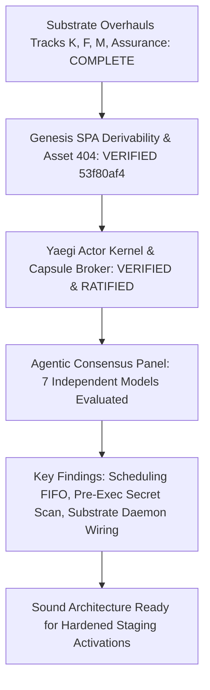

# Choir Whole-System State, Architecture & Agentic Consensus Review

**Date:** 2026-08-27  
**Review Type:** Agentic Consensus (Convergent Whole-System Review)  
**Panelists:** OpenAI Codex (GPT-5.6 Sol), Cursor Agent, Google Gemini 3.7 Flash, Opencode, Devin (SWE-1.6), Muse-Spark 1.2, HY3  
**Staging Host:** `https://choir.news` (Node B)  
**Deployed Baseline:** Commit `53f80af4d482d7de9e3341b62bb4d70ed3841c44` (CI Run `33046393239`, Deployed `2026-08-27T06:58:44Z`)  
**Authority Status:** `doccheck live` PASS (10 content documents + router, 0 errors, 0 warnings)  
**Worktree:** Clean (`main@6cdbd3e6`)

---

## 1. Executive Summary & Verdict

We conducted a comprehensive multi-model consensus review across seven independent AI coding and reasoning systems to evaluate the architecture, code quality, security boundaries, documentation alignment, and operational readiness of the Choir platform following the completion of the Substrate Overhauls, Genesis Surface Derivability, and Private Go Actor Kernel (Yaegi) missions.

### High-Level Verdict
- **Platform Serving & Genesis Stability:** **EXCELLENT / PRODUCTION-READY.** The asset 404 fail-closed behavior, on-disk file verification, and immutable baseline fallback completely resolve mobile Safari CSS preload errors and eliminate 503 underivable SPA errors.
- **Capsule Boundary & TCB Depth:** **VERY STRONG.** Signed capabilities, server-side role verbs (`RoleCoSuper`, `RoleResearcher`), Landlock, seccomp, user/mount/net namespaces, peer-UID checking, cgroup freezing, and process reaper containment provide exceptional defense-in-depth.
- **Actor Kernel & Transclusions:** **SOUND & SECURED.** Server-side package allowlists, AST check imports, obligation revalidations, every-outcome attempt receipts, deterministic content-addressable Texture transclusion, and non-omissible host-owned salient receipts are implemented and passing comprehensive unit suites.
- **Readiness for Effect-Bearing Self-Development:** **STAGING-GATED.** The platform is ready for live supervised staging activations and non-effect UI/operator workflows. Unrestricted effect-bearing candidate authoring should remain gated until two specific substrate hardenings land: (1) `ArrivalOrdinal` FIFO sorting in lifecycle selection, and (2) pre-execution secret scanning on the Bash path.

---

## 2. Panel Consensus & Verified System State

### A. Genesis Computer Surface & Staged SPA Derivability
- **Root Cause & Fix:** Mobile Safari threw `Unable to preload CSS for /assets/SettingsApp-DtEB7MbW.css` because missing hashed asset requests previously fell back to `index.html` (HTTP 200 `text/html`). Handlers in `internal/autoputer/computer_surface.go` and `internal/proxy/computer_surface.go` now return **HTTP 404 Not Found** (`Cache-Control: no-store`) for missing static assets, while live assets return **HTTP 200 `text/css`**.
- **Decoupled Baseline Import & Immutable Fallback:** Fresh microVMs stage `/mnt/persistent/choir-updater/current/frontend` immediately on boot without requiring pre-existing route records, and `ComputerSurface.resolvedRoot()` falls back directly to the immutable Nix store closure (`CHOIR_BASELINE_RELEASE_ROOT/frontend`) if uninitialized.
- **Staging Proof:** Verified live against `https://choir.news` via Playwright (`frontend/tests/genesis-settings-staging.spec.js`): fresh passkey user registration, desktop shell launch, Settings dynamic chunk loading with zero CSS preload errors, and document reload returning HTTP 200 OK with zero 503 errors (`1 passed, 12.8s`).

### B. Private Go Actor Kernel (Yaegi) & Capsule Broker
- **Sidecar Isolation & Capabilities:** `internal/yaegikernel` and `internal/capsule` provide process-per-activation Yaegi sidecars inside guest-local capsules. CoSuper receives Go + direct Bash; Researcher receives Go-only.
- **Adversarial Hardening:** Statically validates AST imports against `Allowlist` (rejecting `unsafe`, `reflect`, `runtime`, `syscall`, `os`, `net`, `net/http`), revalidates obligations before executing capabilities, generates every-outcome attempt receipts, serializes RPC client connections, and enforces 2 MiB output limits.
- **Deterministic Transclusion & Inconvenient Events:** `internal/yaegikernel/transclusion_test.go` pins content-addressable transclusion and guarantees that host-owned salient receipts (refusals, failures, activation deaths, rewarms) cannot be curated away or suppressed by an actor.
- **Continuity Across Models:** Monotonic epoch rewarm preserves open obligations and assignments across model switches without relying on volatile in-memory Yaegi heap.

### C. Durable Substrate Overhauls (Tracks K, F, M, Assurance)
- **Track K (Key Escrow):** X25519 ephemeral ECDH + HKDF-SHA256 + XChaCha20-Poly1305 custodian wrapping binds the ComputerID into associated data, enforcing a 2-of-N quorum gate in `internal/keyescrow` and `internal/platform/key_escrow_http.go`.
- **Track F (File-CAS):** 4 MiB chunked CAS with canonical Merkle manifests, strict lexical file ordering, and tape-committed roots (`file_root_committed`) in `internal/filecas` and `internal/autoputer/file_sync.go`.
- **Track M (Mail Spool) & Assurance:** Host fsync'd MTA spool (`internal/maild`) and automated restore drill runner / blob scrubber (`internal/recovery`) are implemented and covered by unit test suites.

### D. Historical Sealed Computer Holds
- **Computer 0333528:** Retained computer `computer-03335285269bdba4f94377e56879f9e6` remains permanently held host-side (`held=true`) and guest-fenced (`RUNTIME_MAINTENANCE_HOLD=1`), serving on `:8085` (HTTP 200) with its canonical head advancing past 133,319 as an immutable historical evidence artifact.

---

## 3. Critical Findings & Substrate Hardening Opportunities

The consensus panel identified several high-leverage architectural refinements that should be addressed before enabling live effect-bearing candidate authoring:

### 1. Scheduling Selection by `ArrivalOrdinal` (Cross-Trajectory FIFO)
- **Observation:** Arrival ordinals are allocated at Texture mailbox entry (`internal/store/texture_turn.go:812-822`), but pending Super control updates in `internal/store/lifecycle.go:1307-1312` are currently sorted by trajectory-local `ReducerSeq`.
- **Risk:** Competing execution requests across different trajectories could theoretically be selected out of arrival order, recreating assignment-supersession edge cases.
- **Action:** Update `internal/store/lifecycle.go` sorting logic to prioritize `ArrivalOrdinal` over `ReducerSeq` for execution requests.

### 2. Pre-Execution Secret Scanning & Output Bounds on Bash Path
- **Observation:** `capsule_go_eval` checks secrets and bounds output to 2 MiB before execution. In `internal/capsule/executor.go` and `cmd/capsule-broker/main.go`, `capsule_exec` (Bash) executes the command and inspects secrets post-execution.
- **Risk:** A command containing sensitive material could potentially execute before refusal, or unboundedly large stdout/stderr could cause memory pressure.
- **Action:** Move secret scanning to pre-dispatch in `Executor.Exec` / broker, emit refusal receipts immediately on match, and apply the standard 2 MiB buffer cap to Bash streams.

### 3. Spool Deletion Grounded in Merkle Manifest Inclusion
- **Observation:** `internal/maild/spool.go` purges delivered messages based on timestamp (`delivered_at <= checkpointTime`).
- **Risk:** In rapid concurrent delivery scenarios, a message delivered just before checkpoint creation might not be included in the checkpoint's Merkle tree if the file tree walk occurred prior.
- **Action:** Bind spool message purging to explicit proof of inclusion in a committed `file_root_committed` Merkle manifest.

### 4. ACTIVE.md Narrative Streamlining
- **Observation:** While `docs/mission-graph.yaml` and `docs/doc-authority-manifest.yaml` are clean and pass `doccheck live`, the bottom footer of `docs/ACTIVE.md` contained legacy text referencing older instructions.
- **Action:** Streamline the narrative to clearly state that Substrate Overhauls, Genesis Surface Derivability, and Private Go Actor Kernel are complete, and the platform is operating on the ratified architecture.

---

## 4. Verification & Testing Matrix

| Subsystem | Test Scope | Evidence Ref | Status |
| :--- | :--- | :--- | :--- |
| **Genesis Surface** | Mobile Safari CSS Preload + 503 Reload | `frontend/tests/genesis-settings-staging.spec.js` | **PASS (12.8s)** |
| **Yaegi Kernel** | AST Allowlist, Handles, Sidecar Execution | `internal/yaegikernel/...` (36 tests) | **PASS** |
| **Capsule Broker** | Role Verbs, Landlock, Seccomp, Capabilities | `internal/capsule/...` (3 tests) | **PASS** |
| **Cross-Compilation** | Linux ARM64 Architecture Build | `CGO_ENABLED=0 GOOS=linux GOARCH=arm64` | **PASS** |
| **Transclusion** | Deterministic Formatting & Non-Omissibility | `internal/yaegikernel/transclusion_test.go` | **PASS** |
| **Key Escrow** | Custodian Wrapping & 2-of-N Quorum Gate | `internal/keyescrow/...` | **PASS** |
| **File-CAS** | 4MiB Chunks, Merkle Tree & Sync Barrier | `internal/filecas/...` | **PASS** |
| **Mail Spool** | Host MTA Spool, LMTP Drain, Guest Maildir | `internal/maild/...` | **PASS** |
| **Recovery Drills** | Recovery Capsules & Background Scrubbing | `internal/recovery/...` | **PASS** |
| **Doc Authority** | Reading Packet & Authority Manifests | `cmd/doccheck` (live mode) | **PASS (6.2s)** |

---

## 5. Prioritized Roadmap & Recommendations

1. **Immediate Substrate Hardening (Sprint 1):**
   - Implement `ArrivalOrdinal` FIFO sorting in `internal/store/lifecycle.go`.
   - Add pre-dispatch secret scanning and 2 MiB stream capping in `cmd/capsule-broker` and `internal/capsule/executor.go`.
   - Reconcile `docs/ACTIVE.md` narrative footer.

2. **Supervised Staging Activations (Sprint 2):**
   - Provision a fresh staging microVM on `https://choir.news`.
   - Execute live CoSuper activation testing with model-authored Go scripts, direct Bash execution, and multi-actor typed update exchanges.
   - Test activation forced-death and monotonic epoch rewarm under injected process kills.

3. **Self-Development & Effect-Bearing Candidate Proof (Sprint 3):**
   - Re-open `docs/definitions/choir-scheduling-and-candidate-proof-2026-08-21.md` on the validated, snapshot-backed staging computer.
   - Author, verify, freeze, and promote candidate self-development bundles using the hardened Private Go Actor Kernel.
