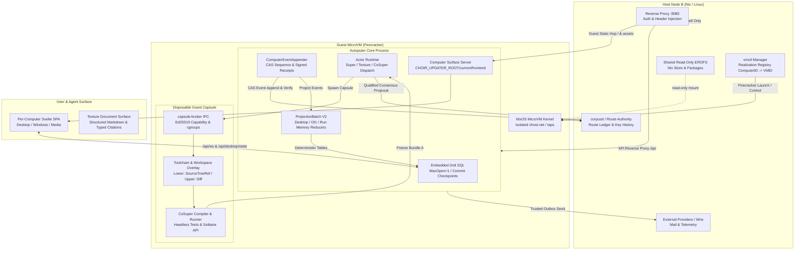
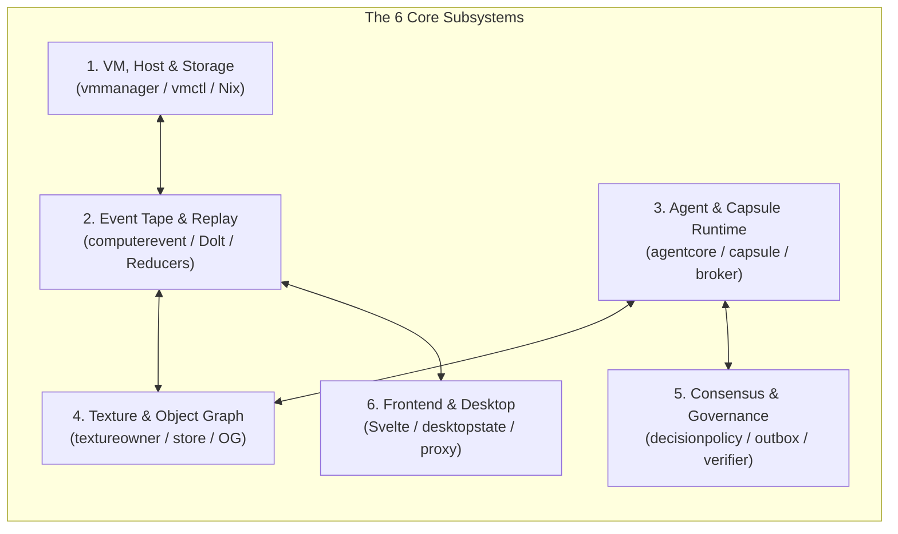
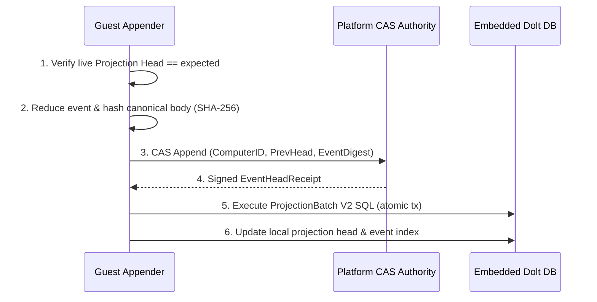
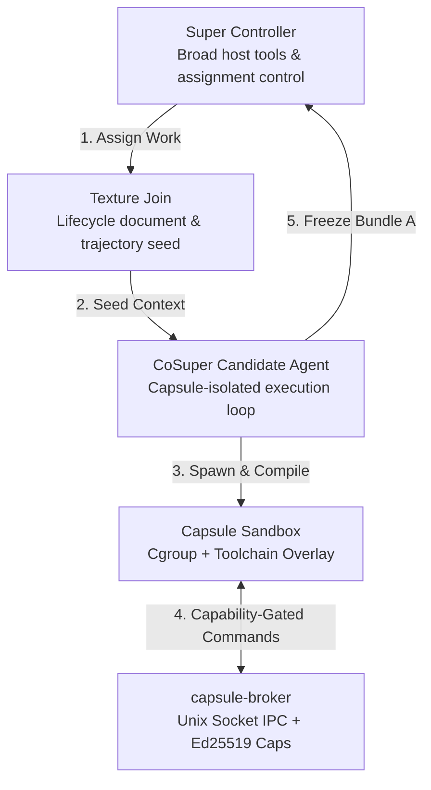
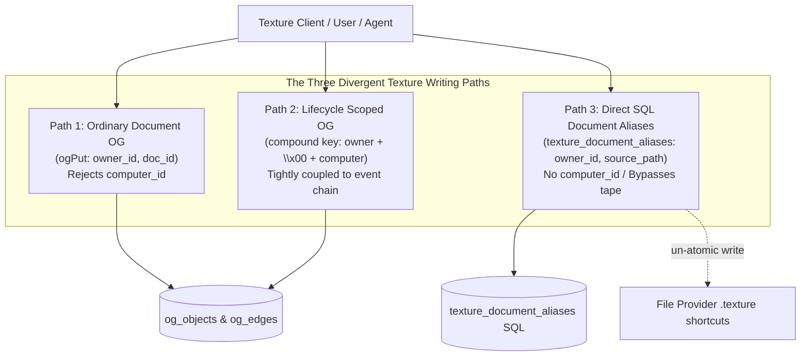
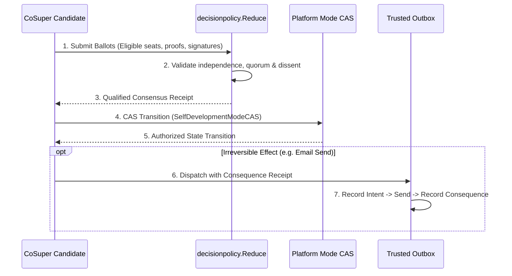
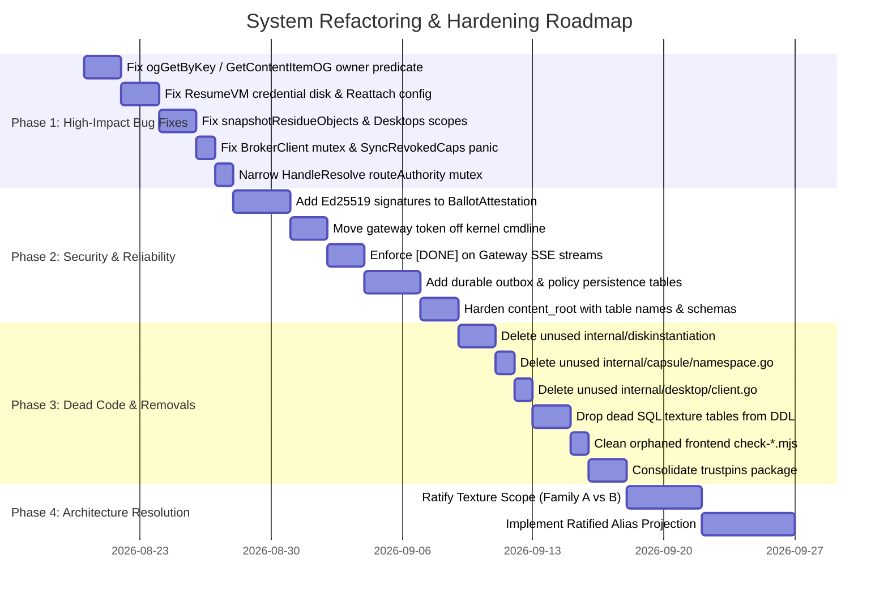

# Choir Whole-System Architecture & Invention Review

**Date:** 2026-08-18 (Updated 2026-08-19)  
**Status:** Comprehensive Codebase Review & Subsystem Audit  
**Authority:** `docs/choir-vision.md`, `docs/choir-doctrine.md`, `docs/computer-ontology.md`, `docs/definitions/choir-supervised-self-development-effects-2026-08-11.md`  
**Mutation Class:** Green (Documentation / Analysis only)

---

## Executive Summary & System Topology

Choir is an architecture for the **Automatic Computer** — a persistent, self-developing computing environment designed for supervised autonomy. Unlike conventional agentic harnesses that treat the environment as ephemeral disposable containers or stateless tool-calling loops, Choir establishes a **durable user computer** with an immutable event tape as its single semantic authority, an embedded Dolt SQL projection engine, policy-governed multi-agent consensus, and in-guest isolated execution capsules.

---

## 1. Top-Level Inventions & Architectural Novelties

Choir introduces six foundational architectural inventions that distinguish it from existing AI agent platforms, operating systems, and developer environments:

### 1. Persistent User Computer Ontology vs. Ephemeral VM Realizations
* **The Invention:** Decouples the durable identity of a user computer (`ComputerID`, `EventHead`, `CodeRef`, `ArtifactProgramRef`, `RouteSlot`, and embedded state) from the disposable Firecracker microVM instance (`VMID`, `RealizationID`, `Epoch`).
* **Why it matters:** If a microVM crashes, runs out of memory, or suffers hardware failure, `vmctl` launches a fresh microVM realization, attaches the persistent ext4 data disk, replays the canonical event chain from the tape, and resumes operation without state loss.
* **Key Code:** `docs/computer-ontology.md`, `internal/vmctl/ownership.go`, `internal/computerversion/version.go`.

### 2. Event Tape as Single Semantic Authority (Dolt as Projection Witness)
* **The Invention:** The canonical event chain is the sole address and authority of the computer's history. Embedded Dolt SQL inside the guest is treated as an *event-derived projection and audit witness*, never an alternate head.
* **Why it matters:** Eliminates dual-source-of-truth drift. Replay completeness is verified cryptographically by running `ComputerEventAppender` from genesis in a fresh scratch database and comparing per-table SHA-256 hashes against the live Dolt head via `DoltStateExtractor`.
* **Key Code:** `internal/computerevent/appender.go`, `internal/agentcore/replay_completeness.go`, `internal/computerversion/dolt_state_extractor.go`.

### 3. Disposable In-Guest Capsules with Toolchain Overlays
* **The Invention:** Enables autonomous coding agents (CoSuper) to compile, build, test, and run unverified code inside lightweight, disposable namespace/cgroup capsules *inside the persistent guest microVM* without requiring host root or polluting the persistent guest OS.
* **Why it matters:** Safe autonomous self-development. Toolchain overlays (`capsule.Executor`) isolate workspace diffs and communicate with the parent harness via a secure, capability-gated Unix domain socket broker (`capsule-broker`).
* **Key Code:** `internal/capsule/executor.go`, `cmd/capsule-broker/main.go`.

### 4. Policy-Governed Multi-Agent Consensus as the True Autonomy Boundary
* **The Invention:** Replaces naive "human-in-the-loop" approval gates with mathematically formal, policy-governed multi-agent consensus. Reversibility is recognized as a *recovery property*, not the boundary of autonomy.
* **Why it matters:** Autonomous operation can proceed without per-candidate human clicks. Both reversible self-development (`reversible_selfdev_v1`) and irreversible actions like email sends (`irreversible_email_v1`) are evaluated against frozen seat manifests, independence domains, quorum rules, and explicit dissent disposition.
* **Key Code:** `internal/decisionpolicy/reduce.go`, `internal/platform/self_development_modes.go`.

### 5. Per-Computer Frontend Serving via Guest-Static Hop
* **The Invention:** The desktop UI (Svelte SPA) is per-computer software served directly from the guest microVM's staged filesystem (`CHOIR_UPDATER_ROOT/current/frontend`), proxied through the host with authentication and header injection.
* **Why it matters:** The UI state and software version travel with the computer's event head and checkpoint. The host platform shell only serves unauthenticated picker/auth chrome, preventing host-side UI versions from drifting from guest backend capabilities.
* **Key Code:** `internal/autoputer/computer_surface.go`, `internal/proxy/computer_surface.go`, `docs/memo-per-computer-frontend-2026-08-13.md`.

### 6. Cryptographically Hashed Structured Document & Evidence Graph (Texture)
* **The Invention:** A dual-purpose document control plane readable by both humans and LLMs. Features Structured Texture Docs (`BodyDoc`), typed citations with content hashes, and parent revision chains.
* **Why it matters:** Eliminates hallucinated references. Agents cite exact source entity versions and body nodes; revision hashes cryptographically verify document lineage.
* **Key Code:** `internal/textureowner/texture.go`, `internal/texturedoc/validate.go`, `internal/types/texture_revision_hash.go`.

---

## 2. Subsystem-by-Subsystem Deep Dive

---

### Subsystem 1: Host, MicroVM & Storage Architecture

**Packages:** `internal/vmmanager`, `internal/vmctl`, `cmd/vmctl`, `cmd/autoputer`, `internal/autoputer`, `nix/`, `internal/diskinstantiation`, `internal/persistentdisk`

#### How It Works
* `vmmanager.Manager` (`internal/vmmanager/manager.go`) manages Firecracker microVM lifecycles on Host Node B. It provisions TAP network interfaces, attaches a 32GiB sparse ext4 persistent data disk (`data.img`), mounts a shared read-only EROFS Nix store, and builds kernel boot arguments.
* `vmctl` (`internal/vmctl/ownership.go`) maintains a durable realization registry mapping `ComputerID -> VMID`. During boot reconciliation, it collapses transient states (`booting`, `degraded`, `stopping`) to `stopped` and increments the realization `Epoch`.
* Inside the guest, `cmd/autoputer` initializes the embedded Dolt database (`store.Open`), starts Dolt background GC (every 5m), constructs the `ComputerEventAppender`, and runs a 1-minute background loop for guest capability renewal (renewing when $\le 90$s remain).

#### Key Load-Bearing Mechanisms
1. **Dolt Connection Discipline:** `store.Open` enforces `max_open_conns=1` to prevent database locks and corruption in embedded cgo/Dolt mode, maintaining a separate read-only DB handle for queries.
2. **Realization Epoch Bumping:** Every recovery, refresh, or reboot increments the epoch, invalidating stale guest tokens and preventing split-brain writes.
3. **State Generation Integrity:** `computerversion.StateGenerator` (`state_generator.go`) verifies one captured journal slice before deriving the tree and writing blobs, avoiding verify/read races.

#### Identified Seams, Risks & Dead Code
* **Global VM Resolve Lock Bottleneck (`HandleResolve`):** `internal/vmctl/handlers.go:170` acquires `h.routeAuthority.mutationMu` around the entire route resolution and Firecracker boot sequence (up to 180s on Node B). This causes one cold microVM boot to globally serialize all other user computer resolutions. *Recommendation: Narrow lock scope to route state reads/CAS or use per-computer mutexes.*
* **Credential Disk Re-Attach Seam on `ResumeVM` (Critical Bug):** `BootVM` creates `credential.img` containing a root-owned mode-0400 envelope; guest autoputer consumes and unlinks `/run/choir-bootstrap/computer-event-envelope` on startup. When `ResumeVM` is called after hibernation (e.g. on warm platform paths `WarmAlwaysOnDesktops`), it reuses the same `credentialDiskPath` and epoch without re-seeding the credential envelope. The resumed guest lacks the bootstrap credentials and fails event appends. *Recommendation: Recreate/reseed the credential envelope disk before `ResumeVM` or maintain a durable root-only handoff.*
* **`ReattachManagedVMs` Loses Config Metadata:** `ReattachManagedVMs` invokes `VMManager.ReattachVM` instead of `ReattachVMWithConfig`, causing the reconstructed `VMConfig` to have empty `ComputerID`, `RealizationID`, `OwnerID`, and `credentialDiskPath`. Subsequent warm operations fail to address the guest properly.
* **Ignored Actuator Errors in `hibernateVMForDesktopWithReason`:** `ownership.go` ignores `HibernateVM` error returns (`_ = ...`) and marks ownership as hibernated even if the actuator failed, leading to route desynchronization.
* **Disk Usage Metric Overstatement:** `LookupDataImageStats` sets `FileBytes` to the entire `stateDirBytes` (walking PID, configs, credential images), overstating disk usage in `/health` against `data.img` capacity.
* **Capability Mutex Contention & Silent Renewal Errors:** `GuestCredentials.Capability` holds `g.mu` across the entire 15-second HTTP renewal call. When TTL $\le 90$s, all event/control callers serialize behind the network. Furthermore, `StartBackgroundRenewal` silently drops renewal errors. *Recommendation: Use singleflight in-flight renewal that releases the lock during HTTP calls, add backoff+jitter, and emit health metrics.*
* **Unused Package (`internal/diskinstantiation`):** Codebase search reveals that `internal/diskinstantiation` is only referenced by its own unit tests. `vmmanager.createDataImage` bypasses `Plan/Receipt/Ext4Backend` entirely and runs `mkfs.ext4` directly via shell commands. *Recommendation: Delete `internal/diskinstantiation` or formally integrate its geometry verification into `vmmanager`.*
* **Permissive Firecracker Network Setup:** `launchFirecracker` logs warnings and continues when TAP interface creation or `iptables` setup fails, then waits up to 180s (`BootReadyTimeout`) before timing out. Network setup should fail fast.
* **Gateway Token in Kernel CommandLine:** `vmmanager.buildFirecrackerConfig` appends `choir.gateway_token` to `boot_args` and writes `fc-config.json` with mode `0644`. This leaves a bearer token exposed in `/proc/cmdline` and world-readable VM state files. *Recommendation: Pass gateway tokens exclusively via the root-owned `CHOIR_CRED` disk or file descriptor.*

---

### Subsystem 2: Event Tape, Projection, Replay & Restore

**Packages:** `internal/computerevent`, `internal/platform`, `internal/agentcore`, `internal/selfdevprotocol`, `internal/store`

#### How It Works
* `ComputerEventAppender` (`internal/computerevent/appender.go`) is the single sequencing authority. Every mutation begins with a CAS check against the platform head.
* Events are projected into Dolt using `ProjectionBatch V2` (`internal/computerevent/projection_batch.go`), applying typed operations for desktops, runs, object graphs, run memory, self-development operations, and Texture mutations.
* `replay_completeness.go` tests airworthiness: it opens a fresh scratch Dolt instance, replays all events from genesis, extracts SHA-256 table hashes, and compares them to the live instance.

#### Key Load-Bearing Mechanisms
1. **`ReplayEmptyUntilSupported` Airworthiness Gate:** Direct-write SQL tables without reducers fail replay eligibility closed, preventing unverified mutations from entering production.
2. **Signed Head Receipts:** Platform CAS issues signed cryptographic receipts verifying that no parallel write occurred.
3. **Dolt State Extraction Separation:** `DoltStateExtractor` (`dolt_state_extractor.go`) explicitly separates non-deterministic Dolt commit hashes (audit-only) from deterministic schema/table content hashes.

#### Identified Seams, Risks & Dead Code
* **Residue Import Run Object Column Omission:** `snapshotResidueObjects` queries `WHERE owner_id=? AND computer_id=?` on `og_objects`. However, `CreateRunOG` leaves `og_objects.computer_id` empty and embeds it in the JSON body/metadata. As a result, canonical run objects are omitted during residue snapshots, causing live/replay OG discrepancies.
* **Cross-Computer Desktop Residue Leakage:** `snapshotResidueDesktops(ctx, ownerID, computerID)` queries `WHERE owner_id=?` and completely ignores `computerID` because desktop tables lack a `computer_id` column. If an owner has multiple computers, one computer's residue import captures all desktops across all computers, breaking replay hash isolation.
* **Checkpoints Omit `CompleteFromHead` (Dead Restore Gate):** All live checkpoint producers (`self_development_materializer.go:361`, `api_self_development.go:643`, `rematerialize.go:419`) omit `TapeCompleteness`/`CompleteFromHead`. Consequently, `AdmitRestoreSequence` in `tape_completeness.go` is dead code, and no live producer records a verified completeness boundary.
* **`FinalizeBatch` Projection Failure Poison:** `FinalizeBatch` CASes the platform head and then applies Dolt SQL in a transaction. If the Dolt transaction rolls back, the platform head remains advanced, causing replay poison (`ErrNeedsProjectionRepair`).
* **`content_root` Hash Collision Risk:** `dolt_state_extractor.go` computes `content_root` by sorting bare table content hashes, omitting table names and schemas. If two tables swap content or schemas drift, the aggregate root could match. *Recommendation: Hash `(table_name, schema_hash, table_hash)` tuples.*
* **Unwritten Table (`computer_effective_state`):** Declared in DDL and replay manifest, but codebase search reveals zero production insert/update writers. It remains permanently empty.

---

### Subsystem 3: Agent Orchestration, Supervision & Capsule Runtime

**Packages:** `internal/agentcore`, `internal/capsule`, `cmd/capsule-broker`, `internal/selfdev`, `internal/actorruntime`, `internal/actor`

#### How It Works
* **Supervision Spine:** Super controller (`super_controller.go`) assigns tasks to CoSuper (`cosuper_assignment_runtime.go`). CoSuper operates with a strictly restricted tool profile (`tool_profiles.go`), possessing only capsule execution, file inspection, and bundle freeze capabilities.
* **Capsule Isolation:** `capsule.Executor` builds an isolated namespace with read-only source binds and an ext4 overlay upper directory. Toolchains (Go, Rust, Node) compile and test code without host root.
* **IPC Security:** `capsule-broker` validates peer UID and Ed25519 capability tokens on every request.

#### Key Load-Bearing Mechanisms
1. **Actor Runtime Durable Mailboxes:** `actor.Runtime` (`internal/actor/actor.go`) logs all messages before channel dispatch, enabling replay recovery and backlog processing across restarts.
2. **Freeze & Bundle Integrity:** CoSuper freezes diffs into an immutable `Bundle A` carrying exact `SourceTreeRef`, `BuildRecipeRef`, `DependencyToolchainRefs`, and `TestReceipts`.

#### Identified Seams, Risks & Dead Code
* **Unprotected Broker IPC Socket (Concurrency Bug):** `BrokerClient.call` lacks a mutex over `net.Conn`, while `Capsule.acquireOp` permits concurrent operations. Shared concurrent encoder/decoders can interleave or misassociate RPC responses.
* **Broker RPC Switch Omission & Panic Bug:** `cmd/capsule-broker`'s `handleRPC` switch omits `sync_revoked_caps` despite `handleSyncRevokedCaps` existing. Meanwhile, `BrokerClient.SyncRevokedCaps` passes a `nil` capability, which panics in `call`.
* **Stranded Materialization on Crash:** `reconcileSelfDevelopmentMaterialization` is only invoked in API handlers via untracked goroutines. `Runtime.Start` does not run it, and there is no periodic supervisor worker. Crashes during promotion can strand operations indefinitely.
* **Direct CancelRun Leaves Resident Actor:** `CancelRun` cancels context without dispatching a durable actor cancel message to the mailbox, leaving resident actor state until idle timeout.
* **Dead Namespace Package (`internal/capsule/namespace.go`):** Functions `NamespaceSet`, `CreateCapsuleNamespaces`, and `SetupUserNamespaceMappings` are completely unreferenced across the repository (leftover from a prior isolation design).
* **Hardcoded Broker RPC Timeout:** `capsule-broker` server sets a rigid 60-second context timeout on RPC requests, ignoring client-passed `TimeoutMS` and PTY streaming flags. Long test suites can be killed prematurely.
* **Gateway SSE EOF False-Completion:** `parseGatewaySSE` treats a raw TCP EOF as a successful stream termination without verifying the presence of a `[DONE]` token or a terminal stop reason, potentially masking truncated LLM responses.

---

### Subsystem 4: Texture Document Engine & Object Graph

**Packages:** `internal/textureowner`, `internal/store`, `internal/objectgraph`, `internal/texturedoc`, `internal/sources`

#### How It Works
* Texture provides a unified document substrate. Revisions are modeled as `StructuredTextureDoc v1` (`BodyDoc`), containing prose blocks and typed citation nodes (`types.SourceRef`).
* Revisions form an immutable hash-linked DAG: `ComputeStructuredRevisionHash` hashes the parent revision hash plus canonical body, source entities, and metadata.
* Storage is backed by the Object Graph (`og_objects`, `og_edges`), storing documents (`choir.texture_document`), revisions (`choir.texture_revision`), and source captures (`choir.source_entity`).

#### Key Load-Bearing Mechanisms
1. **Structured Citation Enforcement:** `texturedoc.Validate` guarantees that every cited source entity exists in the revision's source graph and verifies node path integrity.

#### Identified Seams, Risks & Dead Code
* **Cross-Owner Document/Content Collision Bug (Critical):** In `ogGetByKey` -> `DoltStore.GetObjectByMetadata(kind, $.doc_id, value)` and `GetContentItemOG` (`$.content_id`), queries execute `LIMIT 1` without an `owner_id` SQL predicate, checking ownership only after row retrieval. If two owners share a document or content ID, one owner's query can retrieve the other's row and return a false `ErrNotFound`. *Recommendation: Add `owner_id` to the SQL query predicate.*
* **Missing OG Graph Edges for Citations:** `lifecycleSourceGraphBatch` and `PutTextureSourceEntityOG/RefOG` write entities and refs as independent objects, but never create `og_edges` connecting `revision -> source_ref` or `source_ref -> source_entity`. Citation traversals rely on slow JSON metadata scans rather than graph indices.
* **Lifecycle Start Graph Materialization Gap:** `StartLifecycle` writes seed revisions with `SourceEntities`, but never invokes `lifecycleSourceGraphBatch` or writes `source_entity`/`source_ref` OG objects. As a result, initial lifecycle seed revisions show empty source toolbars until subsequent updates.
* **Non-Atomic File-Browser Open Race:** `HandleTextureOpenFile` first calls `GetDocumentAlias`, then creates doc/revisions, and finally calls `UpsertDocumentAlias`. Concurrent initial opens of the same file can create multiple duplicate canonical documents while repointing the alias to one, leaving orphan doc trees.
* **Dead SQL Texture DDL:** `textureSchemaDDL` still creates legacy relational tables (`texture_documents`, `texture_revisions`, `texture_source_entities`, `texture_source_refs`) even though all active code writes exclusively to `og_objects`.
* **The Alias Seam (`texture_document_aliases`):** Direct SQL table lacking `computer_id` and projection batch operations. File shortcut writes (`.texture`) and SQL alias writes do not fate-share atomically across crashes.
* **Documentation Drift (`internal/objectgraph/object.go`):** Package comment states the Object Graph is "intentionally not wired into runtime routes yet", contradicting the reality that all Texture reads and writes use OG.

---

### Subsystem 5: Consensus Governance, Verifiers & Trusted Outbox

**Packages:** `internal/decisionpolicy`, `internal/verifierprotocol`, `internal/receiptsigner`, `internal/routeledger`, `internal/trustedoutbox`, `internal/maild`

#### How It Works
* Autonomous decisions are authorized via `decisionpolicy.Reduce` (`internal/decisionpolicy/reduce.go`). It validates candidate subjects against frozen policy manifests (`reversible_selfdev_v1`, `irreversible_email_v1`).
* Enforces domain independence: panelists cannot share independence domains or reuse signing keys.
* Settled consensus produces a `QualifiedConsensusReceipt` digest, which is verified during `SelfDevelopmentModeCAS` on the platform.

#### Key Load-Bearing Mechanisms
1. **Dissent Adjudication:** If a policy mandates `refuse` on dissent, any single qualified dissenting ballot halts promotion immediately.
2. **Subject Blast-Radius Enforcement:** Reversible policies categorically refuse irreversible subject types (such as email outbox dispatches).

#### Identified Seams, Risks & Dead Code
* **Unsigned Ballot Attestations (Security Gap):** `decisionpolicy.BallotAttestation.Sign` (`digest.go:64-92`) computes only a SHA-256 hash over canonical ballot bytes, rather than an asymmetric cryptographic signature (Ed25519). `SignerProvenance` is an arbitrary unverified string. Any caller can construct a valid-looking ballot for any seat. *Recommendation: Require per-seat Ed25519 signatures and verify them against an external seat key resolver.*
* **Ballot Uniqueness Vulnerability:** In `decisionpolicy.Reduce`, ballot deduplication is keyed strictly on `BallotID`, rather than `(BallotID, SeatID)`. A single rogue seat could theoretically submit multiple distinct ballots to inflate accept counts. *Recommendation: Enforce ballot uniqueness by `(SeatID, SignerPublicKey)`.*
* **Consensus Pipeline Production Scheduling Gap:** `Reduce` is a pure validator over candidate bundles. Automated production seat scheduling, ballot issuance, and signing are not yet wired in runtime packages (used in test/rehearsals).
* **Outbox Dispatch Mode Bypass:** `trustedoutbox.Dispatch` accepts any non-empty/non-off mode string without consulting `SelfDevelopmentModeCAS` or checking mode receipt expiry, trusting the caller's receipt directly.
* **In-Memory-Only Policy Store:** `decisionpolicy.Store` is implemented as an in-memory map (`digest.go`). Policy definitions, custom PUTs, and revocations are not persisted in Dolt and are lost on restart.
* **In-Memory-Only Trusted Outbox:** `trustedoutbox/outbox.go` is implemented entirely in memory without a backing database table. If a microVM restarts mid-dispatch, intent and consequence state are lost. *Recommendation: Add a durable outbox table with transactional intent logging.*
* **Empty Package (`internal/trustpins`):** `internal/trustpins/` is an empty directory. Trust pins are scattered across `computerevent/appender.go`, `platform/event_runtime.go`, and `control_key_history`. *Recommendation: Consolidate all trust pins and rotation logic into `internal/trustpins`.*

---

### Subsystem 6: Frontend SPA, Desktop Environment & Media State

**Packages:** `frontend/`, `internal/desktop`, `internal/desktopstate`, `internal/mediastate`, `internal/proxy`

#### How It Works
* The frontend is a rich Svelte/Vite SPA rendered as a desktop window manager (`Desktop.svelte`).
* Connected to the guest backend via WebSocket (`/api/ws`) and REST (`/api/desktop/state`).
* Window layout, active app instances, and z-index ordering are managed in Svelte stores (`stores/desktop.js`) and debounced to the backend.

#### Key Load-Bearing Mechanisms
1. **Reverse-Proxy Trusted Header Injection:** `internal/proxy/handlers.go` strips client-provided identity headers, authenticates sessions against the host, and injects trusted `X-Authenticated-User` and `X-Authenticated-Computer` headers before proxying to the guest microVM.

#### Identified Seams, Risks & Dead Code
* **Dead Icon Position State (Bug):** `Desktop.svelte` contains logic to save and hydrate `icon_positions`. However, `lib/desktop.js` omits it during serialization, backend `types.DesktopState` lacks the field, and API responses drop it. Desktop icon positions are permanently lost across page reloads. *Recommendation: Add `icon_positions` to `types.DesktopState` and projection reducers, or remove the dead frontend code.*
* **Dead Client Package (`internal/desktop/client.go`):** `BaseClient` in `internal/desktop/client.go` has zero callsites outside its own test file. `cmd/desktop` uses native session bridging instead.
* **Desktop Event Tape Bloat:** `Desktop.svelte` emits full desktop state snapshots every 500ms on window drag/focus, creating heavy projection events that delete and recreate all app rows.
* **Media Progress Tracking Flaws:** `internal/mediastate` writes playback progress directly to SQL tables (`media_progress`, `media_recents`) without going through `projection_tape.go`. Video/audio progress is not reconstructed during tape replay. Furthermore, `AudioApp.svelte` and `VideoApp.svelte` only update progress on pause/seek, omitting continuous `timeupdate` tracking, while `PodcastApp` fires un-debounced requests on every tick (~4-10 PUT/s).
* **Package Manager Ambiguity & Stale Test Scripts:** `frontend/` contains both `package-lock.json` and `pnpm-lock.yaml`, plus numerous orphaned diagnostic scripts (`check-runtime.mjs`, `webauthn-register-round5.mjs`, `transfer-cookies.mjs`, `final-screenshots.mjs`) with hardcoded stale endpoints that are not part of any CI workflow.

---

## 3. Master Inventory: Novelties vs. Load-Bearing Fragilities

| Subsystem | Core Invention / Novelty | Load-Bearing Mechanism | Critical Seam / Fragility | Proposed Remedy |
|---|---|---|---|---|
| **1. VM & Host** | Persistent Computer Ontology vs Ephemeral VM Realizations | Realization epoch bumping & Dolt connection pooling | `ResumeVM` reuses empty credential disk; `HandleResolve` global lock | Reseed credential disk on resume; scope resolve mutex |
| **1. VM & Host** | Deterministic Dolt microVM embedding with EROFS | Reattach routing via `RouteAuthority` | `internal/diskinstantiation` is 100% unused in production boot | Delete `diskinstantiation` or integrate its geometry checks |
| **2. Event Tape** | Event Chain as single semantic authority | `ReplayEmptyUntilSupported` fail-closed airworthiness gate | `snapshotResidueObjects` misses run objects due to column mismatch | Query OG metadata/body for `computer_id` during residue snapshot |
| **2. Event Tape** | Cryptographic table & content witness comparison | Atomic CAS event appender with signed head receipts | `snapshotResidueDesktops` omits `computer_id` filter (cross-computer leak) | Add `computer_id` scoping to desktop state tables |
| **3. Agent & Capsule** | Disposable in-guest compilation capsules | Durable actor mailboxes with replay recovery | `BrokerClient.call` lacks mutex; `SyncRevokedCaps` panics on nil cap | Add connection mutex; fix broker switch for revoked caps |
| **3. Agent & Capsule** | Self-reproducing agent loop with Bundle A digest | Restricted tool profiles (`super` vs `cosuper`) | Gateway SSE parser returns success on raw TCP EOF without `[DONE]` | Require `[DONE]` token before concluding LLM streams |
| **4. Texture & OG** | Cryptographically hashed structured document revisions | Structured citation validation (`texturedoc.Validate`) | `ogGetByKey` & `GetContentItemOG` lack `owner_id` SQL predicate | Add `owner_id` to `GetObjectByMetadata` SQL query |
| **4. Texture & OG** | Unified Object Graph for documents & evidence | Immutable parent revision chains | Non-atomic file-browser open flow creates orphan docs | Implement atomic insert/unique resolution for aliases |
| **5. Governance** | Policy-governed multi-agent consensus as autonomy boundary | Domain independence & dissent adjudication | `decisionpolicy.BallotAttestation` is SHA hash, not Ed25519 signature | Enforce Ed25519 signatures with seat key resolvers |
| **5. Governance** | Tamper-evident consequence receipts for irreversible effects | Atomic `SelfDevelopmentModeCAS` | `trustedoutbox` & `decisionpolicy.Store` are in-memory only | Implement durable database tables for outbox and policy state |
| **6. Frontend & UI** | Per-computer frontend served from guest static hop | Reverse-proxy trusted header injection | `Desktop.svelte` icon positions are dead state across reloads | Add `icon_positions` to backend schema or remove frontend dead code |
| **6. Frontend & UI** | Persistent desktop workspaces projected from Dolt | WebSocket stream reconnection with sequence tracking | Media progress writes bypass event tape projection | Route media progress writes through event projection |

---

## 4. Concrete Prioritized Action Plan

### Phase 1: High-Impact Bug Fixes (Immediate)
1. **Fix `ogGetByKey` and `GetContentItemOG` Cross-Owner Metadata Lookup:** Update `internal/objectgraph/dolt_store.go:GetObjectByMetadata` and `internal/store/graph_store.go` to enforce an `owner_id = ?` predicate in the SQL query.
2. **Fix `ResumeVM` Credential Re-Seeding & `ReattachVM` Config Loss:** Ensure `ResumeVM` reseeds the credential envelope and pass ownership-derived configuration to `ReattachVMWithConfig`.
3. **Fix Residue Snapshotting Scopes:** Update `internal/store/residue_import.go:snapshotResidueObjects` to inspect metadata/body for `computer_id`, and scope `snapshotResidueDesktops` to the target computer.
4. **Fix Broker Client Concurrency & Sync Panic:** Add `sync.Mutex` to `BrokerClient.call` and implement `sync_revoked_caps` handling in `cmd/capsule-broker/main.go`.
5. **Narrow `HandleResolve` Mutex Scope:** Narrow `h.routeAuthority.mutationMu` in `internal/vmctl/handlers.go` to route queries/CAS only, preventing single cold boots from stalling all concurrent users.
6. **Fix Duplicate Branch in Alias Query:** Remove the redundant `CASE WHEN ... LIKE '%.texture'` branch in `internal/store/texture.go:GetDocumentAliasSourcePath`.

### Phase 2: Security & Reliability Hardening
1. **Add Asymmetric Cryptographic Signatures to Ballots:** Update `internal/decisionpolicy/digest.go` and `reduce.go` to require Ed25519 signatures and seat key verification, eliminating raw SHA hash attestations.
2. **Redact Gateway Bearer Tokens:** Pass `choir.gateway_token` through the root-owned ext4 credential disk or an anonymous file descriptor, removing it from kernel command-line parameters and `fc-config.json`.
3. **Harden Gateway SSE Parser:** Require an explicit `[DONE]` message or terminal stop reason before concluding stream reading in `internal/gateway/client.go`.
4. **Persist Trusted Outbox & Policy State:** Create durable database tables for outbox intents/consequences and decision policies.
5. **Add Startup Materialization Reconciler:** Invoke `reconcileSelfDevelopmentMaterialization` during `Runtime.Start` to prevent stranded promotions after crashes.
6. **Harden `content_root` Derivation:** Update `internal/computerversion/dolt_state_extractor.go` to hash `(table_name, schema_hash, table_hash)` tuples.

### Phase 3: Removals & Dead Code Cleanup
1. **Delete `internal/diskinstantiation`:** Remove the unreferenced package and its unit tests since `vmmanager` handles ext4 creation directly.
2. **Delete `internal/capsule/namespace.go`:** Remove dead parallel user namespace code.
3. **Delete `internal/desktop/client.go`:** Remove unreferenced `BaseClient`.
4. **Drop Dead SQL Tables from `textureSchemaDDL`:** Remove `texture_documents`, `texture_revisions`, `texture_source_entities`, and `texture_source_refs` from `internal/store/texture.go`.
5. **Clean Orphaned Frontend Diagnostic Scripts:** Remove stale `frontend/check-*.mjs` and `frontend/webauthn-register-*.mjs` files that reference deprecated endpoints.
6. **Update Object Graph Package Comment:** Remove misleading "not wired into runtime routes" comment from `internal/objectgraph/object.go`.
7. **Consolidate `internal/trustpins`:** Populate the empty `internal/trustpins` directory and unify trust pin validation across `computerevent`, `platform`, and `vmctl`.

### Phase 4: Strategic Architectural Resolution
1. **Ratify Texture Scope Model:** Settle the choice between **Family A** (Strict Computer Monism) and **Family B** (Artifact Library + Computer Mounts).
2. **Implement Ratified Document Alias Authority:** Either build the computer-scoped event reducer for aliases (Family A) or implement the owner library mount protocol (Family B), eliminating the direct unprojected SQL table and unblocking whole-computer replay completeness.
