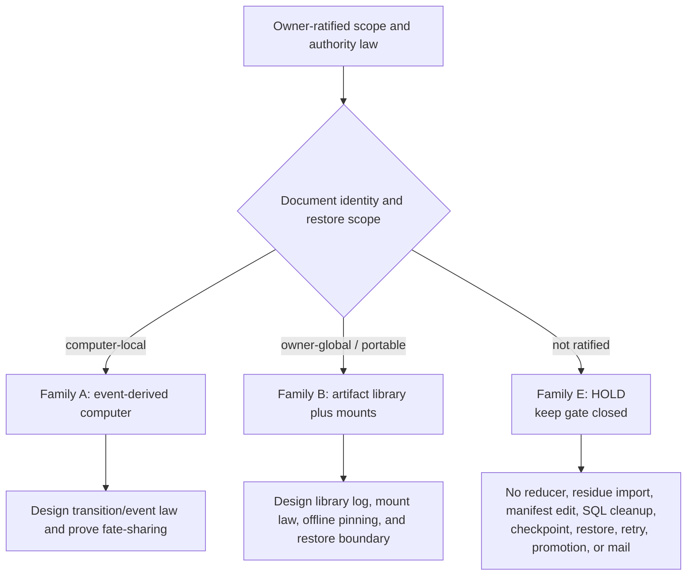
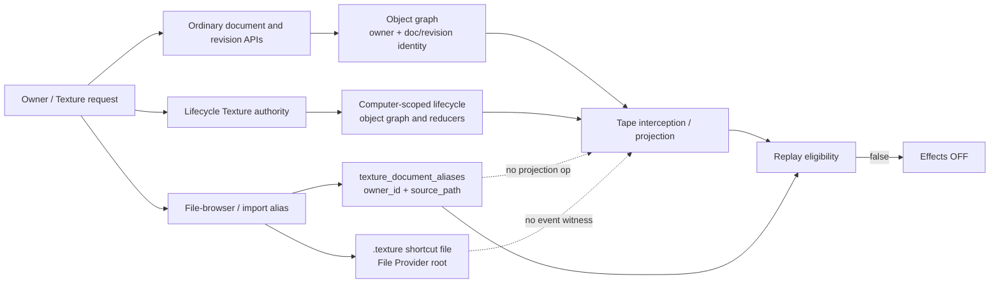

# Texture System Sensemaking Review - 2026-08-18

**Boundary:** architecture sensemaking only. No runtime implementation, staging
mutation, replay reclassification, checkpoint, restore, retry, promotion, or
effect authorization.

**Parent authority:**
`docs/definitions/choir-supervised-self-development-effects-2026-08-11.md`

**Current status:** HOLD. The effects Definition is `blocked_incomplete`,
`texture_document_aliases` remains `ReplayEmptyUntilSupported`, replay
eligibility remains false, effects remain OFF, and no implementation family is
owner-ratified.

**Mutation class:** red architecture boundary, documentation-only.

## Executive decision

The safe current decision is **Family E: ledger-honest HOLD**. Consensus does not
supply owner architecture authority. Do not add an alias reducer or projection,
wire the latent object-graph edge, import alias residue, change the replay
manifest, delete or empty SQL rows, replace the workspace, bind a checkpoint,
restore, retry self-development, promote, invoke qualified consensus, or send
mail.

The later architecture fork is unresolved:

- **Family A, strict computer monism:** all behavior-bearing Texture state that
  belongs to one computer is reconstructed from that computer's canonical event
  chain; aliases become computer-scoped event-derived state.
- **Family B, owner artifact library plus computer mounts:** documents and
  versions remain owner-global artifacts; the computer tape owns local mounts,
  path bindings, overlays, and effects.

A is the doctrine-nearest target **only if the owner explicitly reaffirms that
ordinary Texture documents and path bindings are computer-local**. B is the
honest target **only if the owner explicitly reaffirms that documents outlive a
computer restore and defines library/mount fate-sharing**. Neither is selected
or authorized here. Graph/CAS and trajectory-first families remain larger
architectural alternatives, not next implementation slices.

## Evidence-backed state

At replay sequence `3342` on the retained staging computer:

- canonical, desired, and effective event heads matched;
- `run_memory_entries` matched exactly: `1083` live, `1083` replay, zero
  live-only, zero replay-only, and zero differing rows;
- whole-computer equivalence remained `not_equivalent`;
- `texture_document_aliases` was non-empty and classified
  `ReplayEmptyUntilSupported`; and
- the replay receipt also reported a differing `dolt:texture:content_root`.

The deployed replay proof is narrow run-memory acceptance, not whole-computer
restore acceptance. Sources:

- `docs/evidence/effects-red-replay-eligibility-recheck-2026-08-18.md`;
- `docs/evidence/effects-red-replay-run-memory-scope-repair-2026-08-18.md`;
- `docs/problems/effects-red-replay-texture-alias-authority-2026-08-18.md`;
- the active Definition's `now` block and `next_action`.

### Correct interpretation of `content_root`

`internal/computerversion/dolt_state_extractor.go:188-202` computes
`dolt:<database>:content_root` as a SHA-256 over the sorted per-table content
hashes. Therefore a differing `content_root` is an aggregate witness, not a
second independent table authority. The current receipt exposes the alias-table
and aggregate-root differences but does not expose enough leaf detail to claim
that aliases are the sole causal source of the root difference. Future evidence
must retain that distinction; calling the root an independent blocker overstates
the observed state.

The aggregate-root correction does **not** clear replay eligibility. The alias
table remains a non-empty direct-write surface, and eligibility still rejects
it before equivalence can authorize the declared manifest:
`internal/agentcore/replay_eligibility.go:44-90,120-255`.

## As-built authority map

Verified seams:

1. `texture_document_aliases` is keyed by `(owner_id, source_path)` and has no
   `computer_id`, event identity, namespace identity, version, or tombstone:
   `internal/store/texture.go:106-114`.
2. `GetDocumentAlias`, `GetDocumentAliasSourcePath`,
   `UpsertDocumentAlias`, and deletion paths directly query or mutate SQL:
   `internal/store/texture.go:823-975`.
3. Markdown lineage import, file-browser open, and shortcut materialization
   call the direct alias API. File-open creates the document and revision before
   alias persistence; shortcut materialization writes the physical file before
   alias persistence. These writes do not currently fate-share:
   `internal/textureowner/texture.go:560-750` and
   `internal/textureowner/texture_import.go:540-660`.
4. Projection V2 defines desktop, object, object-edge, run-memory,
   self-development, and Texture-agent-mutation operations, but no alias
   operation: `internal/computerevent/projection_batch.go:10-57`.
5. `projectOp` has no alias reducer case:
   `internal/store/project.go:60-78`.
6. Owner-scoped residue import snapshots desktops, object graph state, and
   runtime/control rows, but has no alias snapshot path:
   `internal/store/residue_import.go:30-130,210-245`.
7. Ordinary documents and revisions are written through `ogPut` without a
   computer scope in `CreateTextureDocumentOG` and
   `CreateTextureRevisionOG`: `internal/store/graph_store.go:1829-1885,2005-2075`.
   Source entities and refs likewise reject non-empty lifecycle computer scope
   on the ordinary path: `internal/store/graph_store.go:2589-2635,2697-2735`.
8. Lifecycle Texture objects use an explicit `(owner, computer)` identity path:
   `internal/store/lifecycle.go:2832-2839`. The repository therefore contains
   at least two Texture scope species; adding `computer_id` to aliases would
   choose how they compose, not merely fill a missing column.
9. `document_alias` is registered as an object-graph edge kind and
   `ogEdgeDocAlias` exists, but no production writer was established for it:
   `internal/objectgraph/registry.go:171-174` and
   `internal/store/graph_store.go:70-73`. A latent edge is a connection
   opportunity, not authority.

## Panel method and result

The extended divergent panel used a 1200-second per-agent timeout. Seven
substantive seats returned: Codex, Devin, Claude, Cursor, GPT-5.6 Sol,
Gemini-3.6, and Cursor Grok. DeepSeek returned a provider rate-limit failure;
opencode timed out. The convergent panel used the same 1200-second timeout and
returned the same seven substantive seats; the two unavailable seats were not
used as votes. Full manifests are retained under
`.agentic-consensus/effects-system-sensemaking-20260818/divergent-1200/` and
`convergent-1200/`.

The divergent panel separated these families:

| Family | Core claim | Main unresolved law |
|---|---|---|
| A. Computer monism | Computer tape is sole transition authority for computer-local Texture state. | Whether ordinary documents and aliases are computer-local; event granularity and cross-computer import. |
| B. Artifact library plus mounts | Owner-global document/version library; computer-local mount and path binding. | Library authority, pinning, offline behavior, privacy, and restore fate-sharing. |
| C. Graph/CAS canonical | Immutable graph or Merkle root is canonical; tape records authorized roots. | Current graph is not proven as a canonical Merkle authority; root semantics and operational surface. |
| D. Trajectory/actor-first | Documents are derived views over actor/evidence trajectories. | Conflicts with current Texture-as-canonical-artifact doctrine and sequenced successor timing. |
| E. Hold / era-cut / ledger honesty | Resolve the C1/C2/C15 constitutional seam before implementation. | Owner decision must prevent indefinite archaeology. |

The convergent panel agreed on the operational HOLD. It split only on the
conditional target: Claude favored B because current ordinary Texture code
already enforces owner-global document scope, while GPT, Gemini, Devin, Codex,
and Cursor treated A as the doctrine-nearest conditional target. The useful
common result is not a majority target: **no runtime family is authorized until
owner scope and authority are ratified**.

The panel also agreed that:

- the tape carries many row/object post-images under canonical appender and CAS
  ordering, so it is partly binlog-like but not authority-free; and
- the replay manifest is a fail-closed airworthiness registry, not a complete
  product ontology. Reclassifying one table would be a policy/authority change,
  not proof of reconstructibility.

## Decision ledger

| Decision | Current answer | Authority / proof required | Consequence now |
|---|---|---|---|
| Who owns ordinary Texture documents? | Unsettled: ordinary OG path is owner-scoped; persistent-computer doctrine is computer-centered. | Dated owner statement, then Definition update. | Do not add `computer_id` or move aliases. |
| What does `source_path` mean? | It conflates file-browser lookup, shortcut path, provenance, and possibly mount identity. | Canonical path, normalization, case, privacy, rename, and version law. | Do not reclassify aliases as derived or canonical. |
| Does computer restore rewind document bytes? | Unsettled. | Explicit restore-set and cross-computer scope law. | Keep whole-computer eligibility closed. |
| What is the canonical alias authority? | None is settled; SQL is the current writer, not a ratified authority. | Owner-selected relational projection, OG edge/object, or derived view with one writer. | No reducer, latent-edge wiring, or manifest change. |
| What is the event payload law? | Current projection often stores row/object post-images. | Decide whether post-images are acceptable or domain/root transitions are required. | No symptom-level alias projection. |
| How do file and alias writes fate-share? | They currently do not. | Atomic transaction or durable joined receipts, including restart behavior. | No claim that an alias reducer alone restores UX. |
| What is the fate of live rows? | Provenance, dangling IDs, and product-vs-residue status are unpaid. | Read-only inventory plus owner residue law. | No SQL cleanup or residue import. |
| What proves completion? | No family has a replay, restart, or deployed acceptance artifact. | Exact row/root/surface equality, no-SSH operation, and rollback proof. | Consensus remains analysis, not acceptance. |

## Smallest safe next action

Obtain one dated owner ratification that answers the ledger's scope and authority
questions. Update the Definition's `next_action` and authority references with
that statement. Then run a fresh review on the frozen design before entering an
`Implement` slice.

A separately authorized, read-only owner-scoped alias inventory may be useful,
but it must remain diagnostic: privacy-safe counts/digests, dangling mappings,
writer provenance, and explicit `eligibility unchanged`. It must not import,
reclassify, repair, or empty anything.

Until ratification, keep these invariants:

- `texture_document_aliases` remains `ReplayEmptyUntilSupported`;
- replay eligibility, checkpointability, restore, retry, promotion, and effects
  remain closed;
- no candidate or bundle is created; and
- no mail or other external effect is sent.

## Boundary, rollback, and learning

This review changed no product state, event head, VM-local projection, staging
computer, or registry authority. Rollback is a documentation revert. The
review's evidence is the retained panel manifests, source reads, and the
existing deployed replay receipts; it does not prove whole-computer replay,
checkpointability, restore, self-development retry, qualified consensus, or any
external effect.

**Heresy delta:** discovered - the alias table is an unresolved owner/path
authority inside a replay boundary, and the aggregate `content_root` is a
computed witness rather than a separate table authority; introduced - none;
repaired - clarified the root interpretation in this report only.

**Conjecture delta:** confirmed - the narrow run-memory repair and the source
shape of the alias/projection seam; unresolved - ordinary Texture scope,
path/mount law, live-row provenance, alias/file fate-sharing, and a
reconstructible whole-computer implementation.

**Next realism axis:** owner-ratified document identity and restore scope, then
restart-durable projection/import fidelity with deployed artifact evidence.
